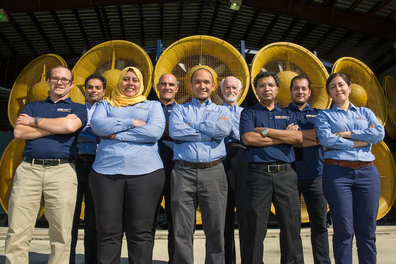
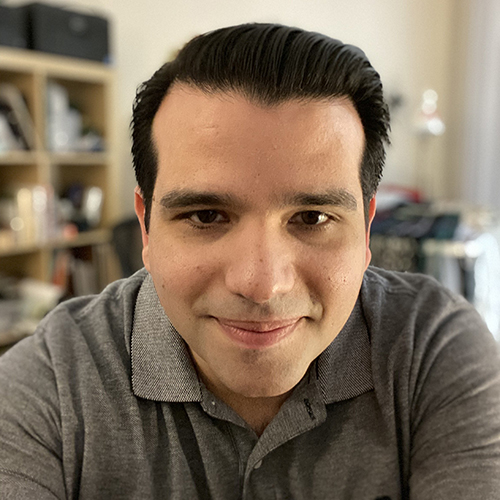
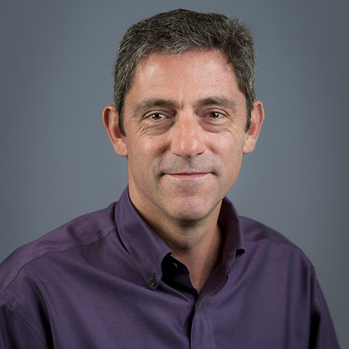

### NHERI Virtual Office Hours

Virtual Office hours is the newest way to connect with experts in the NHERI network. Using the links below, schedule a time to meet with facility personnel to answer your questions. If you don’t see the facility you are interested in, email us at <a href="mailto:eco-feedback@designsafe-ci.org" target="_blank">eco-feedback@designsafe-ci.org</a>.

---
#### [DesignSafe Data Depot/Curation](#depot) { #depot }

{: width="40%" }

DesignSafe’s Data Curator, Dr. Maria Esteva, holds virtual office hours every <b>Tuesday and Thursday from 1:00pm to 2:00pm CT</b> (via Zoom) to assist you with your data curation and publication. <em>Reservations are not required, simply connect to the Zoom feed during this time.</em>

<a href="https://DesignSafe-ci.zoom.us/j/730745593?pwd=U0VyaG1nVHgya3RZaS9hZng1MU82UT09" target="_blank"><strong>Connect to Office Hours</strong></a>  
<b>Meeting ID:</b> 730 745 593  
<b>Passcode:</b> 595633  

---
#### [DesignSafe Workspace](#workspace) { #workspace }

{: width="40%" }

Dr. Wenyang Zhang holds virtual office hours <strong><em>every other</em></strong> <b>Tuesday from 2:00pm to 3:00pm CT</b> (via Zoom) beginning Sep 27, 2022, to assist you with applying your research using the various Tools &amp; Applications or with managing your files in the Data Depot. <em>Reservations are not required, simply connect to the Zoom feed during this time.</em>

<a href="https://DesignSafe-ci.zoom.us/j/92199252248?pwd=c05HSjdRWk1uVEFBa3ZiT29Tdjdadz09" target="_blank"><strong>Connect to Office Hours</strong></a>  
<b>Meeting ID</b>: 921 9925 2248  
<b>Passcode</b>: 776504  

---
#### [Florida International University, Wall of Wind](#wallofwind) { #wallofwind }

{: width="40%" }

The Wall of Wind Research Scientists are available to meet with you every <b>Wednesday between 3:00-5:00 pm EST</b>.

<strong><a href="https://bit.ly/NHERI_FIU" target="_blank">Sign Up for Office Hours</a></strong>

---
#### [Lehigh University, Real-Time Multi-Directional Experimental Facility](#lehigh) { #lehigh }

{: width="40%" }  
Lehigh’s Dr. Liang Cao is available to answer questions and discuss research proposals <b>every other Wednesday from 2:00-3:00 pm EST</b>.

<strong><a href="https://bit.ly/NHERI_LEHIGH" target="_blank">Sign Up for Office Hours</a></strong>

---
#### [University of California, San Diego, Large High Performance Outdoor Shake Table](#ucsd) { #ucsd }

{: width="40%" }

Dr. Koorosh Lotfizadeh, NHERI USCD Interim NHERI Operations Manager, is available to answer your questions and discuss research proposals the <b>first and third Tuesday of the month from 1:00-2:00 pm PDT</b>.

Contact Dr. Lotfizadeh: <a href="mailto:klotfiza@ucsd.edu" target="_blank">klotfiza@ucsd.edu</a>
<strong><a href="https://bit.ly/NHERI_UCSD" target="_blank">Sign Up for Office Hours</a></strong>

---
#### [Oregon State University, O.H. Hinsdale Wave Research Laboratory](#hinsdale) { #hinsdale }

{: width="40%" }

Dr. Pedro Lomonaco, Co-Pi and Director of NHERI O.H. Hinsdale Wave Research Laboratory, is available to answer your questions and discuss research proposals. Schedule a time to meet by emailing him below.

Contact Dr. Lomonaco: <a href="mailto:pedro.lomonaco@oregonstate.edu" target="_blank">pedro.lomonaco@oregonstate.edu</a>

---
### [How to Schedule Virtual Office Hours](#schedule) { #schedule }

To schedule a meeting with NHERI facility faculty, click the facility Eventbrite link, schedule your date and time, chose individual or group meeting, and then register. A confirmation email will include the Zoom link for your scheduled day and time. You will also receive reminder emails about your scheduled meeting. Also see our <a href="https://youtu.be/y_dxfAfsRek" target="_blank">video tutorial</a>.

<strong><em>Questions? Email: <a href="mailto:eco-feedback@designsafe-ci.org" target="_blank">eco-feedback@designsafe-ci.org</a></em></strong>

