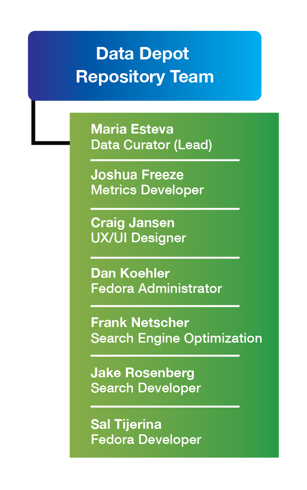

# Governance

Policies for the DDR are driven by the Natural Hazards (NH) scientific community and informed by best practices in library and information sciences. The DDR operates under the leadership of the DesignSafe Management Team (DSMT), who establishes and updates policies, evaluates and recommends best practices, oversees its technical development, and prioritizes activities. The broad organizational structure under which the DDR operates is <a href="https://www.designsafe-ci.org/about/designsafe/">here</a>.

## [Repository Team](#repositoryteam) { #repositoryteam }

An interdisciplinary repository team (RT) carries out ongoing design, development and day-to-day operations, gathering requirements and discussing solutions through formal monthly and bi-weekly meetings with the NHERI community and maintaining regular communications with members of the network, including monthly meetings with the<a href="https://www.designsafe-ci.org/facilities/experimental/"> Experimental Facilities</a>, <a href="https://rapid.designsafe-ci.org/">RAPID</a>, and <a href="https://rapid.designsafe-ci.org/">CONVERGE</a> staff. Based on these fluid communications, the RT designs functionalities, researches and develops best-practices, and implements agreed-upon solutions. The figure below shows the current formation of the RT, including their expertise.

Formal mechanisms are in place for external evaluators to gather feedback and conduct structured assessments, in the form of usability studies and yearly user surveys, to ensure that the repository is meeting the community’s expectations and needs. To track development the DDR curator meets every other week with the DesignSafe PI and with the head of the development team. All DDR activities are reported to the National Science Foundation on a quarterly and annual basis in terms of quantitative and qualitative progress.

## [Community Norms for DDR](#norms) { #norms }

Within the broader conditions of use for DesignSafe we have established a set of Community Norms specific for DDR which have to be agreed upon at the point of registering an account on the platform. These norms, highlighting our existing policies, are the following:

Users who either publish and use data in DDR must abide by both the <a href="https://portal.tacc.utexas.edu/tacc-usage-policy">TACC Acceptable Use Policy</a> and the <a href="https://www.designsafe-ci.org/account/terms-conditions/">DesignSafe Terms of Use</a>.

### [For users curating and publishing data in DDR:](#norms-curators) { #norms-curators }

* Users understand that their data submissions to the DDR should follow our Data Policies and our Curation and Publication Best Practices to the best of their ability. 
* Users agree to use DDR to publish only <a href="https://www.budapestopenaccessinitiative.org/read">open access </a>data, which they must document in a manner that does not hinder the ability of other users to reuse or reproduce it. 
* Users publishing or reusing data of others in their data publications must properly cite the datasets in accordance with the <a href="https://www.force11.org/datacitationprinciples">Joint Declaration of Data Citation Principles</a> using the fields provided in the DDR interface. 
* Users agree to provide all the needed licenses and permissions to make data available for archiving and for reuse by others. 
* Users publishing human subjects data should abide by our Protected Data Best Practices. 
* Using DDR to publish data is entirely voluntary. None of these terms supersede any prior contractual obligations to confidentiality or proprietary information the user may have with third parties; thus, the user is entirely responsible for what they upload or share with DDR. .
* Publications that do not fall within these norms may be removed. 

### [For users using data published in DDR:](#norms-users) { #norms-users }

* Users accessing and using DDR data agree to the following Data Use Agreement. 
* Users agree to use DDR resources in accessing and reusing open access data in ways that respect the licenses established in the publications. 
* Users agree to properly cite the datasets they use in their works in accordance with the <a href="https://www.force11.org/datacitationprinciples">Joint Declaration of Data Citation Principles</a> using the citations provided in the published datasets landing pages. 
* We reserve the right to ask users to suspend their use of DDR should we receive complaints or note violations of these Community Norms. 

