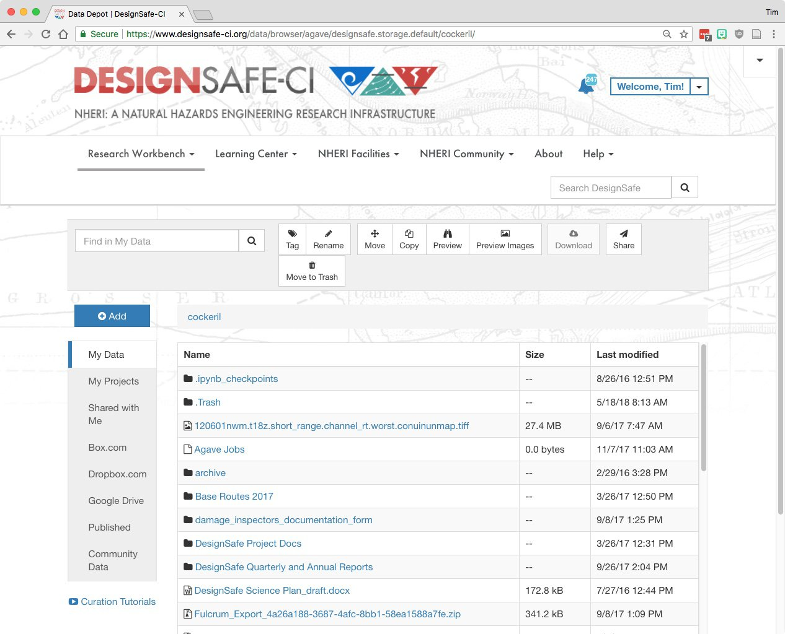

The <a href="https://www.designsafe-ci.org/data/browser/public/" target="_blank">Data Depot</a> is the data repository for DesignSafe. The web interface to the Data Depot allows you to browse, upload, download, share, curate and publish data stored within the repository. You are encouraged to use the Data Depot not only for curation and publication of research results, but as a working “scratch” area for any of your own data and work in progress. Scientific applications in the <a href=”https://www.designsafe-ci.org/rw/workspace/” target=”_blank”>Tools & Applications</a> area can access your Data Depot files, enabling data analysis directly in the DesignSafe portal that minimizes the need to transfer data to your laptop. The Data Depot hosts both public and private data associated with a project, with the following directories:

* **My Data**: Private directory for your data.
* **My Projects**: Data to be curated and published must be in this directory. Also has group access that you control.
* **Box.com**: Access to your Box files for copying to DesignSafe.
* **Dropbox.com**: Access to your Dropbox for copying to DesignSafe.
* **Google Drive**: Access to your Google Drive files for copying to DesignSafe.
* **Published**: Curated data/projects with DOI’s.
* **Community Data**: Non-curated user-contributed data.
 
### [Browsing, Upload, and Download](#browsing) { #browsing } 

Figure 1. Data Depot “My Data” screenshot 

The Data Depot provides a user interface with a familiar desktop metaphor for manipulating files. The UI for a typical Data Depot window is shown in Figure 1 above. On the left is your directory tree (My Data, etc), and on the right are the files and folders within the currently selected directory. Folders can be navigated simply by clicking on the name of the folders. Clicking on the name of a file will pop up a preview of the file. 

The Data Depot is searchable using the "Find in <DirectoryName>" search box  (The global website search box "Search DesignSafe" is above and to the right). 

Alongside the search, buttons are available for a number of file and folder actions. The Rename, Move, Copy, Download, etc. actions all behave as one would expect.

Click on the blue "+Add" button above the list of directories to create a New Folder, a New Project in My Projects, to do a File Upload or a Folder upload or for Bulk Data Transfer instructions. Note that only Chrome supports browser-based Folder uploads.

A number of data transfer methods are supported for uploading and downloading files. The [Data Transfer Guide](../datatransfer) provides details regarding the various methods and recommendations based on the quantity and size of your files.

### [Data Sharing, Collaboration, Curation & Publication](#sharing) { #sharing }

My Projects is the simplest way to share data with your collaborators and to curate and ultimately publish your data and receive a Digital Object Identifier (DOI). Any team member in a project has both read and write access to the entire contents of the project. The Data Curation & Publication User Guide provides instructions for creating projects, managing team members, curating and publishing your data.

---
