# Data Transfer Guide

DesignSafe supports multiple ways of moving data in and out of the Data Depot, the data transfer method that is best for you will depend on the quantity of data you wish to move. There are two broad categories of data transfer methods available; we will refer to these categories as large data transfer methods and normal data transfer methods. Large data transfer methods are for situations where you want to move a large amount of data (&gt; 2GB), a large numbers of files (&gt; 25), or folders. Whereas normal data transfer methods are for situations where you wish to move a small amount of data (&lt; 2GB) stored across a small number of files (&lt; 25).

This document provides a brief description of the various methods available for moving data to DesignSafe to assist you in identifying the right data transfer method for your research needs. Once you have selected your data transfer method, each description concludes with a link to detailed instructions for initiating your transfer.

## [Recommended Data Transfer Methods](#recommended) { #recommended }

### [Recommended Large Data Transfer Methods](#recommended-largedatatransfer) { #recommended-largedatatransfer }

We define a large data transfer here as any file transfer that is  &gt; 2GB, or &gt; 25 files or &gt; 2 folders.

1. Globus (recommended)

	Globus supplies high speed, reliable, and asynchronous transfers to DesignSafe. Once setup, Globus will allow you to not only transfer files to and from DesignSafe, but also other cyberinfrastructure resources at TACC and other research centers. While the setup of Globus can take slightly longer than the other transfer methods, setup only needs to be performed once, making later transfers as fast (if not faster due to Globus' superior speed) than the other methods. For these reasons, Globus is the recommend approach for moving large quantities of data to and from DesignSafe.

	See the <a href="#globus">Globus Data Transfer Guide</a> for instructions. If you need to perform automated transfers using Globus, see the <a href="#globuscli">Globus CLI Automated Transfer Guide</a> for instructions.

1. Cyberduck

	Cyberduck is an open-source client for file transfer protocols that allows you to securely connect to DesignSafe and other TACC resources without directly using the command line. Cyberduck presents a compromise between a shorter setup time than Globus but at the expense of Globus' superior speed and reliability.

	See the <a href="#cyberduck">Cyberduck Data Transfer Guide</a> for instructions.

1. Command Line

	Common command-line utilities, such as scp and rsync, may also be used to transfer large amounts of data to DesignSafe. Command line tools require the shortest setup time (assuming you have a compatible terminal), however are generally found challenging for first-time users. Therefore, command line transfers are only recommended in specific circumstances where other tools have been tried and found to be insufficient.

	See the <a href="#globuscli">Command-Line Data Transfer Guide</a> for instructions.

### [Recommended Normal Data Transfer Methods](#recommended-normaldatatransfer) { #recommended-normaldatatransfer } 

We define a "normal" data transfer as &lt; 2GB or  &lt; 25 files or &lt; 2 folders

1. Data Depot's Browser-Based Interface

	The Data Depot's browser interface allows you to conveniently upload and download small quantities of data as well as move and copy data between directories.

	See below <a href="#datadepotbrowser">Data Depot's Browser-Based Data Transfer Guide</a> for instructions.

1. JupyterHub's Browser-Based Interface

	Similar to the Data Depot's browser interface, the DesignSafe JupyterHub provides a convenient way to upload and download small amounts of data.

	See below <a href="#jupyterbrowser">JupyterHub's Browser-Based Data Transfer Guide</a> for instructions.

1. Cloud Storage Providers (Box, Dropbox, and Google Drive)

	DesignSafe provides the ability to directly transfer small amounts of data to and from your preferred cloud storage provider. DesignSafe currently supports integration with Box, Dropbox, and Google Drive. Note that DesignSafe does not synchronize your data with the selected cloud storage provider.

	See <a href="#cloud">Cloud Storage Data Transfer Guide</a> below for instructions.

---

## [Globus Data Transfer Guide](#globus) { #globus }

Globus supplies high speed, reliable, and asynchronous transfers to DesignSafe. Once setup, Globus will allow you to not only transfer files to and from DesignSafe, but also other cyberinfrastructure resources at TACC and other research centers. While the setup of Globus can take slightly longer than the other transfer methods (see <a href="../datatransfer">Data Transfer Guide</a>), it only needs to be performed once, making later transfers as fast (if not faster due to Globus' superior speed) than the other methods. For these reasons, Globus is the recommend approach for moving large quantities of data to and from DesignSafe.

The following provides detailed instructions for setting up Globus access to DesignSafe.

### [1. Submit a ticket to activate Globus access for your DesignSafe/TACC Account](#globus-step1) { #globus-step1 }

Create a new ticket on DesignSafe (<a href="https://designsafe-ci.org/help">https://designsafe-ci.org/help</a>) to request Globus access for your account. 

In the body of the message indicate you wish to use Globus and list the Data Depot location(s), such as My Data or a project in My Projects, where you intend to transfer files to/from.

You will get a response via email when the activation is complete.

### [2. Create a Distinguished Name (DN)](#globus-step2) { #globus-step2 }

Globus requires a unique identifier, called a Distinguished Name (DN), for each user.

To create a DN, you need to log in through an authoritative source that can verify your identity, typically your university or employer.

If you already have a DN, you may reuse it here and skip to <a href="#globus-step3">Step 3</a>.

If you do not have a DN, you can create one for free using the “CI Logon” service.

<strong>Important: You must use your institution’s credentials, not your personal Google account, when setting up Globus to prevent issues when accessing the DesignSafe endpoint (Corral).</strong>

To create a DN, go to <a href="https://cilogon.org" target="_blank">https://cilogon.org</a>.

Select an "Identity Provider" from the drop-down list, and click "Log On" to be redirected to your Identity Provider's log in screen.

If your university or employer is not in the list, we recommend using Cyberduck instead. See the <a href="#cyberduck">Cyberduck Data Transfer Guide</a> for instructions.

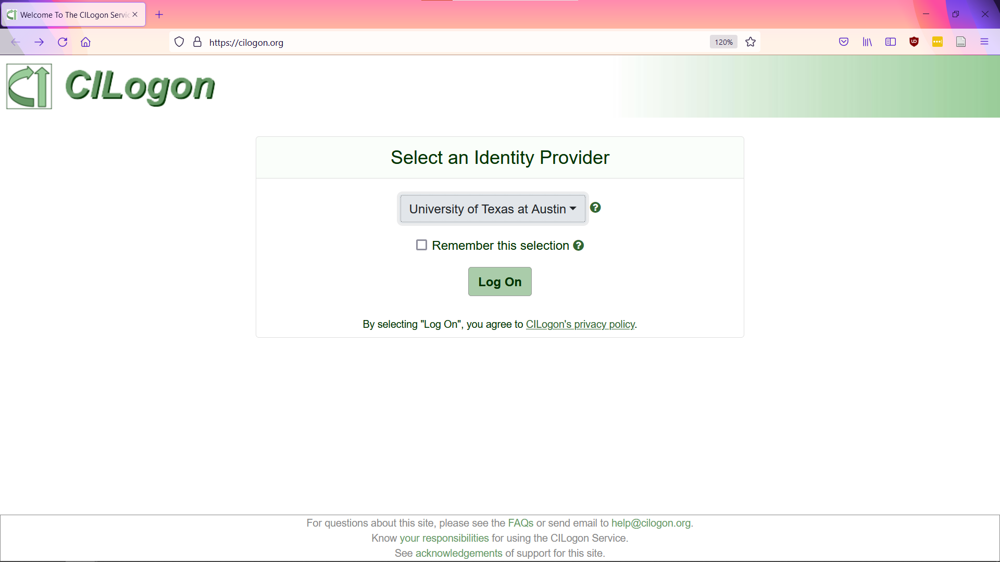

After authenticating via the Identity Provider, you will be redirected back to CILogon, where you can find your Certificate Subject that you will need to copy and paste for <a href="#globus-step3">Step3</a>.

	/DC=org/DC=cilogon/C=US/O=University of Texas at Austin/CN=Sample Person A00000

### [3. Associate your DN with your DesignSafe/TACC Account](#globus-step3) { #globus-step3 }

Login to the TACC User Portal (<a href="https://www.tacc.utexas.edu/portal/login" target="_blank">https://portal.tacc.utexas.edu</a>) with your DesignSafe/TACC account.

Select "Home" &gt; "Account Profile".

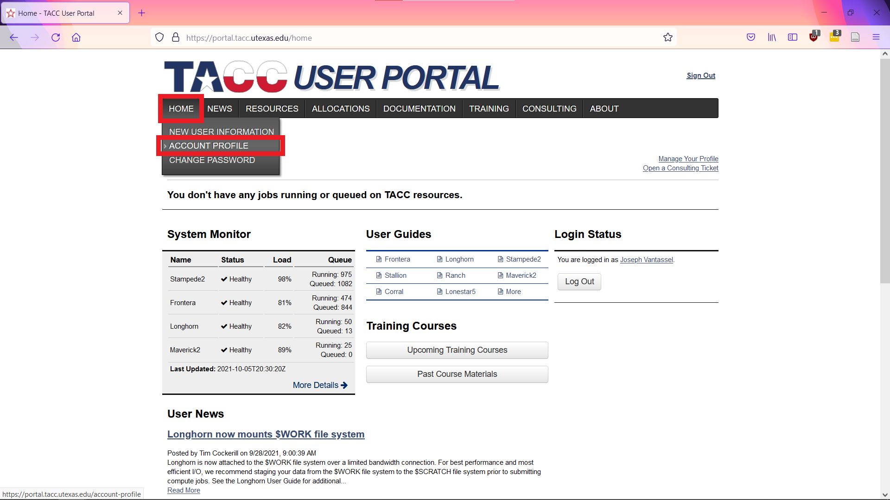

Select "Manage DNs" in the lower left.


Enter the Certificate Subject obtained from CILogon.org in the text field, then click "Associate DN". This will associate the new DN with your account.

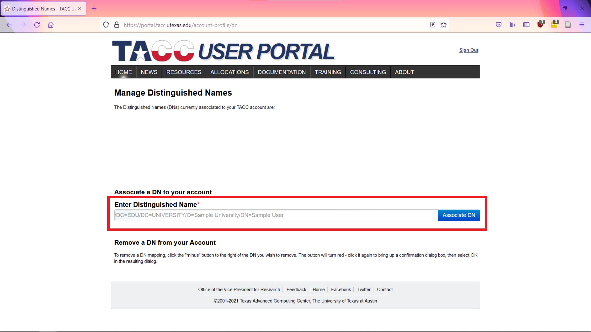

**Important**: It may take up to 2 hours for your DN to propagate to all TACC systems.

### [4. Activate Your Desktop/Laptop as a Globus Endpoint and Connect](#globus-step4) { #globus-step4 }

After giving your DN time to propagate through the systems (up to 2 hours), go to <a href="https://globus.org" target="_blank">https://globus.org</a> and log in.


Upon successful login you, you will be directed to the "File Manager" landing page.


Click on "Endpoints" in the left-hand menu, then click “Create a personal endpoint”.

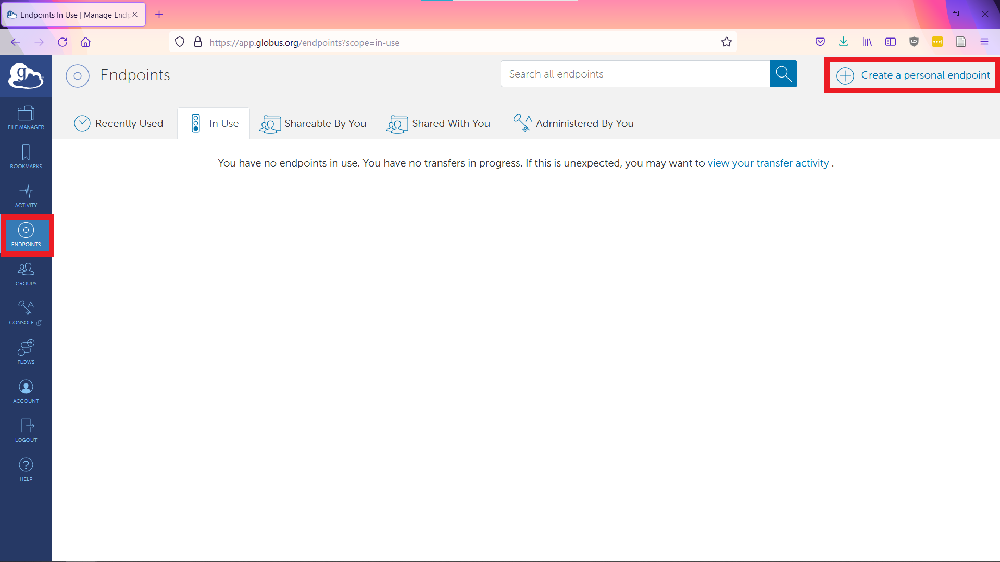

If you are using Windows click "Download Globus Connect Personal for Windows" in the upper right, otherwise click "Show me other supported operating systems" and select the one appropriate for your desktop/laptop.


Download and Install the Globus Connect Personal client. When setting the "Collection Name" be sure to select a descriptive name. We will use "My Laptop" as the name of our endpoint.

After installation and setup is complete return to the Globus online interface. Select the “File Manager” tab (upper left), then click on the search bar immediately to the right of the label "Collection".

To initiate a transfer between your local desktop/laptop and DesignSafe, select "Your Collections" followed by the name of your endpoint, this is "My Laptop" for our example.

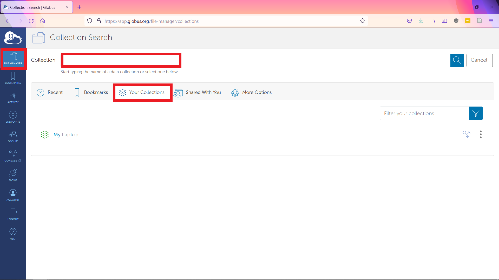

You can now access the files on your desktop/laptop via Globus.


### [5. Connect to the DesignSafe (TACC Corral3) Endpoint](#globus-step5) { #globus-step5 }

To view both endpoint simultaneously, change the Globus' interface to the "two pane" view by toggling the buttons next to "Panels" in the upper right.

To establish the second endpoint, select the right-hand search bar and search for "TACC". Select "TACC Corral3" as your second end point.

After successfully authenticating, you will be redirected back to Globus and you will now be able to access your data on Corral, where the files for DesignSafe are stored.

Corral3 is a large (40 PB), shared data resource, as such, the data stored on DesignSafe is only a small fraction of that stored on the entire system. Therefore, Corral3 requires a complex file structure for organization.

To access your data on DesignSafe

* For <strong>My Data</strong> set Path to <strong>/corral-repl/projects/NHERI/shared/&lt;username&gt;/</strong>
* For <strong>My Projects</strong> set Path to <strong>/corral-repl/projects/NHERI/projects/&lt;project-uid&gt;/</strong>
* For <strong>Published </strong>DesignSafe projects set Path to <strong>/corral-repl/projects/NHERI/published/&lt;PRJ-XXXX&gt;</strong>/
* For <strong>Published (NEES)</strong> projects set Path to <strong>/corral-repl/projects/NHERI/public/projects/&lt;NEES-XXXX-XXXX.groups&gt;/</strong>

For more information on path selection please see the detailed guide on <a href="../settingpathtodesignsafe">Setting the Path to DesignSafe on Corral</a>.

After entering the appropriate path to DesignSafe on Corral, you are ready to perform your file transfer.

<em>Note: For directories you connect to frequency, for example My Data, you can create a bookmark for easy access using the bookmark icon immediately to the right of the "Path" bar.</em>

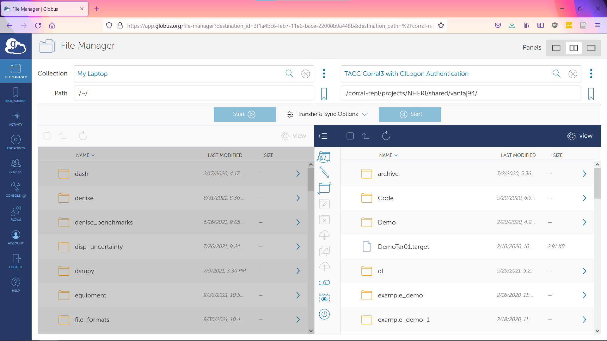

### [6. Perform Transfer between Your Local Enpoint and the DesignSafe (TACC Corral3) Endpoint](#globus-step6) { #globus-step6 }

To begin your transfer, select the file/folder you wish to move to/from DesignSafe.

Select the receiving location for the data in the other panel. You can do this by either typing the desired path or clicking through the directory structure.

Press the "Start" button to begin the transfer.

Once the transfer is initiated, you can view the state of the transfer by clicking "Activity".

You do not need to keep the Globus interface open through the duration of the transfer.

Globus will email you when the transfer is complete.

---

## [Globus CLI Automated Transfer Guide](#globucli) { #globuscli }

Globus provides a command line interface (CLI), for those who need to perform automated data transfers. This data transfer method will likely be of most use to NHERI centers that need to bulk upload their data on a schedule.

### [1. Submit a ticket to activate Globus access for your DesignSafe/TACC Account](#globuscli-step1) { #globuscli-step1 }

Create a new ticket on DesignSafe (<a href="https://designsafe-ci.org/help">https://designsafe-ci.org/help</a>) to request Globus access for your account. 

In the body of the message indicate you wish to use Globus and list the Data Depot location(s), such as My Data or a project in My Projects, where you intend to transfer files to/from.

You will get a response via email when the activation is complete.

### [2. Create a Distinguished Name (DN)](#globuscli-step2) { #globuscli-step2 }

Detailed instructions for creating a DN can be found in <a href="#globus-step2">Step 2 of the Globus Data Transfer Guide</a>.

If you have already completed the DN creation process and associated it with your DesignSafe/TACC account you may skip to <a href="#globus-step4">Step 4</a>.

### [3. Associate your DN with your DesignSafe/TACC Account](#globuscli-step3) { #globuscli-step3 }

Detailed instructions for associating your DN with your DesignSafe/TACC account can be found in <a href="#globus-step3">Step 3 of the Globus Data Transfer Guide</a>.

### [4. Activate Your Desktop/Laptop as a Globus Endpoint and Connect](#globuscli-step4) { #globuscli-step4 }

If the data you wish to transfer is located on your local machine, follow <a href="#globus-step4">Step 4 of the Globus Data Transfer Guide</a> to create a personal endpoint.

If the data you wish to transfer is located on a server operated by your organization and does not already have a Globus Endpoint available, talk to your system administrator about creating one.

### [5. Install the Globus CLI](#globuscli-step5) { #globuscli-step5 }

Follow the instructions provided by Globus for installing the CLI (<a href="https://docs.globus.org/cli/">https://docs.globus.org/cli</a>)

*Note the recommended installation method requires a system with Python3 and the ability to run pip commands.*

### [6. Settings for CLI Transfer](#globuscli-step6) { #globuscli-step6 }

With the Globus CLI successfully installed on our local machine, we must now determine the endpoint information for DesignSafe.

Go to the Globus web interface &gt; select the search bar.


Search for <strong>TACC Corral3 with CILogon Authentication </strong>&gt; <strong>click the three vertical dots to the right</strong> to view endpoint details.

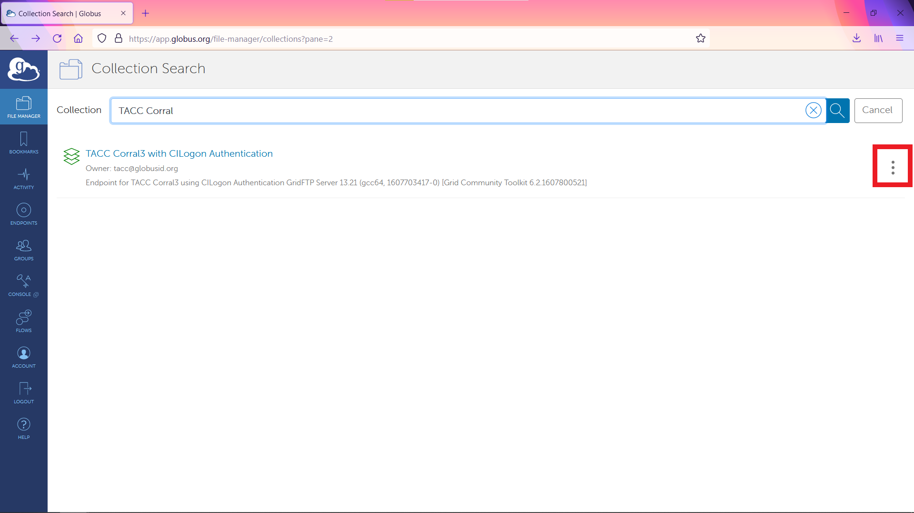

<strong>Copy the Endpoint UUID </strong>and store for later reference.

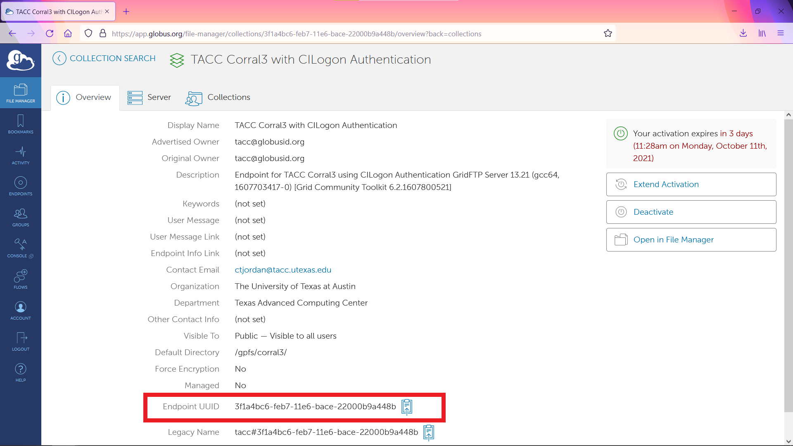

<strong>Repeat the process above to attain the UUID for your local endpoint.</strong>

### [7. Test Globus CLI Transfer](#globuscli-step7) { #globuscli-step7 }

With the endpoint IDs, we can now do a test transfer with the Globus CLI.

Start by authenticating by entering the following:

<code>globus login</code>

This will prompt you to authenticate through your web-browser and grant permissions to Globus-CLI.

Next, we create our transfer command. The basic structure follows:

<code>globus transfer [OPTIONS] SOURCE_ENDPOINT_ID[:SOURCE_PATH] DEST_ENDPOINT_ID[:DEST_PATH]</code>

An example transfer command:

<code>globus transfer --recursive [endpoint uuid for your machine]:[path on your machine] [endpoint uuid for tacc corral3]:[path on tacc corral3 to your My Data or Project]</code>

Fill out the variables in the example command with the UUIDs and paths and submit the transfer. If you are unsure of the appropriate Corral3 path, please refer to the guide on <a href="../settingpathtodesignsafe">Setting the Path to DesignSafe on Corral</a> for more information.

You will get a message stating whether your transfer was successful or not. If it was successful, you will receive the message:

<code>Message: The transfer has been accepted and a task has been created and queued for executionTask ID: [taskid]</code>

The full reference for the Globus CLI can found here: <a href="https://docs.globus.org/cli/reference/">https://docs.globus.org/cli/reference</a>.

The full reference for the transfer command, including information on additional options that may be useful to you, can be found here: <a href="https://docs.globus.org/cli/reference/transfer/">https://docs.globus.org/cli/reference/transfer</a>.

### [8. Create an Automatic Transfer Script](#globuscli-step8) { #globuscli-step8 }

We will now create a shell script to store the transfer details (i.e., UUIDs and paths) and globus-cli syntax to allow us to quickly and reliably initiate future transfers.

Below is an example script you can modify for your transfers. Note that this does hard code the UUIDs and paths and therefore assumes you are always transferring to and from the same locations.

``` { .bash }
#!/bin/bash

GLOBUS_CLI_INSTALL_DIR="$(python -c 'import site; print(site.USER_BASE)')/bin"

export PATH="$GLOBUS_CLI_INSTALL_DIR:$PATH"

# Globus endpoints
epid1 = ENTER_YOUR_GLOBUS_CONNECT_ENDPOINT_ID
epid2 = ENTER_THE_TACC_CORRAL_ENDPOINT_ID

# Data paths
local_path = PATH_TO_YOUR_DATA_ON_LOCAL_MACHINE
remote_path = PATH_TO_YOUR_DATA_ON_CORRAL3

# End points
ep1 = $epid1:$local_path
ep1 = $epid2:$remote_path

# Time stamped label for transfer
label=$(data + "%Y&amp;m&amp;d_%H%M%S")
label=$"YourLabelHere_${label}"

# Run transfer
globus transfer --recursive --label $label "$ep1" "$ep2"
```

### [9. Automate Script Execution with cron](#globuscli-step9) { #globuscli-step9 }

To automate the transfer we wil use the Linux scheduling utility cron to call our transfer script on a specified schedule.

An example cron table entry that you can use to automatically run your transfer every six hours is listed below:

<code>0 */6 * * * /location/of/your/globustransfer.sh &gt; /dev/null</code>


---

## [Cyberduck Data Transfer Guide](#cyberduck) { #cyberduck }

Cyberduck is an open-source client for file transfer protocols that allows you to securely connect to DesignSafe and other Texas Advanced Computing Center (TACC) resources without directly using the command line.

### [1. Submit a ticket to activate Corral access for your DesignSafe/TACC Account](#cyberduck-step1) { #cyberduck-step1 }

If you have already requested access to Corral for using Globus or another data transfer method, you may skip this step.

To request access, go to the DesignSafe website and submit a ticket to request Corral access (<a href="https://designsafe-ci.org/help">https://designsafe-ci.org/help</a>). In the body of the message say you wish to use Cyberduck. Please list the Data Depot locations(s), such as My Data or a project in My Projects, where you intend to transfer files to/from. You will get a response via email when the access request is complete.

### [2. Set up MFA using the TACC Token App](#cyberduck-step2) { #cyberduck-step2 }

Go to TACC user portal (<a href="https://www.tacc.utexas.edu/portal/login">https://www.tacc.utexas.edu/portal/login)</a> and log in with your DesignSafe/TACC credentials and pair a device with your account.

Full instructions are provided here: <https://portal.tacc.utexas.edu/tutorials/multifactor-authentication>.

Select the TACC Token App option.

### [3. Download and Install Cyberduck](#cyberduck-step3) { #cyberduck-step3 }

Download Cyberduck (<a href="https://cyberduck.io/download/">https://cyberduck.io/download/</a>) and install.

Note that Cyberduck is Free Software and as such is freely available to download (see link above). However, some approaches to downloading Cyberduck (such as through the Windows Store and Mac App Store) come with a registration key that disables a donation prompt. While you may purchase a registration key to support the development of Cyberduck if you wish, the **activation key is not required** to use the software for transfer files to and from DesignSafe.

### [4. Create a New Bookmark](#cyberduck-step4) { #cyberduck-step4 }

Launch the Cyberduck app and select "Bookmark" &gt; "New Bookmark".


### [5. Populate Bookmark](#cyberduck-step5) { #cyberduck-step5 }

Change the top dropdown to "SFTP (SSH File Transfer Protocol)".

Provide a descriptive nickname to the connect, for example "DesignSafe - Data Depot".

Set "Server" to "data.tacc.utexas.edu".

Enter your DesignSafe/TACC username and password.

For the "Path", select one of the following:

* For **My Data** set Path to **/corral-repl/projects/NHERI/shared/&lt;username&gt;/**
* For **My Projects** set Path to **/corral-repl/projects/NHERI/projects/&lt;project-uid&gt;/**
* For **Published **DesignSafe projects set Path to **/corral-repl/projects/NHERI/published/&lt;PRJ-XXXX&gt;**/
* For **Published (NEES)** projects set Path to **/corral-repl/projects/NHERI/public/projects/&lt;NEES-XXXX-XXXX.groups&gt;/**

For more information on path selection please see the detailed in guide on <a href="../settingpathtodesignsafe">Setting the Path to DesignSafe on Corral</a>.

If you do not see the "Path" option click the button "More Options" in the lower left.

When complete your bookmark should look similar to the example provided below.

When done close the bookmark. You will now see your newly created bookmark in the main Cyberduck window.


### [6. Perform Transfer](#cyberduck-step6) { #cyberduck-step6 }

Right-click on your newly created bookmark and select "Connect to Server". You will be prompted for your TACC Token code.  Input the code from your TACC Token app.

After you are connected, you will see the directory you selected for your path.

To upload files, in the top menu, click "File" &gt; "Upload". You will be prompted to select files from your machine to upload.  You will get a prompt for your TACC Token code. You will see a "Transfers" window that shows the status of your transfer.

To download files, select the file(s) you wish to download. Select "File" &gt; "Download". You will get a prompt for your TACC Token code. You will see a "Transfers" window that shows the status of your transfer.

---

## [Command-Line Data Transfer Guide](#cli) { #cli }

Common command-line utilities, such as scp and rsync, may also be used to transfer large amounts of data to DesignSafe. Command line tools require the shortest setup time (assuming you have a compatible terminal), however are generally found challenging for first-time users. Therefore, command line transfers are only recommended in specific circumstances where other tools have been tried and found to be insufficient.

### [1. Submit a ticket to activate Corral access for your DesignSafe/TACC Account](#cli-step1) { #cli-step1 }

If you have already requested access to Corral for using Globus or another data transfer method, you may skip this step.

To request access, go to the DesignSafe website and submit a ticket to request Corral access (<a href="https://designsafe-ci.org/help">https://designsafe-ci.org/help</a>). In the body of the message say you wish to use a command-line based data transfer. Please list the Data Depot locations(s), such as My Data or a project in My Projects, where you intend to transfer files to/from. You will get a response via email when the access request is complete.

### [2. Set up MFA using the TACC Token App](#cli-step2) { #cli-step2 }

Go to TACC user portal (<https://www.tacc.utexas.edu/portal/login>) and log in with your DesignSafe/TACC credentials and pair a device with your account.

Full instructions are provided here: <https://docs.tacc.utexas.edu/basics/mfa/>.

Select the TACC Token App option.

### [3. Select Transfer Utility and Perform Transfer](#cli-step3) { #cli-step3 }

There are several different command-line based file transfer utilities. We detail two of them here: scp and rsync.

#### [scp](#cli-step3-scp) { #cli-step3-scp }

A data transfer can be performed using the secure copy (scp) utility between any Linux, Mac, or Windows (with Window's Subsystem for Linux) machine and DesignSafe.

A file can be copied from your local system to the remote server by using the command:

where **&lt;filename&gt;** is the name of the file you wish to copy, **&lt;username&gt;** is your DesignSafe/TACC username, and **&lt;/path/to/directory&gt;** is the path on Corral where you wish to send the copy of your file.To select the appropriate path on Corral see the guide for <a href="../settingpathtodesignsafe">Setting the Path to DesignSafe on Corral</a>.


An entire folder can be copied from your local system to the remote server by using the command:

<em><b>scp -r &lt;/path/to/folder/&gt; &lt;username&gt;@data.tacc.utexas.edu:&lt;/path/to/project/directory/&gt;</b></em>

where the `-r` indicates the copy should be recursive, <b><i>&lt;/path/to/folder/&gt;</b></i>is the name of the folder you wish to copy (be sure to include the final "/", and all other terms defined previously.

For help execute:

<em><strong>scp -h</strong></em>

For more information execute:

<em><strong>man scp</strong></em>

#### [rsync](#cli-step3-rsync) { #cli-step3-rsync }

A data transfer can also be performed using the rsync utility between any Linux, Mac, or Windows (with Window's Subsystem for Linux) machine and DesignSafe. The rsync utility is different from the scp utility as it first compares the source and destination files prior to performing the transfer and only performs a data transfer on the file(s) if they are different.

A file can be synced from your local system to the remote server by using the command:

	<em><strong>rsync &lt;filename&gt; &lt;username&gt;@data.tacc.utexas.edu:&lt;/path/to/project/directory/&gt;</strong></em>

where <em><strong>&lt;filename&gt;</strong></em> is the name of the file you wish to copy, <em><strong>&lt;username&gt;</strong></em> is your DesignSafe/TACC username, and <em><strong>&lt;/path/to/directory/&gt;</strong></em> is the path on Corral where you wish to send the copy of your file. To select the appropriate path on Corral see the guide for <a href="../settingpathtodesignsafe">Setting the Path to DesignSafe on Corral</a>.

An entire directory can be synced from your local system to the remote server by using the command:

	<em><strong>rsync -avtr &lt;/path/to/folder/&gt; &lt;username&gt;@data.tacc.utexas.edu:&lt;/path/to/project/directory&gt;</strong></em>

where <strong>-avtr</strong> will transfer the files recursively <em><strong>-r</strong></em>,  with the modification times <em><strong>-t</strong></em>, in the archive mode <em><strong>-a</strong></em>, and verbosely <em><strong>-v </strong></em>and all other terms defined previously.

 

For help execute:

<em><strong>rsync -h</strong></em>

For more information execute:

<em><strong>man rsync</strong></em>

---

## [Data Depot's Browser-Based Data Transfer Guide](#datadepotbrowser) { #datadepotbrowser }

The Data Depot's browser interface allows you to conveniently upload and download small quantities of data (&lt; 100 MB, &lt; 25 files, &lt; 2 folders) as well as move and copy data between directories.

### [Upload](#datadepotbrowser-upload) { #datadepotbrowser-upload }

To upload a small amount of data through your browser **login to DesignSafe** and **go to My Data**.

**Open the DesignSafe directory where you wish to uploaded your data.** Here we upload to "an_example_upload_directory".


Select **+ Add** then **File Upload: max 100 MB**.


Select **Browse...** at the top to select the files you wish to upload. Press **Begin upload** to initiate the transfer.

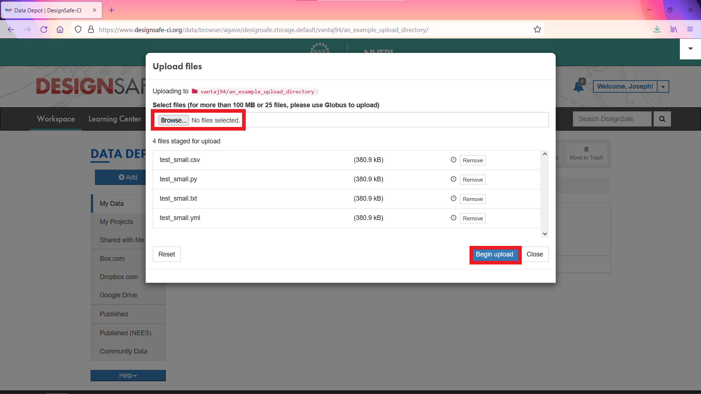

Once the transfer is complete the Upload files window will close and you will see your files in your DesignSafe directory.

**Note, if the files are not immediately visible refresh the page.**


If you wish to upload a folder, follow the same procedure as above except select **Folder upload: max 25 files**. However, be sure that the folder you wish to upload is small than 100 MB and contains fewer than 25 files. If the folder you wish to upload exceeds these limits please use one of the large data transfer methods listed in this guide rather than the web interface.

 

### [Download](#datadepotbrowser-download) { #datadepotbrowser-download }

To download a file from DesignSafe to your local desktop/laptop **select the file** you wish to download and press **Download**.

**Note depending on how you have configured your browser, it will either download the file directly to your default downloads directory or will prompt you to save the file in a location of your choice.**


If you would like to download an entire folder from DesignSafe, please use one of the large data transfer methods listed in this guide.

### [Transferring Data Inside of DesignSafe](#datadepotbrowser-transferring) { #datadepotbrowser-transferring }

You can move and copy the data inside of DesignSafe using the browser-based interface.

**Select the file** you wish to move or copy, then press **Move** or **Copy**.

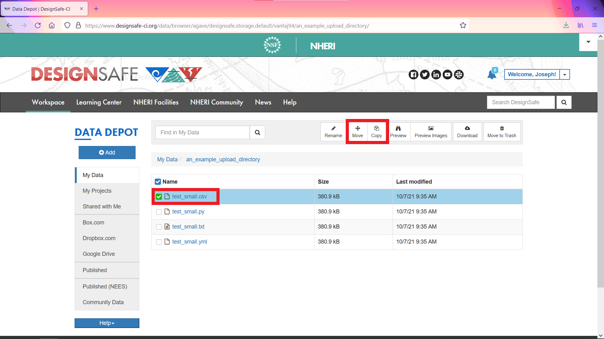

#### [If you selected Move](#datadepotbrowser-transferring-move) { #datadepotbrowser-transferring-move }

Navigate to the new destination and press **Move Here**.

**Note that you cannot move files between main directories, such as My Data and My Projects, however may copy between them. See instructions below for details.**


#### [If you selected Copy](#datadepotbrowser-transferring-copy) { #datadepotbrowser-transferring-copy }

**Use the drop down menu** in the top left to switch between main directories, such as My Data and My Projects, **navigate to the new destination**, and press **Copy Here**.

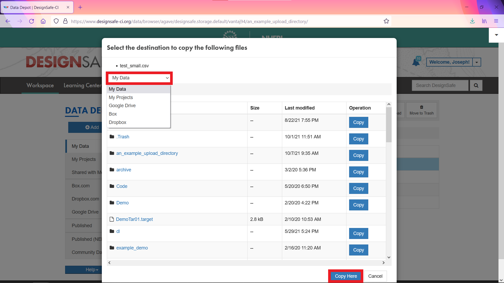

---
## [JupyterHub's Browser-Based Data Transfer Guide](#jupyterhubbrowser) { #jupyterhubbrowser }

The DesignSafe JupyterHub provides a convenient way to upload and download small amounts of data ( &lt; 100 MB, &lt; 25 files).

### [To Upload a File Through Jupyter](#jupyterhubbrowser-upload) { #jupyterhubbrowser-upload }

Launch Jupyter by logging into DesignSafe and going to **Workspace** &gt; **Tools &amp; Applications** &gt; **Analysis** &gt; **Jupyter** &gt; **Select Jupyter from dropdown**.

When your session has launched you will see a directory structure similar to that shown below.

Select **MyData**.


Navigate to the directory where you wish to upload.


Select Upload


**Select the file(s) you wish to upload and press OK.** You will now see the files have been queued for upload. Click **Upload** for each queued file.

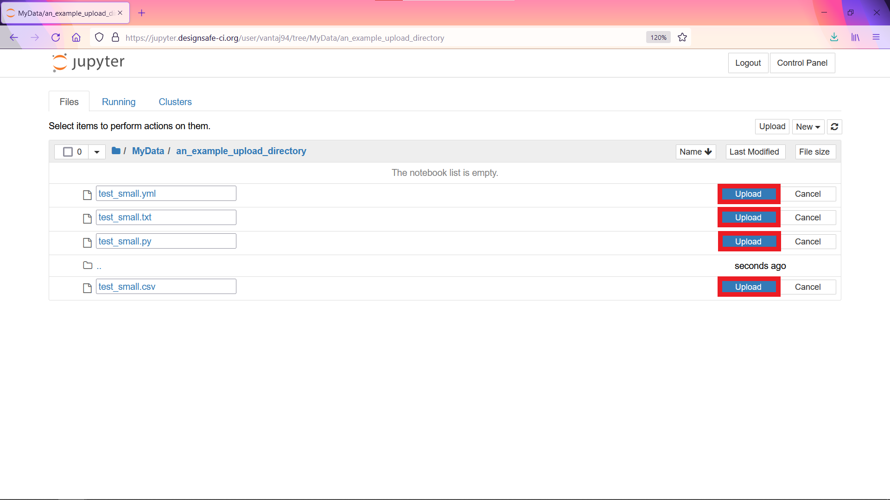

After the upload is complete the files will be viewable in Jupyter.


If you would like to upload an entire folder, please use one of the large data transfer methods listed in this guide.

 

### [To Download a File Through Jupyter](#jupyterhubbrowser-download) { #jupyterhubbrowser-download }

To download a file, **select the file** then select **Download**.

*Note depending on how you have configured your browser, it will either download the file directly to your default downloads directory or will prompt you to save the file in a location of your choice.*


If you would like to download an entire folder, please use one of the large data transfer methods listed in this guide. 

If you have any issues transferring files using the JupyterHub browser interface,</strong><strong> please create a ticket (<a href="https://designsafe-ci.org/help">https://designsafe-ci.org/help</a>).


## [Cloud Storage Transfer](#cloud) { #cloud }

DesignSafe provides users the capability to connect to their preferred cloud storage provider.

Once connected, data held on the selected cloud storage provider can be easily copied to and from DesignSafe. Note DesignSafe does not actively synchronize your data and so any copy operation must be initiated manually. Any changes you make to data transferred to DesignSafe from a cloud storage provider will not affect the files located on the cloud storage provider. To update the files on the cloud storage provider you must manually copy them back to the provider using the copy functionality in the DesignSafe browser interface.

The three main cloud storage providers, <a href="#cloud-box">Box</a>, <a href="#cloud-dropbox">Dropbox</a>,and <a href="#cloud-googledrive">Google Drive</a>, are supported on DesignSafe. Detailed instructions for setting up these integrations is provided below.

### [Box](#cloud-box) { #cloud-box }

**Login to DesignSafe** and go to **Workspace &gt; Data Depot &gt; Box.com**.

Click here to connect to your Box account.


Click Setup Box.com.

Follow the on-screen instructions to login to your Box.com account.


Return to the Box.com section of the Data Depot. You can now copy files to and from your Box.com account. For instructions on copying data in DesignSafe see the <a href="#datadepotbrowser">Data Depot's Browser-Based Data Transfer Guide</a>.


### [Dropbox](#cloud-dropbox) { #cloud-dropbox }

Login to DesignSafe and go to Workspace &gt; Data Depot &gt; Dropbox.com.

Click here to connect to your Dropbox account.


Click Setup Dropbox.com.

Follow the on-screen instructions to login to your Dropbox.com account.


Return to the Dropbox.com section of the Data Depot. You can now copy files to and from your Dropbox.com account. For instructions on copying data in DesignSafe see the <a href="#datadepotbrowser">Data Depot's Browser-Based Data Transfer Guide</a>.


### [Google Drive](#cloud-googledrive) { #cloud-googledrive }

Login to DesignSafe and go to Workspace &gt; Data Depot &gt; Google Drive

Click here to connect to your Google Drive account.


Click Setup Google Drive.

Follow the on-screen instructions to login to your Google Drive account.


Return to the Google Drive section of the Data Depot. You can now copy files to and from your Google Drive account. For instructions on copying data in DesignSafe see the <a href="#datadepotbrowser">Data Depot's Browser-Based Data Transfer Guide</a>.


---

**Important: To avoid problems when transferring files to DesignSafe, name your files using standard ASCII characters, for example [a-z][A-Z][0-9], and avoid the use of special characters, for example [%,*,#,@,°].**

**If you have any issues transferring files to DesignSafe using a method listed above, please create a ticket (<a href="https://designsafe-ci.org/help">https://designsafe-ci.org/help</a>).**


*Last Update: October 2021*
