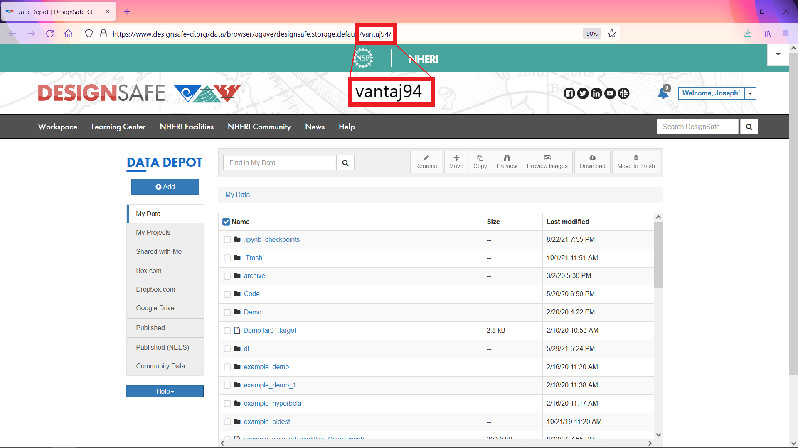
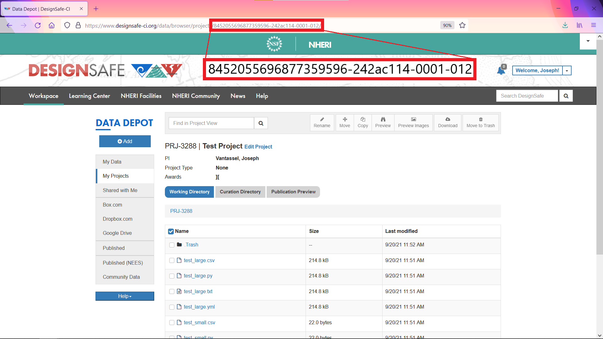
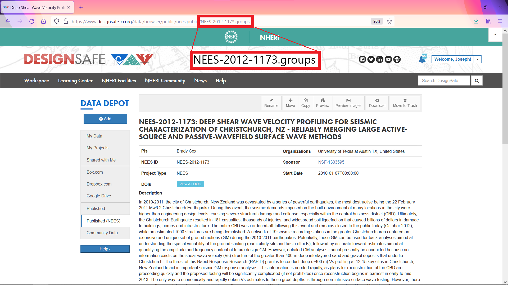

The data stored on DesignSafe resides on the large (40 PB), shared data resource Corral located at the Texas Advanced Computing Center. Importantly, Corral services many different projects, not only DesignSafe, and as such utilizes a complex file structure for organization. The purpose of this documentation is to explain how to navitage this complex file structure to locate the directories pertinent to your data transfer needs on DesignSafe.

There are four main locations for data transfers on DesignSafe: <a href="#mydata">My Data</a>, <a href="#myprojects">My Projects</a>, <a href="#published-nheri">Published</a>, and <a href="#published-nees">Published (NEES)</a>, they are each presented in detail below.

### [Path to My Data](#mydata) { #mydata }

For <strong>My Data</strong> set Path to <strong>/data/designsafe/mydata/&lt;username&gt;/</strong>

Replace <strong>&lt;username&gt;</strong> with your username. You can find your username by examining the URL in My Data, see figure below.

 

### [Path to My Projects](#myprojects) { #myprojects }

For <strong>My Projects</strong> set Path to <strong>/corral/projects/NHERI/projects/&lt;project-uid&gt;/</strong>

Replace <strong>&lt;project-uid&gt;</strong> with your projects unique identifier (UID). You can find your projects UID by examining the URL in My Projects, see figure below.

### [Path to Published](#published-nheri) { #published-nheri }

For <strong>Published </strong>DesignSafe projects set Path to <strong>/corral/projects/NHERI/published/&lt;PRJ-XXXX&gt;</strong>

Replace <strong>&lt;PRJ-XXXX&gt;</strong> with your project's number. You can find your project number by examining the URL in Published, see figure below.

### [Path to Published (NEES)](#published-nees) { #published-nees } 

For <strong>Published (NEES)</strong> projects set Path to <strong>/corral/projects/NHERI/public/projects/&lt;NEES-XXXX-XXXX.groups&gt;</strong>

Replace <strong>&lt;NEES-XXXX-XXXX.groups&gt;</strong> with the NEES project number. You can find the NEES project number by examining the URL in Published (NEES), see figure below.

<strong>If you have any issues setting the path to DesignSafe on Corral, please create a ticket (<a href="https://designsafe-ci.org/help">https://designsafe-ci.org/help</a>)</strong>.
