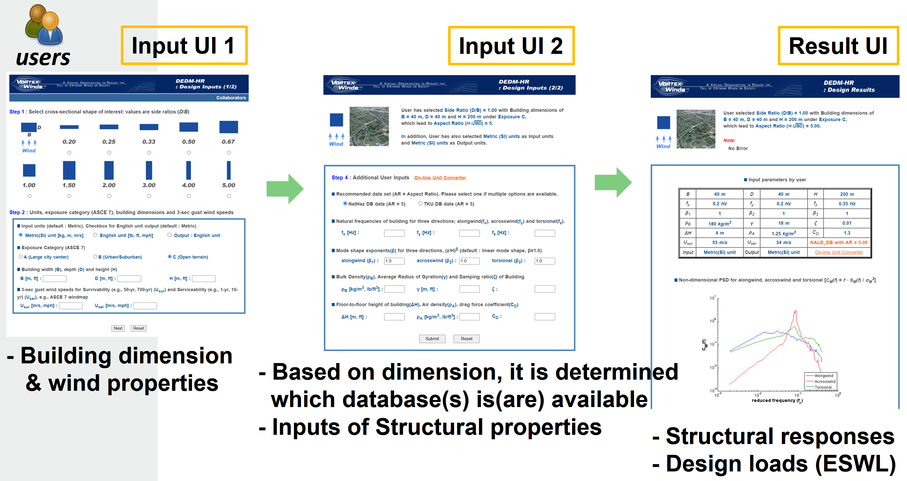
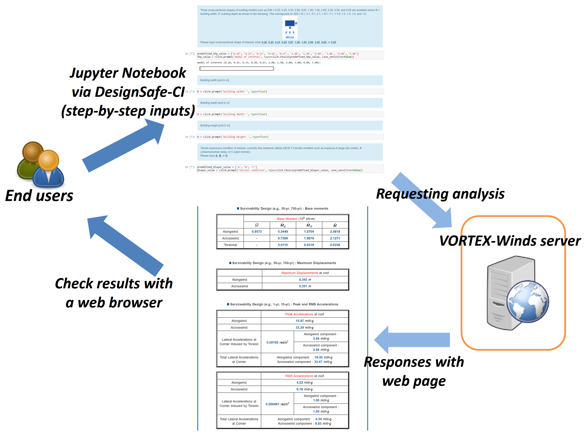
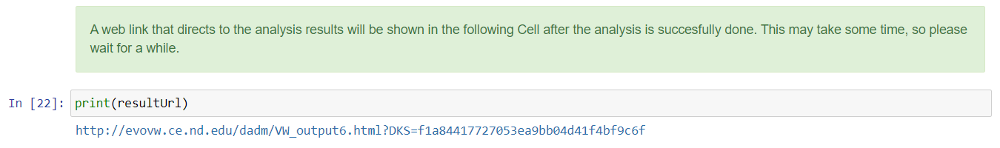
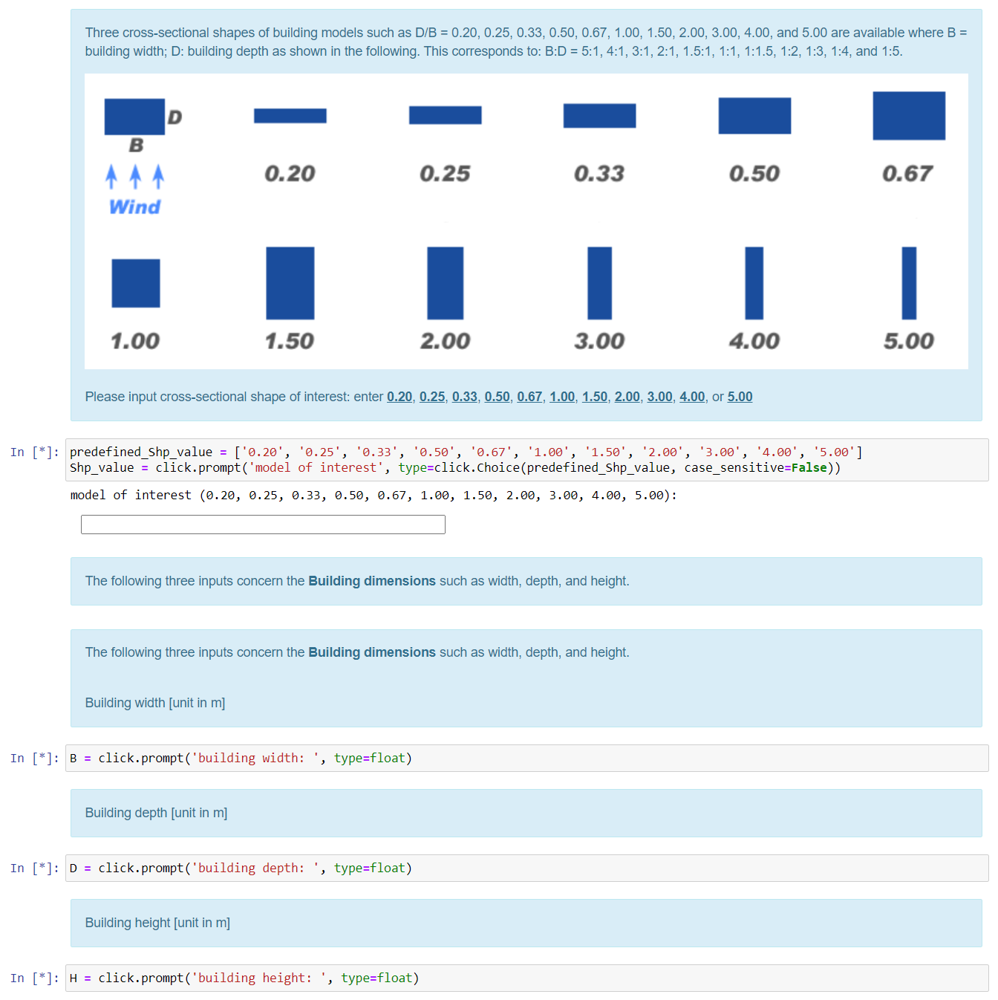

## Jupyter Notebook for DEDM-HR

**Jupyter Notebook for Database-Enabled Design Module for High-Rise Buildings**

**Dae Kun Kwon - [NatHaz Modeling Laboratory](https://nathaz.nd.edu/) & [Center for Research Computing (CRC)](https://crc.nd.edu/), University of Notre Dame**  
**Ahsan Kareem - [NatHaz Modeling Laboratory](https://nathaz.nd.edu/), University of Notre Dame**  

Key Words: Database-enabled design, High-rise buildings, Wind loads, Wind response

### Resources
The example makes use of the following DesignSafe resources:<br/>
• [Jupyter Notebook for DEDM-HR: Step-by-step approach](https://jupyter.designsafe-ci.org/hub/user-redirect/notebooks/CommunityData/Use%20Case%20Products/DEDM-HR/Jupyter%20DEDM-HR%20Step-by-step%20v1.0.ipynb)<br/>
• [Jupyter Notebook for DEDM-HR: One-step approach](https://jupyter.designsafe-ci.org/hub/user-redirect/notebooks/CommunityData/Use%20Case%20Products/DEDM-HR/Jupyer%20DEDM-HR%20One-step%20v1.0.ipynb)<br/>
• [DesignSafe Tool: VORTEX-WINDS: DEDM-HR](https://www.designsafe-ci.org/rw/workspace/#!/VORTEX-Winds:%20DEDM-HR-1.0)

### Description

Successful utilization of digital technologies in different domains requires different platforms that provide the necessary workflows and software to address the computational requirements. In the area of wind engineering, the effects of wind on structures are typically carried out in research and design by wind tunnel studies, or reliance is made on building standards. The area of computational wind engineering is emerging fast to complement these resources and DesignSafe offers such a platform to address the wind load effects on structures computationally, e.g., using database-enabled design (DED) and computational fluid mechanics (CFD). Jupyter Notebooks are emerging as a web-based interactive computational platform ideally suited for carrying out multiple simulations cases and utilizing DED results for other applications. A database-enabled design of high-rise buildings is developed for the Jupyter Notebook platform akin to the currently available version in the DesignSafe in Tools & Applications > Hazard Apps > VORTEX-Winds: DEDM-HR. This will offer researchers dealing with tall buildings in several NEHRI projects to have quick access to wind load effects and performance of tall buildings in the Jupyter environment.

All files discussed in this use case are shared at [Data Depot > Community Data](https://www.designsafe-ci.org/data/browser/public/designsafe.storage.community/Use%20Case%20Products/DEDM-HR/). It is recommended that users make a copy of the contents to their directory (My Data) for tests and simulations.

### Implementation

#### Background: web-enabled multiple database-enabled design module for high-rise buildings (DEDM-HR)

A database-enabled design (DED) procedure has been gaining acceptance to overcome inherent limitations pertaining to current codes and standards that are very limited to providing aerodynamic effects on structures such as acrosswind and torsional wind loads. The basic concept is to directly use wind tunnel-derived data for the wind-induced response assessment in a better and more reliable way than relying on code-specified load effects in which the overall accuracy may be compromised due to several simplifications introduced. Although DED is a promising design procedure, it requires not only a database of wind tunnel data, which often presents a limited range of building shapes and configurations, and familiarity with the manipulation of the database and analysis/design procedure for a quick assessment. To alleviate this limitation, Kwon and Kareem (2013) [1] introduced a new concept of DED, a database-enabled design module for high-rise buildings (DEDM-HR), which hosts multiple databases in collaboration with various research groups and efficiently utilizes them for enhancing the number of building shapes and configurations. To improve the user’s accessibility, the DEDM-HR was implemented in a web-based online module with user-friendly interfaces for both the input and output in terms of familiar web-style forms that are commonly used in most web services. Currently, the DEDM-HR hosts two databases: one is from the NatHaz Modeling Laboratory, University of Notre Dame, USA [2, 3] (NatHaz database) and the other is from the Wind Engineering Research Center (WERC), the Tamkang University, Taiwan [4, 5] (TKU database). Fig. 1 shows the overall workflow of the DEDM-HR.


<p align="center">Fig. 1. Overall workflow of the web-enabled DEDM-HR</p>

#### Jupyter Notebooks for the DEDM-HR

Although the aforementioned web-enabled DEDM-HR offers a great advantage for a preliminary design of a high-rise building, it has some limitations such as performing a host of design cases, utilizing DED results for other applications, etc. This can be overcome by newly developed Jupyter Notebooks for the DEDM-HR, which interrogates the pre-existing DEDM-HR server with high-rise databases. To this end, the DEDM-HR hosted at [VORTEX-Winds server](https://vortex-winds.org) is manipulated to establish communication with the Jupyter Notebook’s requests. Accordingly, an end user at DesignSafe can access the Notebook to directly execute a DED of a high-rise building.<br/>
Fig. 2 shows a schematic diagram of the Jupyter Notebook-based procedure. Currently, two Notebooks are provided: one is a Step-by-step approach and the other is a One-step approach. For the former, when a user runs the Notebook, a prompt will show up for each item to input the value of the parameter involved (step-by-step approach), e.g., the cross-sectional shape of the building, building dimensions, terrain/exposure condition (urban area, suburban, open terrain), wind properties such as 3-sec gust wind speeds for survivability and habitability/occupant comfort designs (e.g., ASCE 7 standard), dynamic properties of the building such as natural frequency, damping ratio, and mode shape, etc. It has similar input terms to those used in the web-enabled DEDM-HR. Alternatively, an experienced user can utilize a One-step approach by making inputs directly at the Notebook cell. Those two approaches will be further discussed in the next sections.<br/>
After all the inputs are made, the Notebook will request an analysis to be carried out at the VORTEX-Winds server, which will be explained in the later section in detail. The server will generate a web page that contains the analysis results when the analysis is completed. A corresponding web link is automatically generated at the Notebook (Fig. 3), thus the user can access the page via a web browser. The results consist of a table of user’s inputs; non-dimensional power spectral density for alongwind, acrosswind, and torsional directions; base moments; maximum displacements; peak and RMS accelerations; plots of equivalent static wind loads (ESWL) such as mean, background, and resonant load components for all three directions.
It is worth noting that this Jupyter Notebook implicitly saves the computed ESWL file into DesignSafe’s Data Depot (My Data), which is the same location where the user copied the Jupyter Notebook. Accordingly, a user can either conveniently plot the ESWL independently using, e.g., Python Matplotlib, graphic software, etc., or utilize the ESWL for other applications such as structural analysis, etc. A description of the ESWL file is made in the Jupyter Notebook, thus details are omitted here.<br/>
DesignSafe recently introduced a [Jupyterhub Spawner](https://www.designsafe-ci.org/rw/user-guides/tools-applications/jupyter/) for users to run one of two Jupyter server images. Jupyter Notebooks presented in this document are tested under the Classic Jupyter Image as the Jupyter server.


<p align="center">Fig. 2. A schematic diagram of the Jupyter Notebook-based procedure for the DEDM-HR</p>


<p align="center">Fig. 3. Generated web link after analysis</p>

##### Step-by-step approach

Fig. 4 shows an example of the step-by-step input interface, [Jupyter DEDM-HR Step-by-step v1.0.ipynb](https://www.designsafe-ci.org/data/browser/public/designsafe.storage.community/Use%20Case%20Products/DEDM-HR/), which exhibits the inputs of the cross-sectional shape of the building and building dimensions such as building width, depth, and height. For each input form, an instruction/explanation (a cell with blue/green background color) is given for the user to type an appropriate value. By typing an input form and Enter, then the next input form will be shown if the input was made correctly. To minimize the input errors by the user, this Notebook incorporated the Python package “Click”. It is used to limit the user’s input in certain value (e.g., cross-sectional shape input in Fig. 3), allow case-insensitive inputs, and check number or string inputs. To load the package “Click”, the following script is utilized in the Notebook.

```python
import sys
!{sys.executable} -m pip install click

import click
```


<p align="center">Fig. 4. An example of step-by-step input forms</p>

##### One-step approach

The aforementioned Step-by-step Jupyter Notebook is intended for helping easily input forms for a user who is not familiar with the DEDM-HR. To streamline the overall input process, a One-step Jupyter Notebook template, [Jupyer DEDM-HR One-step v1.0.ipynb](https://www.designsafe-ci.org/data/browser/public/designsafe.storage.community/Use%20Case%20Products/DEDM-HR/), is provided, which is only comprised of a single cell involving requests to the server that are discussed in the previous section. Using this template, a user only needs to change input values at the input block and run the cell, which is shown in the following. Please be cautious that cross-sectional shape and terrain/exposure condition inputs are string type and others are number type.

```python
# Please change this input block only
#------------------------------------------------------------------
# cross-sectional shape: string
Shp_value = '1.00'
# building width [m]: float (number)
B = 40
# building depth [m]: float
D = 40
# building height [m]: float
H = 200
# terrain/exposure condition (A, B, or C): string
Blayer_value = 'C'
# 3-sec gust wind for survivability design [m/s]: float
U_10 = 53
# 3-sec gust wind for serviceability/human comfort [m/s]: float
U_ser = 34
# natural frequency of x (alongwind) [Hz]: float
freq_x = 0.2
# natural frequency of y (acrosswind) [Hz]: float
freq_y = 0.2
# natural frequency of t (torsion) [Hz]: float
freq_z = 0.35
# mode shape exponent of x (alongwind): float
beta1 = 1
# mode shape exponent of y (acrosswind): float
beta2 = 1
# mode shape exponent of t (torsion): float
beta3 = 1
# building density [kg/m^3]: float
b_density = 180
# radius of gyration [m]: float
rad_gyr = 18
# damping ratio: float (e.g., 1 % damping => 0.01)
damping = 0.01
# interstory (floor-to-floor) height [m]: float
delta_H = 4
# air density [kg/m^3]: float (typical value is 1.25)
air_density = 1.25
# drag coefficient: float (typical value is 1.3)
drag_Cd = 1.3
#------------------------------------------------------------------
```

##### Requesting analysis to the VORTEX-Winds server

This is the key part of the developed Jupyter Notebook. To achieve the request to the server, this Notebook utilized the Python package, “Requests”, which is a popular HTTP library for handling HTTP requests such as GET and POST and already available in the DesignSafe Jupyer server. It is worth noting that this Notebook internally performs three requests to the server. The first request is for determining which database is available because of the presence of multiple databases. An example script is:

```python
# define headers for requesting to DEDM-HR
headers = {
    'Connection': 'keep-alive',
    'Cache-Control': 'max-age=0',
    'Origin': 'http://evovw.ce.nd.edu',
    'Upgrade-Insecure-Requests': '1',
    'Content-Type': 'application/x-www-form-urlencoded',
    'Accept': 'text/html,application/xhtml+xml,application/xml;q=0.9,image/webp,image/apng,*/*;q=0.8',
    'Referer': 'http://evovw.ce.nd.edu/dadm/VW_design6_noauth1.html',
    'Accept-Encoding': 'gzip, deflate',
    'Accept-Language': 'en-US,en;q=0.9',
}

# set data
data = {
  'RRunit' : 'metric',
  'Shp_value': Shp_value,
  'Blayer_value': Blayer_value,
  'U_10': U_10,
  'U_ser': U_ser,
  'B': B,
  'D': D,
  'H': H,
  'cUrlRequest' : 'DEDM-HR jupyter Notebook',
}

response = requests.post('http://evovw.ce.nd.edu/dadm/VW_step2_1.php', headers=headers, data=data)
```

Based on the first request, the second request is subsequently made for analysis on the server. Finally, the last request is carried out to download the generated ESWL file by the server to DesignSafe’s Data Depot.

#### Conclusions

This use case demonstrates the Jupyter Notebooks developed for scripting the web-enabled DEDM-HR workflow for facilitating preliminary designs of high-rise buildings. In particular, this tool is expanded to the direct use of the Jupyter Hub in the DesignSafe CI, through which the script can be easily published and shared with NHERI and broader research communities.

#### Reference
[1] Kwon, D. K., and Kareem, A. (2013). A multiple database-enabled design module with embedded features of international codes and standards, International Journal of High-Rise buildings, CTBUH, 2(3), 257-269, http://ctbuh-korea.org/ijhrb/05ijhrb01.php?id=62.<br />
[2] Zhou, Y., Kijewski, T., and Kareem, A. (2003). “Aerodynamic loads on tall buildings: Interactive database.” Journal of Structural Engineering, ASCE, 129(3), 394-404.<br />
[3] Kwon, D., Kijewski-Correa, T., and Kareem, A. (2008). “e-analysis of high-rise buildings subjected to wind loads.” Journal of Structural Engineering, ASCE, 134(7), 1139-1153.<br />
[4] Cheng, C.-M., and Wang, J. (2004). “Wind tunnel database for an intermediate wind resistance design of tall buildings.” Proc. 1st International Symposium on Wind Effects on Buildings and Urban Environment, Tokyo Polytechnic University, Tokyo, Japan.<br />
[5] Cheng, C.-M., Lin, Y.-Y., Wang, J., Wu, J.-C., and Chang, C.-H. (2007). “The Aerodynamic Database for the Interference Effects of Adjacent Tall Buildings.” Proc. 12th International Conference on Wind Engineering, Cairns, Australia, 359-366.<br />


### Citation and Licensing

* Please cite [Kwon and Kareem (2013)](http://ctbuh-korea.org/ijhrb/05ijhrb01.php?id=62) to acknowledge the use of any resources from this use case.
* Please cite [Rathje et al. (2017)](https://doi.org/10.1061/(ASCE)NH.1527-6996.0000246) to acknowledge the use of DesignSafe resources.
* This software is distributed under the GNU General Public License (https://www.gnu.org/licenses/gpl-3.0.html).
