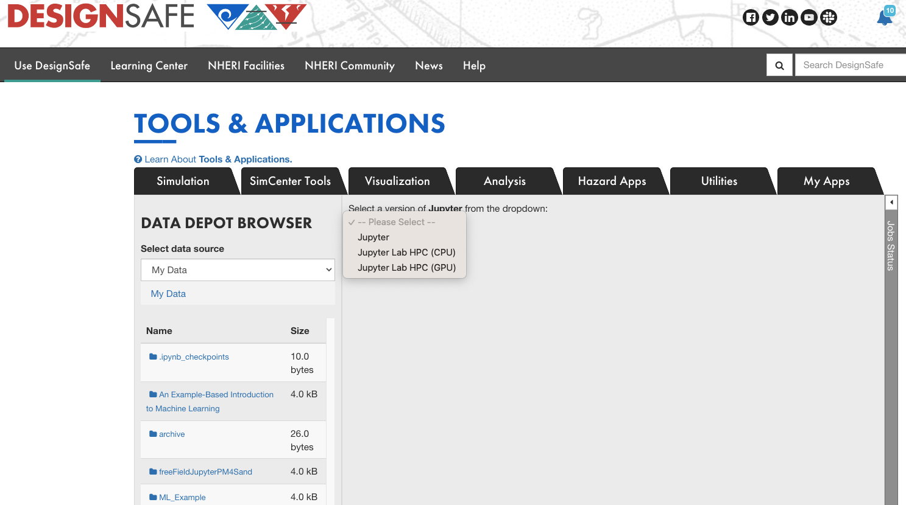
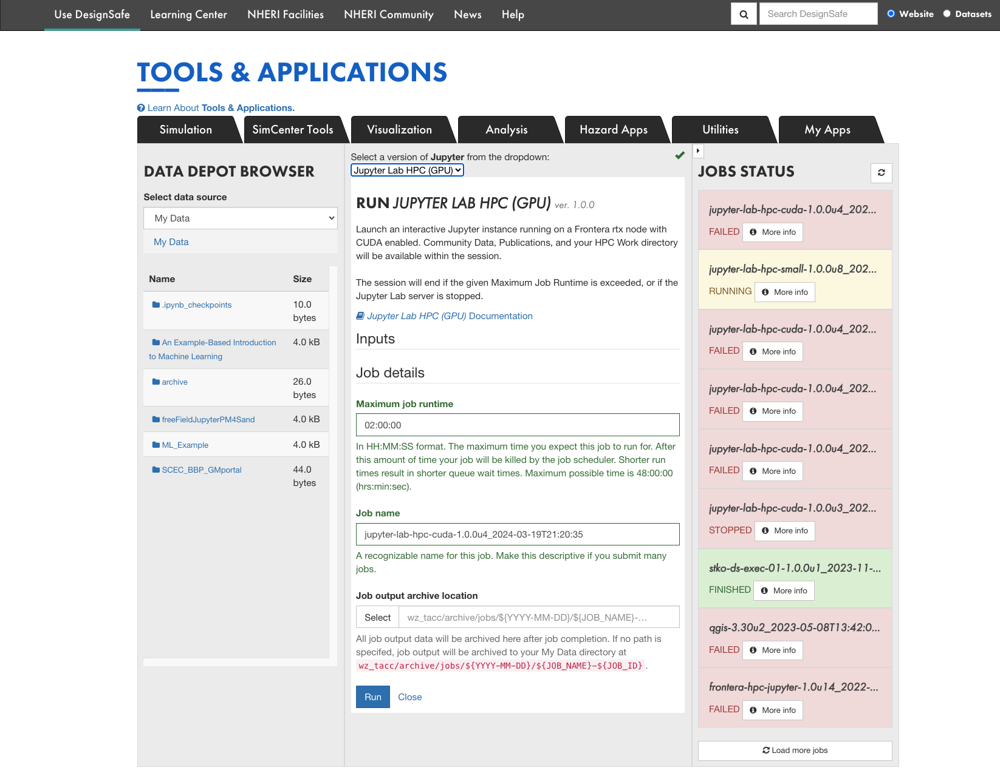
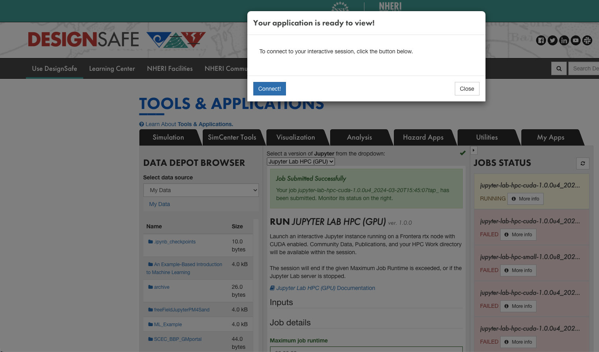
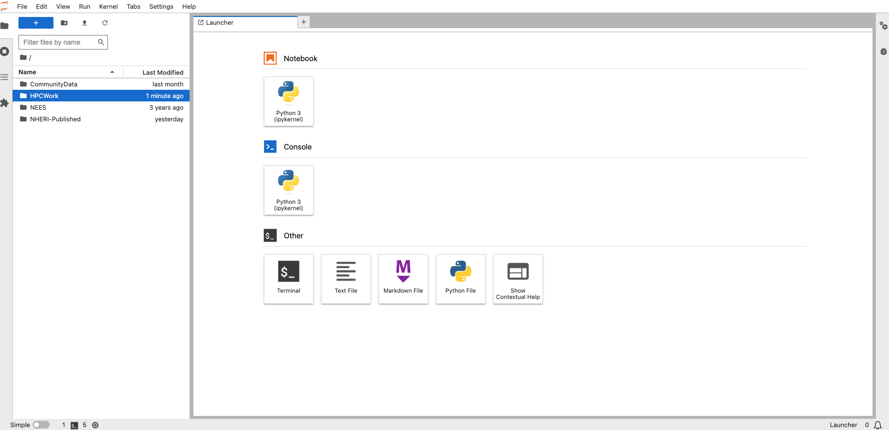
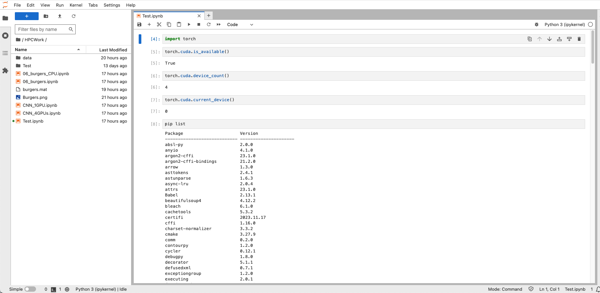

# DesignSafe HPC Jupyter Documentation

On DesignSafe web portal, three versions of Jupyter have been created, including `Jupyter`, `Jupyter Lab HPC (CPU)` and `Jupyter Lab HPC (GPU)`. `Jupyter` will be run on a virtual machine, while `Jupyter Lab HPC (CPU)` and `Jupyter Lab HPC (GPU)` will be run on CPU and GPU nodes on Frontera, respectively. In particular, the `Jupyter Lab HPC (GPU)` will be run on Frontera's NVIDIA RTX GPU nodes that have the best performance, and many commonly used Python packages for AI/ML applications have been pre-installed, including TensorFlow and PyTorch.

   

## Launch the Jupyter Lab HPC (GPU)

1. Go to [DesignSafe website](https://www.designsafe-ci.org) and sign in to your DesignSage account. Then click `Use DesignSafe` --> `Tools & Applications` --> `Analysis` --> `Jupyter` and select `Jupyter Lab HPC (GPU)`.

    

2. Once define your maximum Job runtime (no more than 48 hours) and Job name, click the `Run` buttton so the job will be submitted. Then you can monitor your job status on the right column.

3. Once your job starts, the Job Status bar will show status as "RUNNING" and a small window will pop up. Then click the `CONNECT!` button to connect to your interactive session, i.e., JupyterLab.

    

## Launch the Jupyter Notebook

1. Navigate to the `HPCWork` folder. You need to place all your data/codes/Jupyter Notebooks inside this folder. 

    

2. Click on the `Python 3 (ipykernel)` button on the right to launch a new Jupyter Notebook. In this example, a Jupyter Notebook `Test.ipynb` was created. As seen, the PyTorch has been pre-installed and a total of four GPUs have been recognized. By typing `pip list`, you can view all the Python packages that have been pre-installed, including many popular ones, such as matplotlib, numpy, scipy, TensorFlow, PyTorch, etc.

    

3. To install a Python package, simply type `!pip3 install <Python Package Name>`.

