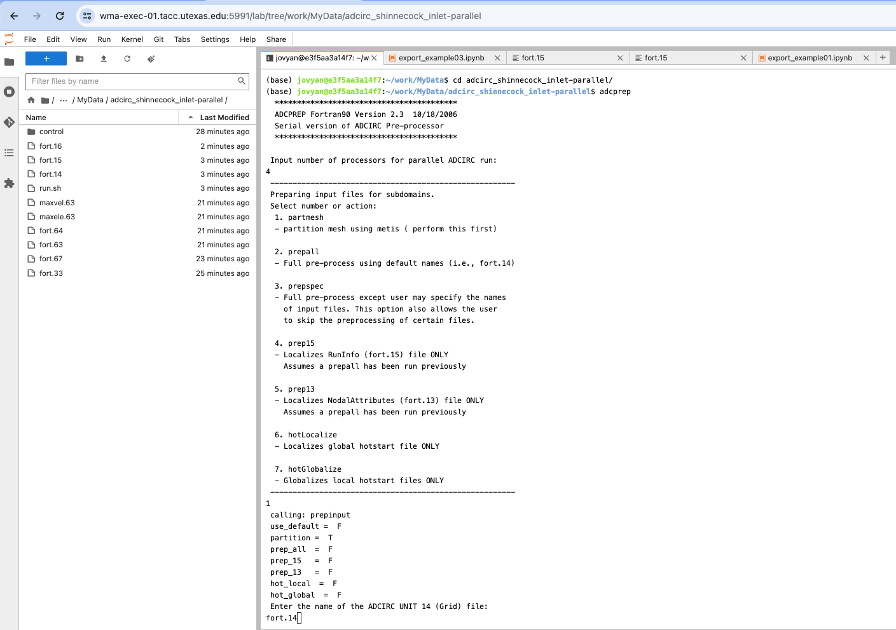

# ADCIRC User Guide { #adcirc_user_guide }

The ADCIRC (ADvanced CIRCulation) model is a system of computer programs often used in Coastal Engineering Storm Surge research for solving time dependent, free surface circulation and transport problems in two and three dimensions.
These programs utilize the finite element method in space allowing the use of highly flexible, unstructured grids.


*An Example ADCIRC Unstructed Triangular 2D Mesh For the Houston/Galveston Bay, TX region*

ADCIRC is often coupled with The wind wave model SWAN (Simulating WAves Nearshore), especially in storm-surge applications where wave radiation stress can have important effects on ocean circulation and vice cersa.
Typical research topics include:

- prediction of storm surge and flooding
- modeling tides and wind driven circulation
- larval transport studies
- near shore marine operations
- dredging feasibility and material disposal studies


The following user guide gives a brief overview of ADCIRC and how it and supporting programs can be run on DesignSafe.

## ADCIRC Applications { #adcirc_apps }

ADCIRC is a suite of Fortran programs, for either parallel or serial execution.
The main components comprise of:

- `adcirc` - Non parallelized version of ADCIRC. 
	- This version of the application is ideal for smaller simulations, and runs on a single node on Frontera. Runtimes are subject to current wait times in the Frontera job queue.
	- There is options to run the serial `adcirc` program within DesignSafe via the ADCIRC Interactive VM.
- `padcirc` - Parallelized version of ADCIRC.
	- This is the Parallel version of the ADCIRC application and uses multiple compute nodes on TACC's Frontera or Lonestar6 HPC resource and is ideal for larger simulations. Runtimes are subject to current wait times in the HPC job queues.
	- Within DesignSafe, `padcirc` simulations can be run within the ADCIRC Interactie VM, in the HPC JupyterHub, and via the TACC HPC queues on TACC's Fontera, Stampede3, and Lonestar6 HPC resources.
- `adcswan`/`padcswan` - Serial/Parallelized versions of ADCIRC coupled with SWAN
	- The tightly coupled SWAN + ADCIRC paradigm allows both wave and circulation interactions to be solved on the same unstructured mesh resulting in a more accurate and efficient solution technique.
	- This version of the application uses multiple nodes on TACC's Frontera or Lonestar6 HPC resource and is ideal for larger simulations. Runtimes are subject to current wait times in the HPC job queues.
- `adcprep`
	- `adcprep` is a utility program that prepares input files for PADCIRC & PADCSWAN simulations. It partitions the mesh accross each parallel process, distributing the necessary input files, such as fort.15, fort.14, and fort.13, through a user-friendly interface.
	- Note this utility only needs to be run when running the parallel version of ADCIRC and ADCIRC+SWAN.

Along with the above programs, commonly used utilities used in conjunction with ADCIRC include:

- FigureGen - A fortran program for visualizing ADCIRC inputs and outputs over the grid. Has a variety of capabilities, and can be run within DesignSafe as a stand-alone app or through the Interactive ADCIRC VM. See the [FigureGen Document](../../visualization/figuregen.md) for more information.
- Kalpana - A python package for visualizign ADCIRC inputs/outputs and converting them into shapefiles and google kmz files for visualization in [QGIS](../../visualization/qgis.md). Kalpana can also be run through the Interactive ADCIRC VM, or as a standalone application. See the [Kalpana Documentation](../../visualization/kalpana.md) for more information.


### Decision Matrix for ADCIRC Applications { #adcirc_decision }

Deciding which DesignSafe application to run depends on your problem domain and size.
In general, the serial adcirc application is only used for testing and benchmarking, as most problems of interest require large grids.
The easiest way to determine the size of your ADCIRC problem is to measure it in terms of the # of finite elements in your grid.
This can be found at the top of the fort.14 file (see input files for more information):

```bash
❯ head fort.14  -n 5
 Quarter Annular Grid - Example 1           ! ALPHANUMERIC DESCRIPTOR FOR GRID FILE                   
 96  63                                     ! NE,NP - NUMBER OF ELEMENTS AND NUMBER OF NODAL POINTS   
    1     60960.0         0.0    3.0480     ! NODE NO., X, Y, DEPTH
    2     76200.0         0.0    4.7625
    3     91440.0         0.0    6.8580
```
*The Quarter Annular Grid Example can be found in the CommunityData folder at ``CommunityData/Use Case Products/ADCIRC/adcirc/adcirc_quarterannular-2d'*

For example, for the common benchmark test case invovling a hypothetical quarter annular grid, we can see that the problem size is of size 96 finite elements.
This test is more than ok to run using the regular ADCIRC version, and no ``adcprep`` prior run is required.
For cases when using parallel processing, the main deciding factor can be how many parallel processes to use.
Scaling studies have shown that targeting about 2000 nodes per process is ideal for these scenarios.
Thus the following table can be helpful for deciding where and when to run each application.

| # Elements       | ADCPREP? | # Nodes per Process | Sequential ADCIRC | Parallel ADCIRC | SWAN + ADCIRC |
|------------------|----------|---------------------|-------------------|-----------------|---------------|
| < 1000           | No       | 1                   | ✅                | 🔄 [^1]         | 🔄 [^2]       |
| 1000 - 1 million | Yes      | 2000                | ❌                | ✅              | ✅            |
| > 1 million      | Yes [^3] | 2000                | ❌                | ✅ [^4]         | ✅            |

- ✅: Recommended for this scenario.
- ❌: Not recommended or not yet available.
- 🔄: Viable under certain conditions or for certain job sizes. Please refer to footnotes.

[^1]: For models with fewer than 1000 elements, parallel ADCIRC may not be necessary, but it can be used depending on the available computational resources.
[^2]: For small models, SWAN + ADCIRC might be more resource-intensive than required unless specific wave dynamics need to be resolved.
[^3]: For very large models, ADCPREP can take a significant amount of time due to the decomposition of large grids. It is recommended that this data be saved and reused when possible to avoid the need for repeated decomposition.
[^4]: For very large models with complex wave-current interactions, SWAN + ADCIRC in parallel is the recommended approach.

## ADCIRC On DesignSafe

DesignSafe Offers a variety of platforms on which to run and test ADCIRC related applications.
Behing the scenes power it is all powered by the Tapis API which connects the compute resources with the analysis environments.
In the context of how ADCIRC can be run, the two important things to keep in mind is (1) Where is the computation running and (2) Through what interface am I interacting with this compute platform.
At a high level, the compute platforms, from most powerful to least, that DesignSafe offers for computation are:

1. High Performance Computing (HPC) Job Queues - Job queues that are configured to handle jobs requiring multiple compute nodes, with GPU compute nodes also available. ADCIRC can be run on HPC job queues in the following manner:

	- HPC ADCIRC Applications - By using the pre-configured HPC applications either via the Web-Portal or throug the Tapis API. These HPC applications run pre-built version of ADCIRC on inputs that you can upload to your MyData on DesignSafe.
	- HPC Jupyter Instances - These are jupyter images running on an HPC queue, and can provide GPU support. For the moment, no native ADCIRC applications are supported in the HPC Jupyter instances, but ADCIRC can be installed in these environments.
	- TACC- By requesting a specific allocation on TACC. Usually this is done if more resources are required for larger runs. Please open a ticket if your use case requires more than the resources provided by the pre-configured HPC applications. 
	For more information on requesting HPC allocations, please refer to the [HPC Allocations documentation](../../advanced/hpcallocations.md#intro).

2. JupyterHub Images - These run on dedicated VMs, so they can handle more computation, but not as much as the HPC job queues that have access to multiple nodes for massively parallel jobs.
3. Interactive VMs - These run on shared VM resources, and therefore handle the lightest form of computations. The Interactive VM is launched from the web-portal, and offers a convenient environment for testing ADCIRC applications before running in a production environment.

### ADCIRC Through the Interactive VM

The Interactive VM is a docker image running on a shared VM with ADCIRC and supporting utilities pre-built for easy testing and development of ADCIRC related applications within the DesignSafe environment.

#### Advantages and Disadvantages of Interactive ADCIRC VM

A few advantages of using the ADCIRC VM include:

1. No queue wait time - Don't have to wait in the HPC queue to test input files.
2. Pre-compiled versions of ADCIRC and supporting utilities such as FigureGen and Kalpana.
3. Convenient Jupyter Lab interface, with plugins for github repo managemen, code formatting, and more.

Disadvantages include:

1. VM runs on a shared resource - Can be slow if lots of users are using the VM.
2. Not as large compute power - To simulate hurricanes at high-fidelity, ADCIRC needs to run on very large grids, which may take too long to run in the VM. Furthermore memory requirements for plotting and visualizing the grids and associated data may be too large for the interactive VM.

**Overall, the interactive VM is meant to be as a testing and learning environment. It is ideal to configure and test smaller runs of large jobs before submitting to the HPC queue to verify inputs/outputs are configured correctly for ADCIRC and supporting programs.**

#### Getting Started 

You can access the interactive VM  via the DesignSafe-CI workspace by selecting "Workspace" &gt; "Tools &amp; Applications" &gt; "Simulation" &gt; "ADCIRC" &gt; Select "Jupyter" &gt; "Interactive VM for ADCIRC" to start the interactive VM.


*Selecting the Interactive VM for ADCIRC*

The intereactive VM will spawn a JupyterLab instance for you on a shared VM not within the HPC queues, so wait time shoudl be minimal (all though may be a little longer if it's your first time).
After your job goes into the "Running" stage, a dialogue box should prompt you to connect to your instance.


*Once Job is running and window appears, click on Connect*

Once you click connect you should see a familiar JupyterLab interface:


*Jupyter Lab Interface Launcher screen provides Kalpana kernel and terminal environment with ADCIRC and FigureGen*

#### Example - Running an ADCIRC simulation

One way to run an ADCIRC simulation in the interactive VM is via the linux terminal available from the Jupyter Lab interface.
Open a new terminal from the launcher window, navigate to your MyData directory and create a new directory for your ADCIRC run.
We copy into this directory some example ADCIRC input files corresponding to the ADCIRC Shinnecock Inlet test case (see [ADCIRC data available on DesignSafe](./adcirc.md#adcirc-data-hosted-on-designsafe) for more example cases).

```bash
cd ~/work/MyData
cp -r ~/work/CommunityData/Use\ Case\ Products/ADCIRC/adcirc/adcirc_shinnecock_inlet .
```

**Serial Run**

Now from within this directory we can run the code in serial by simply running the ``adcirc`` command from the root directory containing the ADCIRC input files.

```bash
cd ~/work/MyData/adcirc_shinnecock_inlet
adcirc
```

You should see an output similar to:


*Example ADCIRC output indicating the max elevation and maximum water velocity values and location at each time step.*

Note the outputs are created in the same directory as the inputs (see left folder bar in Jupyter Lab interface).

**Parallel Run**

To run the same simulation in parallel, we must first run adcprep to prep the files for a parallel run.
If we want to run the same simulation with four parallel processes, we must (from a clean simulation directory) run adcprep twice.

```bash
cd ~/work/MyData
cp -r ~/work/CommunityData/Use\ Case\ Products/ADCIRC/adcirc/adcirc_shinnecock_inlet .
adcprep
```

Note adcprep is an interactive program.


*Example of running ``adcprep`` the first time to partition the mesh.*

On the first run through the you want to partition the mesh inputing in order:

1. Number of processes for parallel run - Be careful it does not exist available processes from an mpi-run.
2. Action to perform - Option 1 on the first run to partition the mesh, which must be done first.
3. Name of the fort.14 file - In our case the default name of fort.14

After partitioning the mesh, a ``partmesh.txt`` and ``metis_graph.txt`` file should be created.
On the second run, you will input in the following order:

1. Number of processes for parallel run - Be careful it does not exist available processes from an mpi-run.
2. Action to perform - Option 2 on the second run to prep the rest of the input files.


*Example of running ``adcprep`` the second time to prep individual PE* run directories.*

Note how after the second adcprep run, PE* directories are created for the input/output files corresponding to each individual process.

After both runs of ``adcprep``, ``padcirc`` can now be run.
Note how it must be launched using the ``mpirun`` command, specifying the number of outputs.

```
mpirun -np 4 padcirc
```


### Running ADCIRC on HPC Resources

ADCIRC can be run on HPC resources at TACC through DesignSafe through the pre-configured HPC applications.
Currently all these are configured to run only on TACC's [Frontera supercomputer](https://tacc.utexas.edu/systems/frontera/).

| App ID								| App Name									 |
|---------------------------------------|--------------------------------------------|
| adcirc_netcdf_55_Frontera-55.01u4     | ADCIRC-V55 (Frontera)                      |
| padcirc_swan-net_frontera_v55-55.00u4 | PADCIRC SWAN (Frontera) - V55              |
| padcirc-frontera-55.01u4              | PADCIRC (Frontera) - V55                   |

Note while the web portal provides a convenient interface to submit HPC jobs, the Tapis API provides a more programmatic way to interact and launch jobs.
The corresponding Tapis application IDs of the web-portal apps avaialable are listed in the table above.
We will review how to run HPC jobs through both of these interfaces below.

#### Using the Web Portal

To access the DesignSafe

<ul>
	<li>Select the appropriate ADCIRC application from the Simulation tab in the Workspace.</li>
	<li>Locate your Input Directory (Folder) with your input files that are in the Data Depot and follow the onscreen directions to enter this directory in the form.</li>
	<li>For the Parallel versions, enter your Mesh File into the form (usually fort.14 file).</li>
	<li>Enter a maximum job runtime in the form. See guidance on form for selecting a runtime.</li>
	<li>Enter a job name.</li>
	<li>Enter an output archive location or use the default provided.</li>
	<li>For the Parallel versions, select the number of nodes to be used for your job. Larger data files run more efficiently on higher node counts.</li>
	<li>Click Run to submit your job.</li>
	<li>Check the job status by clicking on the arrow in the upper right of the job submission form.</li>
</ul>


#### Using Tapis

> **Note:** These instructions are for Tapis v2. See [documentation on Tapis v2](https://tacc-cloud.readthedocs.io/projects/agave/en/latest/) on how to install the Tapis API, and in more in depth documentation. The below uses the Tapis Command Line Interface (CLI). They assume you've also authenticated with tapis using the `tapis auth init` command. Note that DesignSafe's native JupyterHub environment comes with the Tapis API pre-installed, so the following can be run from within a regular Jupyter Analysis Environment from the Web-Portal.

The same ADCIRC applications that are run through the front-end interface can be run via the Tapis v2 API.
For example, to view configurations for the PADCIRC (Frontera) v55 application, we can simply perform a `tapis app show` command:

```bash
$ tapis app show
$ tapis apps show padcirc-frontera-55.01u4
+--------------------------+-------------------------------------------------------------------------------------------------------------------------------------------------------------+
| Field                    | Value                                                                                                                                                       |
+--------------------------+-------------------------------------------------------------------------------------------------------------------------------------------------------------+
| id                       | padcirc-frontera-55.01u4                                                                                                                                    |
| name                     | padcirc-frontera                                                                                                                                            |
| version                  | 55.01                                                                                                                                                       |
| revision                 | 4                                                                                                                                                           |
| label                    | PADCIRC (Frontera) - V55                                                                                                                                    |
| lastModified             | a year ago                                                                                                                                                  |
| shortDescription         | Parallel ADCIRC is a computer program for solving systems of shallow water equations.                                                                       |
| longDescription          | PADCIRC is the parallel version of the ADCIRC which is optimized for enhanced performance on multiple computer nodes to run very large models. It includes  |
|                          | MPI library calls to allow it to operate at high efficiency on parallel machines.                                                                           |
| owner                    | ds_admin                                                                                                                                                    |
| isPublic                 | True                                                                                                                                                        |
| executionType            | HPC                                                                                                                                                         |
| executionSystem          | designsafe.community.exec.frontera                                                                                                                          |
| deploymentSystem         | designsafe.storage.default                                                                                                                                  |
| available                | True                                                                                                                                                        |
| parallelism              | PARALLEL                                                                                                                                                    |
| defaultProcessorsPerNode | 168                                                                                                                                                         |
| defaultMemoryPerNode     | 192                                                                                                                                                         |
| defaultNodeCount         | 3                                                                                                                                                           |
| defaultMaxRunTime        | 02:00:00                                                                                                                                                    |
| defaultQueue             | normal                                                                                                                                                      |
| helpURI                  | https://www.designsafe-ci.org/rw/user-guides/tools-applications/simulation/adcirc/                                                                          |
| deploymentPath           | /applications/padcirc-frontera-55.01u4.zip                                                                                                                  |
| templatePath             | wrapper-frontera.sh                                                                                                                                         |
| testPath                 | test/test.sh                                                                                                                                                |
| checkpointable           | False                                                                                                                                                       |
| uuid                     | 4548497563320577555-242ac11b-0001-005                                                                                                                       |
| icon                     | None                                                                                                                                                        |
+--------------------------+-------------------------------------------------------------------------------------------------------------------------------------------------------------+
```

To get an example job .json config for submitting this job we can use the `tapis jobs init` command:

```bash
$ tapis jobs init padcirc-frontera-55.01u4 > test_job.json
$ cat test_job.json
{
  "name": "padcirc-frontera-job-1715717562412",
  "appId": "padcirc-frontera-55.01u4",
  "batchQueue": "normal",
  "maxRunTime": "01:00:00",
  "memoryPerNode": "192GB",
  "nodeCount": 1,
  "processorsPerNode": 168,
  "archive": true,
  "inputs": {
    "inputDirectory": "agave://designsafe.storage.community/app_examples/adcirc/EC2001"
  },
  "parameters": {},
  "notifications": [
    {
      "event": "*",
      "persistent": true,
      "url": "carlosd@tacc.utexas.edu"
    }
  ]
}
```

Note how the input directory is a DesignSafe Agave URI (see [documentation on how to use agave URIs](https://tacc-cloud.readthedocs.io/projects/agave/en/latest/agave/guides/files/introduction.html)).

Now modify the test job the following way:

1. Change the queue to the development queue (to wait less time)
2. Node Count to 1 and the processors per node to 40
3. Runtime to 30 minutes
4. Notifications email accordingly (note that it should default to the email address associated with your DesignSafe account).

The resulting json file should look like:

```json
{
  "name": "padcirc-frontera-job-1715717815835",
  "appId": "padcirc-frontera-55.01u4",
  "batchQueue": "development",
  "maxRunTime": "00:30:00",
  "memoryPerNode": "192GB",
  "nodeCount": 1,
  "processorsPerNode": 40,
  "archive": true,
  "inputs": {
	"inputDirectory": "agave://designsafe.storage.community/app_examples/adcirc/EC2001"
  },
  "parameters": {},
  "notifications": [
    {
      "event": "*",
      "persistent": true,
      "url": "carlosd@tacc.utexas.edu"
    }
  ]
}
```

Now to submit the job you can perform a `tapis jobs submit` command, specifying the job config file just created:

```bash
$ tapis jobs submit -F test_job.json 
fatal: not a git repository (or any of the parent directories): .git
+--------+------------------------------------------+
| Field  | Value                                    |
+--------+------------------------------------------+
| id     | f6949b3e-a5c9-4c8d-b985-c4bfb4baccb4-007 |
| name   | padcirc-frontera-job-1715717815835       |
| status | ACCEPTED                                 |
+--------+------------------------------------------+
```

> **Note**: You can ignore the "fatal" git repository error.

To view the status of your job, you can list all your jobs (using a `head` command to get the first couple of jobs):

```bash
$ tapis jobs list | head -n 4
+------------------------------------------+--------------------------------------------------------------+----------+
| id                                       | name                                                         | status   |
+------------------------------------------+--------------------------------------------------------------+----------+
| f6949b3e-a5c9-4c8d-b985-c4bfb4baccb4-007 | padcirc-frontera-job-1715717815835                           | RUNNING  |
```

Note your job will be viewable from the front-end web interface as well:


*Jobs submitted via the Tapis API will be visible on the web portal.*

And to see the complete job config you can always do a `tapis job show` command:

```bash
$ tapis jobs show f6949b3e-a5c9-4c8d-b985-c4bfb4baccb4-007
+--------------------+----------------------------------------------------------------------------------------------------------------+
| Field              | Value                                                                                                          |
+--------------------+----------------------------------------------------------------------------------------------------------------+
| accepted           | 2024-05-14T21:59:43.351Z                                                                                       |
| appId              | padcirc-frontera-55.01u4                                                                                       |
| appUuid            | 4548497563320577555-242ac11b-0001-005                                                                          |
| archive            | True                                                                                                           |
| archiveOnAppError  | False                                                                                                          |
| archivePath        | clos21/archive/jobs/job-f6949b3e-a5c9-4c8d-b985-c4bfb4baccb4-007                                               |
| archiveSystem      | designsafe.storage.default                                                                                     |
| blockedCount       | 0                                                                                                              |
| created            | 2024-05-14T21:59:43.354Z                                                                                       |
| ended              | 21 minutes ago                                                                                                 |
| failedStatusChecks | 0                                                                                                              |
| id                 | f6949b3e-a5c9-4c8d-b985-c4bfb4baccb4-007                                                                       |
| lastStatusCheck    | 21 minutes ago                                                                                                 |
| lastStatusMessage  | Transitioning from status ARCHIVING to FINISHED in phase ARCHIVING.                                            |
| lastUpdated        | 2024-05-14T22:01:22.494Z                                                                                       |
| maxHours           | 0.5                                                                                                            |
| memoryPerNode      | 192.0                                                                                                          |
| name               | padcirc-frontera-job-1715717815835                                                                             |
| nodeCount          | 1                                                                                                              |
| owner              | clos21                                                                                                         |
| processorsPerNode  | 40                                                                                                             |
| remoteEnded        | 21 minutes ago                                                                                                 |
| remoteJobId        | 6316891                                                                                                        |
| remoteOutcome      | FINISHED                                                                                                       |
| remoteQueue        | development                                                                                                    |
| remoteStarted      | 2024-05-14T22:00:05.629Z                                                                                       |
| remoteStatusChecks | 2                                                                                                              |
| remoteSubmitted    | 22 minutes ago                                                                                                 |
| schedulerJobId     | None                                                                                                           |
| status             | FINISHED                                                                                                       |
| submitRetries      | 0                                                                                                              |
| systemId           | designsafe.community.exec.frontera                                                                             |
| tenantId           | designsafe                                                                                                     |
| tenantQueue        | aloe.jobq.designsafe.submit.DefaultQueue                                                                       |
| visible            | True                                                                                                           |
| workPath           | /scratch1/05400/ds_apps/clos21/job-f6949b3e-a5c9-4c8d-b985-c4bfb4baccb4-007-padcirc-frontera-job-1715717815835 |
+--------------------+----------------------------------------------------------------------------------------------------------------+
```

Note once the status of the job reaches the `FINISHED` state, you should be able to find the job outputs in the archive directory.
Here we see if is on the storage system `designsafe.storage.default` at the path `clos21/archive/jobs/job-f6949b3e-a5c9-4c8d-b985-c4bfb4baccb4-007`.
This path should be in my `MyData` directory, which I can view from the front end to see my output ADCIRC files:


*Outputs will be found in `MyData` within the the DataDepot.*

See guides on [FigureGen Document](../../visualization/figuregen.md) and [Kalpana Documentation](../../visualization/kalpana.md) for info on how ot visualize ADCIRC output files.  

## ADCIRC Reference

The below section provides a brief overview of more techinical aspects of ADCIRC for quick reference. 
Links to supporting documentation are included or can be found below in the [external documentation](./adcirc.md#external-documentation--external_docs).

### ADCIRC Command Line Options



### ADCIRC Input Files



### ADCIRC Outputs Files



### ADCIRC Examples



### ADCIRC Installation (Advanced)



## Resources and Documentation

The following sections provide further information on useful resources for using ADCIRC.

### ADCIRC Data Hosted on DesignSafe

A wealth of ADCIRC related data can be found already on DesginSafe, in both the CommunityData and published projects folder.
The following are a few notable locations to find already available data to use for ADCIRC simulations.
Note you want to most likely copy these files to your MyData or HPC work before using them, since CommunityData and Published Projects directory are read only, and can lead to issues when running jobs/notebooks from these directories.

- Community Data :
	- Use Case Products - ``CommunityData/Use Case Products/ADCIRC/adcirc``
	- App Examples - ``CommunityData/app_examples/``
- Notable ADCIRC Published Projects:
	- [CERA / ADCIRC Storm Surge Hindcasts: Historical Storms 2003-2022](https://www.designsafe-ci.org/data/browser/public/designsafe.storage.published/PRJ-3932)
	- [Texas FEMA Hurricane Winds and Surge](https://www.designsafe-ci.org/data/browser/public/designsafe.storage.published/PRJ-2968)
	- [ADCIRC Reduced Order Modeling](https://www.designsafe-ci.org/data/browser/public/designsafe.storage.published/PRJ-3870)

To see a full list of ADCIRC related data in the data depot, search for `ADCIRC` in the keyword search bar.

### External Documentation { #external_docs }

There are a wide variety of ADCIRC resources on the web.
Below are a few to help navigate and learn more about ADCIRC.

- **[ADCIRC GitHub Page](https://github.com/adcirc)** - As of v54, the official central information hub for all things ADCIRC. Contains source code, utility programs, and issue tracking; a good place for developers and users interested in the staying up to date with the latest updates and developments in ADCIRC, along with bug fixes and issues. Useful links include:
	- [Issues](https://github.com/adcirc/adcirc/issues) - For reporting bugs, searching for common issues with ADCIRC, or asking questions/feature requests.
	- [Test Suite](https://github.com/adcirc/adcirc-testsuite) - Test suite of ADCIRC examples, used for testing new releases of ADCIRC.
- **[ADCIRC Official Website](https://adcirc.org)** - Older primary source for all things ADCIRC, including model description, capabilities, and latest updates. Useful Sub pages include:
	- [Input File Descriptions](https://adcirc.org/home/documentation/users-manual-v53/input-file-descriptions/)/[Output File Descriptions](https://adcirc.org/home/documentation/users-manual-v53/output-file-descriptions/) - Mostly correct for basic inputs/outputs, barring any changes since v54+.
	- [Parameter Definitions](https://adcirc.org/home/documentation/users-manual-v53/parameter-definitions)
	- [Example Problems](https://adcirc.org/home/documentation/example-problems/)
- **[ADCIRC Wiki](https://wiki.adcirc.org)** - Out of date, but some useful information on here.

### Other ADCIRC Utilities and Libraries

The ADCIRC community is vast, with utility libraries being developed at different institutions around the world.
Below we highlight a few other third-party ADCIRC utilities and libraries that are not currently supported on DesignSafe, but can be useful and may be supported in the future.

- [pyadcirc](https://github.com/UT-CHG/pyadcirc)
- [adcircpy](https://github.com/oceanmodeling/adcircpy)

Do you have an ADCIRC utility or library you'd like to add to the list? Open a ticket to contribute to the user guide!