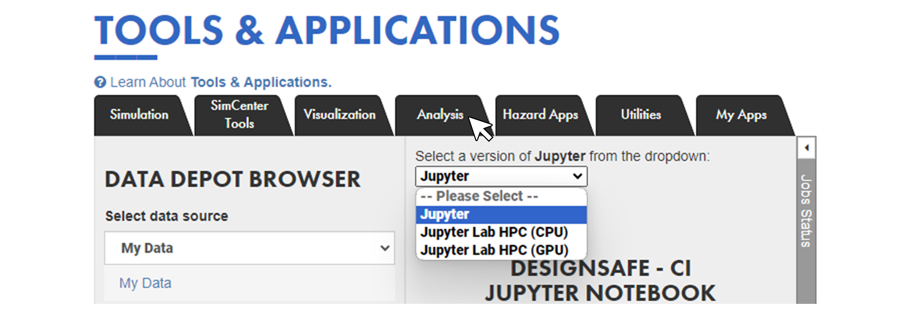

##  IN-CORE User Guide

The Interdependent Networked Community Resilience Modeling Environment (IN-CORE) platform, in continuous development by the Center of Excellence for Risk-Based Community Resilience Planning (CoE), is the result of a multi-university research center funded by The National Institute of Standards and Technology (NIST). Moreover, the platform is intended to offer the potential for community contributed code as resilience modeling research evolves. The platform focuses on measurement science to support community resilience assessment through a risk-based approach to support decision-making for definition, prioritization, and comparison of resilience strategies at the community level. 

The IN-CORE platform's main analysis tools correspond to the Python libraries [pyincore](https://incore.ncsa.illinois.edu/doc/incore/pyincore.html) and [pyincore-viz](https://incore.ncsa.illinois.edu/doc/incore/pyincore_viz.html). Users can access these using [IN-CORE lab](https://incore.ncsa.illinois.edu/doc/incore/incore_lab.html) (hosted on the NCSA cloud system) or by installing the Python libraries on local computers; the latter allows the user to run the job locally or submit the job through the [NCSA](https://www.ncsa.illinois.edu/) cloud system.

This user guide presents how to launch IN-CORE with DesignSafe resources, leveraging the computational capabilities within the DesignSafe Cyberinfrastructure. Moreover, advantages of launching IN-CORE within DesignSafe include the potential to integrate shared data, streamline data curation and publication of results that emerge from simulation with IN-CORE, or even couple IN-CORE simulations and codes with those from other DesignSafe tools and resources.

### IN-CORE on DesignSafe Cyberinfrastructure (DesignSafe-CI)

The JupyterLab shell on DesignSafe-CI can be used to access the pyincore and pyincore-viz functions on DesignSafe-CI. Computational capabilities within the DesignSafe-CI are leveraged to enhance the regional-scale assessment tools within IN-CORE. DesignSafe users can also use the seamless communication of intermediate and final results from IN-CORE python packages with other DesignSafe tools through the DesignSafe-CI Jupyter Notebooks and Data Depot repositories. For example, high-fidelity hazard estimates can be obtained from different resources at DesignSafe and used as input data for risk and resilience analysis using IN-CORE Python packages. Monte Carlo simulations or optimization can be run leveraging the HPC resources of DesignSafe. The interaction between the data archived in Data Depot, tools and applications’ workflow in DesignSafe-CI, and the use of IN-CORE tools through JupyterLab allows the users to create different roadmaps for analysis, visualization, and results publication to advance the field of regional-scale community resilience estimation.

Using a client-based development, IN-CORE Python libraries can connect directly to the NCSA cloud system to retrieve published models and run analyses. However, to leverage the resources at DesignSafe-CI, the client mode must be disabled (more information is presented below), and the models must be created “locally” (on DesignSafe-CI JupyterHub).

### Installation of pyincore on DesignSafe

The user can install pyincore using any of these two options: 

1) the [temporary user installation](#Title1.1) 
2) creating a [specific kernel for pyincore](#Title1.2)

While option 1 may be faster, option 2 corresponds to the formal (recommended) approach for installing the IN-CORE packages. Additionally, some related packages to pyincore, e.g. pyincore-viz, may present installation conflicts when using the temporary option (option 1). For more information about installing Python libraries on DesignSafe-CI, refer to [Installing Packages](https://www.designsafe-ci.org/user-guide/tools/jupyterhub/#installing).

To start, access DesignSafe's JupyterHub via the DesignSafe-CI. Select "Tools & Applications" > "Analysis" > "Jupyter". When asked to select a notebook image, select the “Updated Jupyter Image” and click “Start My Server”.

