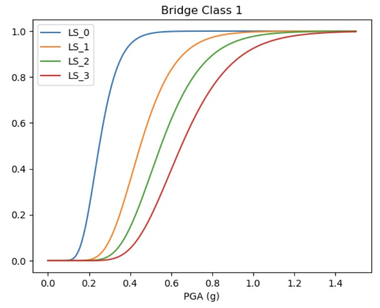

##  IN-CORE User Guide

The Interdependent Networked Community Resilience Modeling Environment (IN-CORE) platform, in continuous development by the Center of Excellence for Risk-Based Community Resilience Planning (CoE), is the result of a multi-university research center funded by The National Institute of Standards and Technology (NIST). Moreover, the platform is intended to offer the potential for community contributed code as resilience modeling research evolves. The platform focuses on measurement science to support community resilience assessment through a risk-based approach to support decision-making for definition, prioritization, and comparison of resilience strategies at the community level. 

The IN-CORE platform's main analysis tools correspond to the Python libraries [pyincore](https://incore.ncsa.illinois.edu/doc/incore/pyincore.html) and [pyincore-viz](https://incore.ncsa.illinois.edu/doc/incore/pyincore_viz.html). Users can access these using [IN-CORE lab](https://incore.ncsa.illinois.edu/doc/incore/incore_lab.html) (hosted on the NCSA cloud system) or by installing the Python libraries on local computers; the latter allows the user to run the job locally or submit the job through the [NCSA](https://www.ncsa.illinois.edu/) cloud system.

This user guide presents how to launch IN-CORE with DesignSafe resources, leveraging the computational capabilities within the DesignSafe Cyberinfrastructure. Moreover, advantages of launching IN-CORE within DesignSafe include the potential to integrate shared data, streamline data curation and publication of results that emerge from simulation with IN-CORE, or even couple IN-CORE simulations and codes with those from other DesignSafe tools and resources.

### IN-CORE on DesignSafe Cyberinfrastructure (DesignSafe-CI)

The JupyterLab shell on DesignSafe-CI can be used to access the pyincore and pyincore-viz functions on DesignSafe-CI. Computational capabilities within the DesignSafe-CI are leveraged to enhance the regional-scale assessment tools within IN-CORE. DesignSafe users can also use the seamless communication of intermediate and final results from IN-CORE python packages with other DesignSafe tools through the DesignSafe-CI Jupyter Notebooks and Data Depot repositories. For example, high-fidelity hazard estimates can be obtained from different resources at DesignSafe and used as input data for risk and resilience analysis using IN-CORE Python packages. Monte Carlo simulations or optimization can be run leveraging the HPC resources of DesignSafe. The interaction between the data archived in Data Depot, tools and applications’ workflow in DesignSafe-CI, and the use of IN-CORE tools through JupyterLab allows the users to create different roadmaps for analysis, visualization, and results publication to advance the field of regional-scale community resilience estimation.

Using a client-based development, IN-CORE Python libraries can connect directly to the NCSA cloud system to retrieve published models and run analyses. However, to leverage the resources at DesignSafe-CI, the client mode must be disabled (more information is presented below), and the models must be created “locally” (on DesignSafe-CI JupyterHub).

### Installation of pyincore on DesignSafe

The user can install pyincore using any of these two options: 

1) the [temporary user installation](#Title1.1) 
2) creating a [specific kernel for pyincore](#Title1.2)

While option 1 may be faster, option 2 corresponds to the formal (recommended) approach for installing the IN-CORE packages. Additionally, some related packages to pyincore, e.g. pyincore-viz, may present installation conflicts when using the temporary option (option 1). For more information about installing Python libraries on DesignSafe-CI, refer to [Installing Packages](https://www.designsafe-ci.org/user-guide/tools/jupyterhub/#installing).

To start, access DesignSafe JupyterHub via the DesignSafe-CI. Select "Tools & Applications" > "Analysis" > "Jupyter". When asked to select a notebook image, select the “Updated Jupyter Image” and click “Start My Server”.

*Figure 1. Access to the JupyterHub on DesignSafe-CI*

#### Installing pyincore without creating a new environment (temporary installation) <a name="Title1.1"></a>

Installing the pyincore package on DesignSafe directly on the "base" subshell in Jupyter can be done using the `%pip` line magics as presented below. 

```python 
!pip3 -q install pyincore --user
```
After this, you may need to restart your kernel (click on Kernel/Restart Kernel and Clear All Outputs). 

#### Installing pyincore creating a new environment (recommended) <a name="Title1.2"></a>

To install the maintained version of the pyincore and the pyincore-viz packages, a particular environment using `conda` must be created. This step requires installing the `kernelutility` Python package as follows:

```python 
!pip3 -q install kernelutility
```
After this, you may need to restart your kernel (click on Kernel/Restart Kernel and Clear All Outputs). For more information on the use of `kernelutility` refer to [Custom User-Defined Kernels](https://www.designsafe-ci.org/user-guide/tools/jupyterhub/#installing-kernels). 

Next, use the `kernelutility` package to create a sharable kernel supported by the Updated Jupyter Image on DesignSafe. Using the following command, create a new environment called 'pyincore_on_DS':

```python 
from kernelutility import kernelset
kernelset.create('pyincore_on_DS')
```

After this step, that is, the previous cell has finished running, select the newly created environment in the "switch kernel" panel (right upper corner of the notebook, as shown in Figure 2). Select specifically the one with the name **Python: [conda env:pyincore_on_DS]**. Then, restart the kernel (click on Kernel/Restart Kernel and Clear All Outputs).

*Figure 2. Selecting the newly created conda environment*

Use the `%conda install` command to install pyincore and pyincore-viz and the recently created environment.

```python 
%conda install -c in-core pyincore
%conda install -c in-core pyincore-viz
```

At this point, you have created a new environment, installed pyincore and pyincore-viz with their respective dependencies, and one last restart of the kernel is required. This created environment can be accessed throughout the current and future sessions.

#### Reproducibility after shutting down your server (if you installed pyincore using kernelutility)

The Jupyter Session will be ended after a few days without any activity or when the user has decided to shut down the server ("File" > "Hub Control Panel" > "Stop My Server" > "Log Out"). In such case, the next time the user accesses the Updated Jupyter Image, the user-defined kernels (pre-existing conda environments, such as the newly created environment 'pyincore_on_DS') will not be immediately visible. If this happens, you will have to run the following commands:

```python 
!pip -q install kernelutility
from kernelutility import kernelset
```
After waiting a few seconds, the pre-existing user-defined kernels may appear after clicking on the "switch kernel" panel (right upper corner, as shown in Figure 2). If not, refresh your browser and check the "switch kernel" panel again.

For more information on accessing created environments, refer to [Custom User-Defined Kernels](https://www.designsafe-ci.org/user-guide/tools/jupyterhub/#installing-kernels). 

### Example: IN-CORE tools within DesignSafe-CI 

The following example leverages the use case published in the Data Depot as [PRJ-4675 “IN-CORE on DesignSafe”](https://doi.org/10.17603/ds2-cx62-ve21). The notebook presents a use case focused on the risk analysis of a regional scale portfolio of bridges exposed to seismic events. The goal of this use case is to show the interaction of DesignSafe with IN-CORE Python tools. You can copy this folder to your “My Data” folder to enable editing permission, thus enabling working directly on the Jupyter Notebook. To access to the main Jupyter notebook of the published use case (called **main.ipynb**), click on the button below.

[](https://jupyter.designsafe-ci.org/hub/user-redirect/lab/tree/NHERI-Published/PRJ-4675/main.ipynb)

For more information about advanced analyses in IN-CORE, including housing unit allocation, population dislocation evaluation, recovery analyses, and computable general equilibrium modeling for quantifying community-level recovery, the reader is referred to the IN-CORE user documentation at the [IN-CORE website](https://incore.ncsa.illinois.edu/doc/incore/introduction.html).

#### Loading a hazard scenario with pyincore

Create an `Earthquake` object from an existing hazard map (in format *.tif) that is available in the use case folder _'/hazard'_. The hazard map can be obtained from other tools within DesignSafe, IN-CORE, or manually developed by the users.

In this example, use the files _'/hazard/eq-mmsa-pga.tif'_ and _'/hazard/eq-dataset.json'_ to create the hazard map scenario as follows:

```python 
from pyincore import Earthquake
route_haz = 'hazard/'

# Create the local earthquake object
eqset = Earthquake.from_json_file(os.path.join(route_haz, "eq-dataset.json"))

# Add the local files that describe the intensities
eqset.hazardDatasets[0].from_file((os.path.join(route_haz, "eq-mmsa-pga.tif")),data_type="ergo:probabilisticEarthquakeRaster")

```

#### Definition of the exposed assets

The illustrative example uses a set of hypothetical bridges located in the Memphis Metropolitan Statistical Area (MMSA). THe input data is located in the folder _'/exposure'_ of the use case. First, create a new shapefile adding an identifier to each asset within the 'MMSA_bridges' shapefile. Then, a Dataset py-incore object is created using this newly defined shapefile.

```python
from pyincore import GeoUtil
gdf = gpd.read_file("exposure/MMSA_bridges.shp")
GeoUtil.add_guid("exposure/MMSA_bridges.shp", "exposure/MMSA_bridges_w_guid.shp")

# Create a Dataset object from the modified shapefile
from pyincore import Dataset
MMSA_bridges = Dataset.from_file("exposure/MMSA_bridges_w_guid.shp", 
                                 data_type="ergo:bridgesVer3")

```

You can check the exposed assets by using Python libraries for visualization of geospatially distributed data (see for example [PRJ-3939 Jupyter notebook for visualization of spatially distributed data in risk and resilience analysis](https://doi.org/10.17603/ds2-a74m-g031)). For example, interactive exploration using Plotly package can be obtained as follows:

```python
# Retrieve the GeoDataframe
bridges_gdf = MMSA_bridges.get_dataframe_from_shapefile() 

# Create the interactive plot
import plotly.express as px
fig = px.scatter_mapbox(bridges_gdf, lat="Latitude", lon="Longitude",
                       hover_name="STRUCTURE_",
hover_data=["DECK_WIDTH","SPEED_AVG",
	"YEAR_BUILT","SPEED_AVG"],
color="MAIN_UNIT_", size="MAIN_UNIT_", size_max=15,
                      	color_continuous_scale=px.colors.sequential.Cividis_r, 
title="Bridges in Memphis, TN-MS-AR Metropolitan Statistical Area")

fig.layout.coloraxis.colorbar.title = 'Number of spans'

fig.update_layout(mapbox_style="carto-positron", 
                  height=350, width=600, margin={"r":0,"t":30,"l":0,"b":0},
                  title_x=0.45, title_y=1)
fig
```

The obtained figure is presented in Figure 3. 


*Figure 3. Visualization of the exposed bridges using interactive plots*

#### Fragility models description using pyincore JSON structure

Very different models of fragility curves can be created using pyincore models (from univariate to parametric functions). A system-level fragility curve (see Figure 4) is created below by passing the “fragility description” string to the function `FragilityCurveSet.from_json_str()`. Check the details on the use case example.

```python
from pyincore import FragilityCurveSet
from pyincore_viz.plotutil import PlotUtil as plot

# Create the fragility description string
definition_frag1 = """{
    "description": "Bridge Class 1",
    "authors": ["Rincon, R., Padgett, J.E."],
    "paperReference": null,
    "resultType": "Limit State",
    "hazardType": "earthquake",
    "inventoryType": "bridges",
    …
}"""

# Create the FragilityCurveSet object and visualize it
fragility_class1 = FragilityCurveSet.from_json_str(definition_frag1)
plt = plot.get_fragility_plot(fragility_class1, start=0, end=1.5)

```


*Figure 4. Univariate visualization of the created fragility functions*

#### Fragility Mapping (fragility functions link to exposure model)
The link between the `Dataset` exposure model and the available `FragilityCurveSets` is obtained through the `MappingSet()` function. Here the link is assumed to be the column **'archetype'** of the bridge `Dataset` object.

```python
from pyincore import Mapping, MappingSet
fragility_entry_class1 = {"Non-Retrofit Fragility ID Code": fragility_class1}
fragility_rules_class1 = {"OR":["int archetype EQUALS 1"]}
fragility_mapping_class1 = Mapping(fragility_entry_class1, fragility_rules_class1)

… # Here the rest of fragilities should be created
                                   
fragility_mapping_definition = {
    "id": "N/A",
    "name": "MMSA mapping object",
    "hazardType": "earthquake",
    "inventoryType": "bridges",
    'mappings': [fragility_mapping_class1,
… # Here the rest of fragilities should be added to the mapping set
],
    "mappingType": "fragility"
}

fragility_mapping_set = MappingSet(fragility_mapping_definition)
```

#### Bridge Damage Analysis
The `BridgeDamage` object in pyincore is used to compute the damage probabilities conditioned on a given set of hazard events. To be able to run this analysis on DesignSafe, the `IncoreClient` object has to be set to 'offline' as explained in the Introduction of this User Guide:

```python
client = IncoreClient(offline=True)
```

The BridgeDamage object is used to link the hazard, datasets, and computation parameters for the desired type of analysis as well as to run the damage analysis. The following commands are used for this purpose:

```python
from pyincore.analyses.bridgedamage import BridgeDamage
from pyincore import IncoreClient

# Sets the use of INCORE to "offline". This is required to use the capabilities at DesignSafe
client = IncoreClient(offline=True)

# Create a BridgeDamage object and set the input parameters
bridge_dmg = BridgeDamage(client)
bridge_dmg.set_input_dataset("bridges", MMSA_bridges)
bridge_dmg.set_input_dataset('dfr3_mapping_set', fragility_mapping_set)
bridge_dmg.set_input_hazard("hazard", eqset)
bridge_dmg.set_parameter("result_name", "MMSA_bridges_dmg_result")
bridge_dmg.set_parameter("num_cpu", 8)

# Run bridge damage analysis
bridge_dmg.run_analysis()
```

The obtained results can be later passed for subsequent models within the pyincore library such as `MonteCarloFailureProbability`, `PopulationDislocation`, `CapitalShocks`, among others. For example, using the `MonteCarloFailureProbability` model, the scenario-based bridge failure probabilities for the previously created `Earthquake`, `DataSet`, `FragilityCurveSets`, and `MappingSet` are presented in Figure 5.


*Figure 5. Visualization of the (Monte Carlo-based) failure probability using interactive plots*
