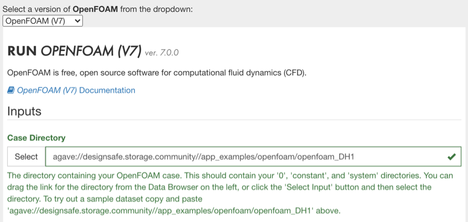
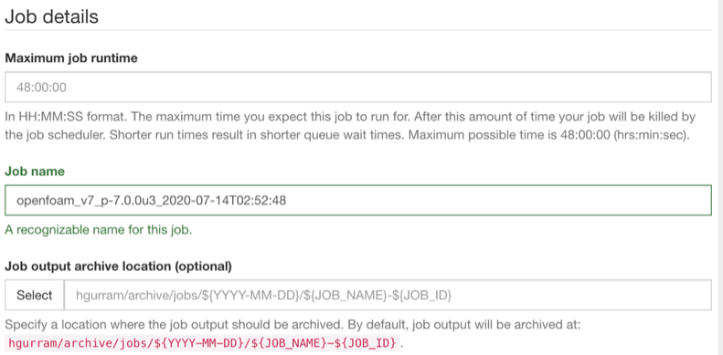

## OpenFOAM User Guide

The OpenFOAM (Open Field Operation and Manipulation) CFD (Computational Fluid Dynamics) Toolbox is a free, open source CFD software package which has a large user base across most areas of engineering and science, from both commercial and academic organizations. OpenFOAM has an extensive range of features to solve anything from complex fluid flows involving chemical reactions, turbulence and heat transfer, to solid dynamics and electromagnetics. It includes tools for meshing, notably snappyHexMesh, a parallelised mesher for complex CAD geometries, and for pre- and post-processing. Almost everything (including meshing, and pre- and post-processing) runs in parallel as standard, enabling users to take full advantage of high performance computing resources.

More detailed information and OpenFOAM user documentation can be found at the <a href="https://openfoam.org/" target="_blank">OpenFOAM website</a>. 

### How to Submit an OpenFOAM Job in the Workspace

* Select the OpenFOAM application from the Simulation tab in the Workspace.

* Select the version of OpenFOAM you wanted to work with (Designsafe supports version 6 and 7). 

* Locate your Case Directory (Folder) with your input files that are in the Data Depot and follow the onscreen directions to enter this directory in the form. The following figure shows the example case in the community data. 

* Select your Solver from the dropdown menu. The workspace has options for 5 OpenFOAM solvers i.e. interFOAM, simpleFOAM, icoFOAM, potentialFOAM and olaFlow. If you need any other specfic solver please submit a ticket.

* Choose decompostion and mesh generation options from the dropdown menu. 

<ul>
	<li>Enter maximum run time. 
	<li>Enter a job name.
	<li>Enter an output archive location or use the default provided.
</ul>

<ul>
	<li>Select the number of nodes to be used for your job. Larger data files run more efficiently on higher node counts. Follow instructions given in the description for chosing number of processors. 
	<li>Click Run to submit your job.
	<li>Check the job status by clicking on the arrow in the upper right of the job submission form.
</ul>

<em>Last update: July 15, 2020</em>

