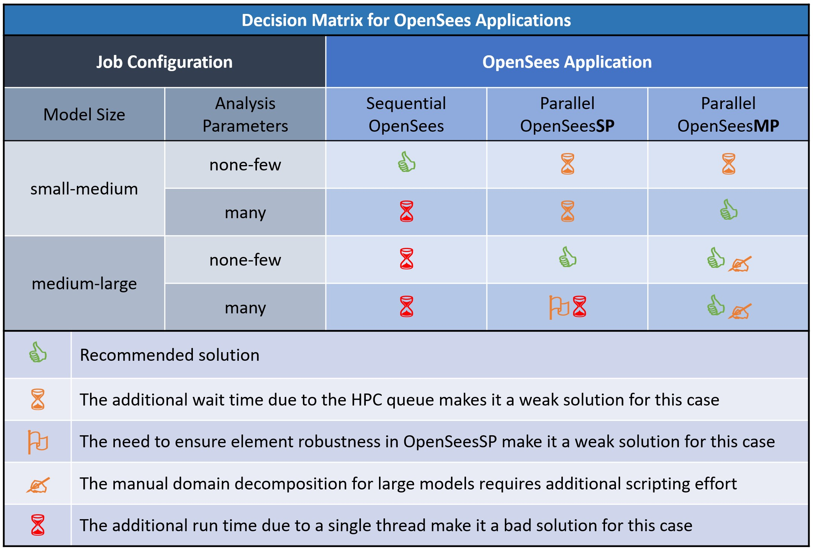
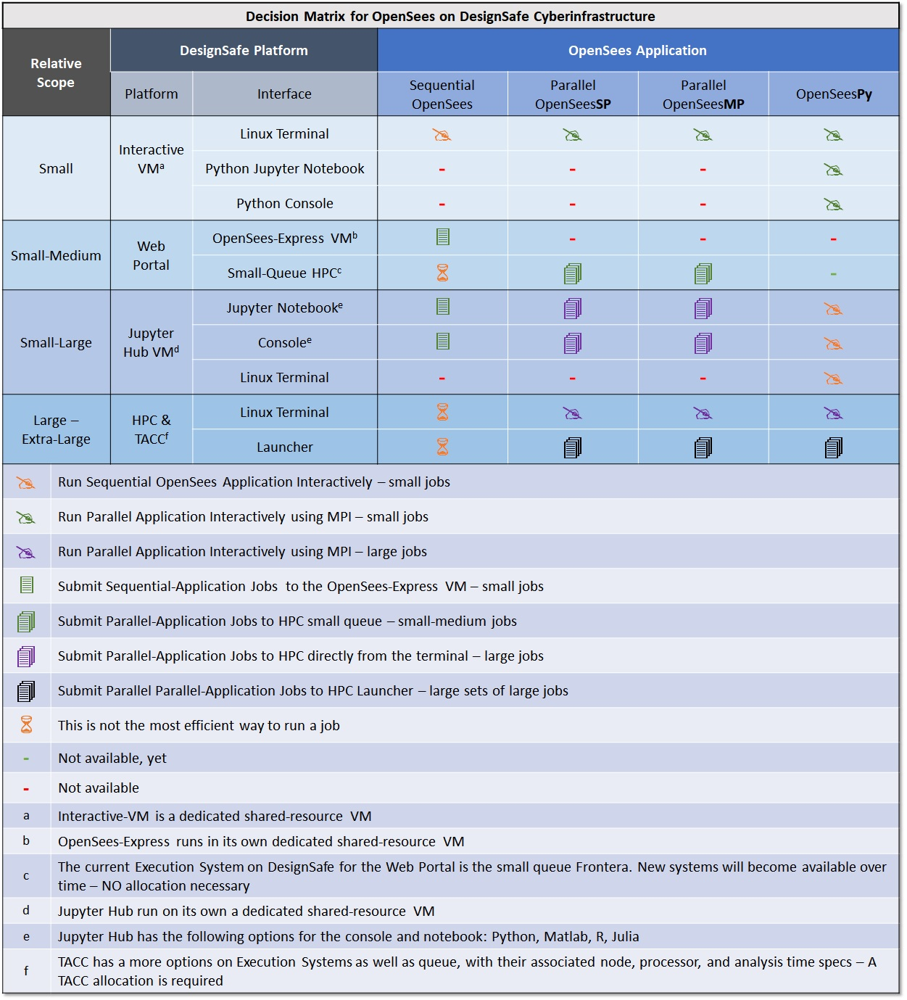
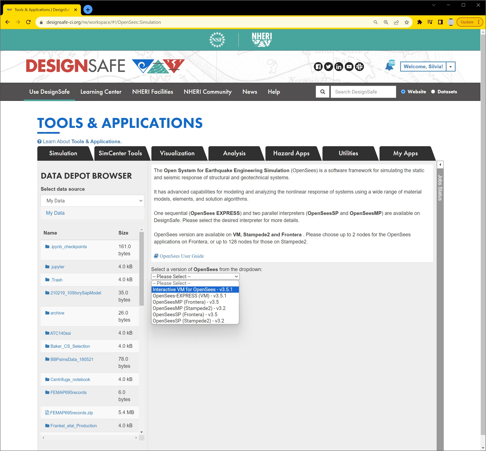
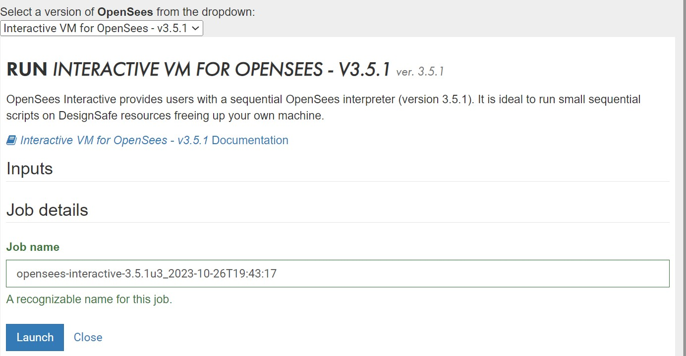
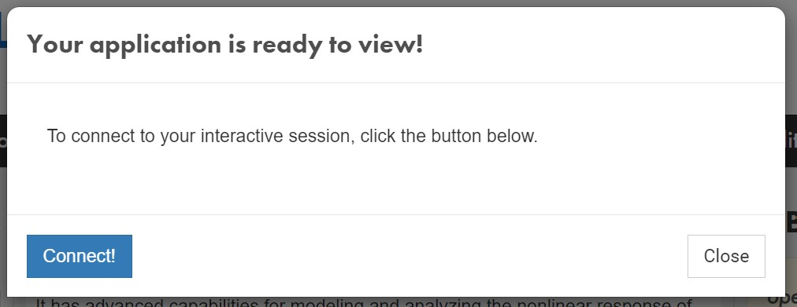
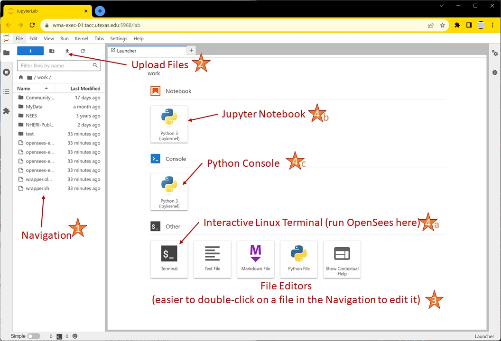

# OpenSees User Guide

## OpenSees On DesignSafe

The Open System for Earthquake Engineering Simulation (<a href="http://opensees.berkeley.edu/" target="_blank">OpenSees</a>) is a software framework for developing applications to simulate the behavior of structural and geotechnical systems subjected to static and dynamic loading. It has advanced capabilities for modeling and analyzing the nonlinear response of systems using a wide range of material models, elements, and solution algorithms.

The purpose of this documentation is to provide the details to help you understand the capabilities of different OpenSees applications and the different DesignSafe platforms on which they run. The choice of which application and platform to use depends on the size and scope of the job you are trying to run.

### OpenSees Quick Start



### OpenSees Applications

OpenSees was conceptualized, designed, and developed with parallel computing as its core objective. An application designed for parallel computing takes advantage of multiple processors working simultaneously on independent tasks as well as on interdependent ones where the processors can pass information to each other. Within these parallel-computing design concepts, there are <b>3+1 application of OpenSees</b>, each designed with a different objective:

1. <b>OpenSees</b> is the sequential application which runs on a single core with basic computer-resources requirements and is easy to use. It's your starting place and can easily meet most project needs.
1. <b>OpenSeesSP</b> is a parallel application driven by a single processor which distributes a large model to the remaining processors for faster solution strategies. This application allows you to run very large model with ease because it automates the model decomposition with no need for input from the user.
1. <b>OpenSeesMP</b> is the most versatile parallel application. It runs all the processors in parallel, each executing the same script containing individual instructions for each processor. This is the most powerful OpenSees application by giving the user full control of the job. The user can decompose the model manually by assigning different nodes, elements and loads to different processors (automated in OpenSeesSP). Alternatively, the user can assign a different analysis to each processor easily. Because of the inter-processor communication, load-balancing techniques can also be employed in the input script to minimize total run time.
1. <b>OpenSeesPy</b> is a Python library with all the capabilities of both the sequential and parallel OpenSees applications. Because it runs in the Python environment, OpenSeesPy creates a seamless integration of OpenSees into your workflow. This integration includes Python's powerful and versatile graphics libraries so that you can use visualization of your model as well as the component behaviors in building and testing your OpenSees script. Parallel-OpenSeesPy: read the chapter on OpenSeesPy to learn how to handle it in the current version in DesignSafe.

### DesignSafe Platforms

DesignSafe provides different platforms to run the OpenSees applications. These platforms have been designed with scalability in mind -- each platform is optimized for a wide range of project size and scope:

1. The <b>Web Portal</b> provides a simple browser interface where the user can submit jobs by simply uploading an input script, selecting the app and computer resources, and pressing a "submit" button. The current version of the Web Portal supports all three TCL applications.
1. The new <b>Interactive Virtual Machine (VM)</b> provides an Integrated Development Environment (IDE) where the user can run OpenSees interactively at a Linux prompt and respond to errors in the input in real time. With a navigation bar and a basic editor, the IDE makes working in the Linux environment very easy. This Interactive VM supports all OpenSees applications, sequential and parallel, as well as both interpreters, Tcl and Python (OpenSeesPy). The IDE also includes the option of working in a Python Jupyter Notebook.
1. The <b>Jupyter Hub</b> provides a versatile Jupyter-based IDE for developing a complete workflow that integrates pre- and post-processing with the OpenSees analyses interactively via Jupyter Notebooks. The Jupyter Hub can be run in a dedicated VM, which requires no allocation, or in an allocation in HPC. While OpenSeesPy can be run directly in a Python-based Jupyter Notebook, Julia, Matlab, and R can also be used interactively within a Jupyter Notebook to create the OpenSees input files, submit them to HPC, and post-process the results.
1. An <b>HPC allocation</b> allows the user to submit very large jobs to the larger queues available on DesignSafe and TACC.

The choice of OpenSees Application and DesignSafe platform depends on your project needs. 


### OpenSees-Project "Size"

As you plan your OpenSees project on DesignSafe, you need to have an idea of the project's "size," which is defined by its scope. The project scope is defined by the size of your model and the type and number of parametric analyses.

Understanding the scope of your project, and how that scope grows in "size", will help you choose the right OpenSees application as well as DesignSafe platform. 

1. The <b>Model Size</b> affects the size of the system of equations that must be solved (the matrix that needs to be inverted) as well as the number of nonlinear state determinations which can be iterative. <br>
Here are a few items that affect Model Size:
    <ul>
        <li>Model dimensions (1-3).</li>
        <li>Number of DOFs per node (1-6): This is controlled by the types of elements being used, as well as the model dimensions. Quadrilateral elements, for example, only have translational dofs at the nodes, while beam-column elements have both translations and rotations. However, quad elements have at least 4 nodes, while beam-column elements have two.</li>
        <li>Total number of nodes and elements.</li>
        <li>Type of elements being used: elastic elements require fewer resources that nonlinear or highly-discretized elements and sections. </li>
        <li>Element discretization: force-formulation B-C elements have at least 4 integration points. Displacement-formulation B-C elements need more elements per structural element.</li>
        <li>Sections: Fiber sections require more memory and processing times.</li>
        <li>Materials: Some material formulations store and update a large number of internal variables. Each instance of this material has its own memory requirements. Also, some materials require more iterations than others.</li>
        <li>Memory management: Some OpenSees objects may not have the most optimized memory management system.</li>
    </ul>


1. The <b>Analysis Parametrization</b> is defined by the different configurations being analyzed, which defines how many times you need to run an OpenSees analysis, and how:
    <ul>
        <li> <b>Model Parametrization</b>: Variations of a model characteristics, such as building configuration, soil-layer discretization, material properties, etc.</li>
        <li> <b>Loading Parametrization</b>: Variations of loading, such number of earthquake ground motions or different wind-load incident angles.</li>
        <li> <b>Type of Parametrization</b>: The type of parametrization determines how the analyses will be run. Are the values in the variation of each parameter dependent or independent of each other? <br>
            --> If the input values of a parameter set are <b>independent</b> of each other the analyses can be run concurrently in <b>parallel</b>. An example of this case is found in earthquake-engineering applications when a system is subjected to a suite of ground motions. <br>
            --> In optimization problems trying to find a local minimum, for example, the input-parameter values of one analysis are <b>dependent</b> on the results of a previous analysis. In this case the analyses need to run <b>sequentially</b>. Many studies can be a combination of these two types or parametrization.
        </li>
    </ul>


### Decision Matrix for OpenSees Applications

The following figure provides the decision matrix: a visual tool for quick assessment of which OpenSees application is best suited for different run configurations, and why. The choice is based on the size of your model as well as the number and type of parametric analyses, as described below.



Choose the right OpenSees application to make the best use of resources such as modeler time, run time, and computer resources. 


### Decision Matrix for DesignSafe Platform for OpenSees

The following table provides a comparison of all the ways you can run OpenSees on the DesignSafe CI execution platforms and configurations. Each platform has different interfaces for you to interact with OpenSees. Items in the table are placed in order of complexity and recommendation. 


### Running OpenSees at the Linux Terminal

Several DesignSafe platforms allows you to run OpenSees directly in Linux.
This section is dedicated to providing more details on the actual process of running OpenSees in the Linux terminal.

#### Basic Linux Commands

Here are the basic commands you <b>may</b> need.<br>
However, for case of the platforms that have the integrated Jupyter environment, the Interactive-VM and Jupyter Hub, most of these actions can be easily performed in the navigation panel within the workspace.
```
    mkdir dirname : make a new directory
    cd dirname : change directory
    pwd : returns current directory
    ls : list files 
    cp origFile newFile : copy a file
    mv origFile newFile : move a file
    rm filename : remove a file
    wc –l directoryname : how many files in a directory 
    wc –l filename : how many lines in a file 
```

##### Command to run OpenSees Applications at Linux Prompt

<small>
<table width=100%>
<tr><th>Application</th><th>TCL</th><th>Python</th></tr>
<tr><td style="white-space:normal">OpenSees Interactively</td><td style="white-space:normal">OpenSees</td><td style="white-space:normal">python<br>>>import openseespy.opensees as ops </td></tr>
<tr><td style="white-space:normal">OpenSees Script</td><td style="white-space:normal">OpenSees filename.tcl</td><td style="white-space:normal">python filename.py</td></tr>
<tr><td style="white-space:normal">OpenSeesSP</td><td style="white-space:normal">mpiexec -np NP OpenSeesSP filename.tcl </td><td style="white-space:normal">mpiexec -np NP python filename.py </td></tr>
<tr><td style="white-space:normal">OpenSeesMP</td><td style="white-space:normal">mpiexec -np NP OpenSeesMP filename.tcl </td><td style="white-space:normal">mpiexec -np NP python filename.py </td></tr>
</table>
</small>


##### Running OpenSees Parallel Applications
<p>The parallel OpenSees applications require the MPI, which has been preinstalled in the VM. <br>
The Tcl-Interpreter OpenSees applications (OpenSees-Express, OpenSeesSP, and OpenSeesMP) are compiled executable programs. The MPI, therefore, will run NP processes of this executable.<br>
OpenSeesPy, on the other hand, is a python library that has been pre-installed in the VM and is called within the python environment. In this case, therefore, the MPI will run NP Python processes and each process will call its own Python library. In addition, all three OpenSees applications are integrated into a single library, OpenSeesPy.</p>

#### Examples 

The following examples give you the command to executed as well as a demonstration of the Interaction with OpenSees:

##### Run Sequential Applications: OpenSees in the TCL interpreter

command: <b><i>OpenSees</i></b>
<br>

```
    (base) jovyan@3cd0f33abec1:~/work$ OpenSees


            OpenSees -- Open System For Earthquake Engineering Simulation
                    Pacific Earthquake Engineering Research Center
                            Version 3.5.1 64-Bit

        (c) Copyright 1999-2016 The Regents of the University of California
                                All Rights Reserved
        (Copyright and Disclaimer @ http://www.berkeley.edu/OpenSees/copyright.html)


        OpenSees > wipe
        OpenSees > model BasicBuilder -ndm 2 -ndf 3
        OpenSees > exit
    (base) jovyan@3cd0f33abec1:~/work$ OpenSees
```

##### Run Sequential Applications: OpenSeesPy in the Python interpreter

command: <b><i>python</i></b>
<br>

```
    (base) jovyan@3cd0f33abec1:~/work$ python
    Python 3.10.6 | packaged by conda-forge | (main, Aug 22 2022, 20:35:26) [GCC 10.4.0] on linux
    Type "help", "copyright", "credits" or "license" for more information.
    >>> import openseespy.opensees as ops
    >>> ops.wipe()
    >>> ops.model('BasicBuilder','-ndm',2,'-ndf',3)
    >>> exit()
    Process 0 Terminating
    (base) jovyan@3cd0f33abec1:~/work$

```


##### Run Parallel Applications: OpenSeesMP in the TCL interpreter

command: <b><i>mpiexec -np NP OpenSeesMP inputFile.tcl</i></b><br>
<small><i>NP=number of processes</i></small>
<br>

```
    (base) jovyan@3cd0f33abec1:~/work$ mpiexec -np 3 OpenSeesMP simpleMP.tcl


            OpenSees -- Open System For Earthquake Engineering Simulation
                    Pacific Earthquake Engineering Research Center
                            Version 3.5.1 64-Bit

        (c) Copyright 1999-2016 The Regents of the University of California
                                All Rights Reserved
    (Copyright and Disclaimer @ http://www.berkeley.edu/OpenSees/copyright.html)


    pid 1 of 3
    pid 0 of 3
    pid 2 of 3
    tclLibUnits.tcl
    tclLibUnits.tcl
    tclLibUnits.tcl
    pid 0 source Ex4.Portal2D.build.InelasticSection.scr.tcl
    pid 0 source Ex4.Portal2D.analyze.Dynamic.EQ.Uniform.scr.tcl
    pid 1 source Ex4.Portal2D.build.InelasticSection.scr.tcl
    pid 1 source Ex4.Portal2D.analyze.Dynamic.EQ.Uniform.scr.tcl
    pid 2 source Ex4.Portal2D.build.InelasticSection.scr.tcl

    .....

    pid 0 inFiles: ./GMfiles/RSN31_PARKF_C08050.at2
    pid 0 file read
    pid 0 OpenSeesMP
    pid 0 count 4 check 1 goRun 0
    pid 0 done infile: ./GMfiles/RSN31_PARKF_C08050.at2
    pid 0 ALL DONE!!!
    Process Terminating 0
    (base) jovyan@3cd0f33abec1:~/work$ 
```


##### Run Parallel Applications: OpenSeesMP in the Python interpreter (OpenSeesPy)

command: <b><i>mpiexec -np NP python inputFile.py</i></b><br>
<small><i>NP=number of processes</i></small>
<br>
```
    (base) jovyan@3cd0f33abec1:~/work$ mpiexec -np 3 python simpleMP.py
    pid 0 of 3
    pid 2 of 3
    pid 1 of 3
    pyLibUnits.tcl.py
    pyLibUnits.tcl.py
    pid 2 sourced pyLibUnits.tcl.py
    pyLibUnits.tcl.py
    ....
    pid 0 inFiles: ./GMfiles/RSN122_FRIULI.A_A-COD000.at2
    pid 0 file read
    pid 0 OpenSeesMP
    pid 0 count 2 check 2 goRun 0
    pid 0 ALL DONE!!!
    Process 0 Terminating
    Process 0 Terminating
    Process 0 Terminating
    (base) jovyan@3cd0f33abec1:~/work$ 
```
</ul>

### References &amp; Resources

#### OpenSees Docs:

The OpenSees documentation is now managed in RST format in GitHub. Because not all the content has been transferred, you can use a search engine to search to the following pages:
<ul style="margin-top:-20px;">
	<li> <a href = "https://opensees.berkeley.edu/" target="_blank">OpenSees Main Page</a></li>
	<li> <a href = "https://opensees.github.io/OpenSeesDocumentation/" target="_blank">Latest Official OpenSees Documentation</a>. This documentation contains the documentation for new and updated contributions to OpenSees. You will need to refer to other documentation for older content.</li>
	<li> <a href = "https://openseespydoc.readthedocs.io/en/latest/" target="_blank">OpenSeesPy Documentation</a>. This documentation contains 99.9% of the content from the wiki, as well as updated content. This is the best documentation on the Force Beam-Column element integration options. Even though the commands are formatted for OpenSeesPy, the additional content applies to the TCL applications as well.</li>
	<li> <a href = "https://opensees.berkeley.edu/wiki/index.php/Main_Page" target="_blank">OpenSees Wiki</a>. This documentation was written in 2009, it has the most content, not always the latest</li>
	<li> <a href = "https://opensees.berkeley.edu/OpenSees/manuals/usermanual/index.html" target="_blank">OpenSees Command Language Manual</a>. This is the first OpenSees documentation, it has some useful recommendations</li>
	<li> The official <b>OpenSeesDays</b> was an annual workshop organized by the OpenSees Development Team in the early days. <a href="https://opensees.berkeley.edu/workshop/OpenSeesDays.html" target="_blank"> Click here to access some archived content</a>. You can also search YouTube for more content.
</ul>

##### OpenSeesPy Documentation

<p>All the documentation for OpenSees-Tcl applies to OpenSeesPy, the only thing that changes is the format. Here are some links to the OpenSeesPy documentation as well as some useful videos.</p>
<ul style="margin-top:-20px;">
    <li> You can find the <a href="https://openseespydoc.readthedocs.io/en/latest/" target="_blank"> OpenSeesPy Documentation here</a>. The documentation contains most of the content from the OpenSees Wiki.</li>
    <li> Refer to the <a href="https://openseespydoc.readthedocs.io/en/latest/src/parallelcmds.html" target="_blank">Parallel Commands</a> Chapter for additional instructions on how to run OpenSeesMP and OpenSeesSP commands.</li>
    <li> View Dr. Minjie Zhu's, the main developer of OpenSeesPy, presentation on YouTube on <a href="https://www.youtube.com/watch?v=C26IYKaRZJQ&t=163s" target="_blank" >Minjie Zhu & OpenSeesPy at the OpenSees Support Group</a></li>
    <li> View Dr. Minjie Zhu's, the main developer of OpenSeesPy, presentation on YouTube: <a href="https://youtu.be/vjGm2kM5Ihc?si=jb97Xs6SSD3mE6gO" target="_blank">Dr. Zhu Minjhe on Introduction to Parallel Computing in OpenSeesPy</a></li>
</ul>

#### References on Parallel-Computing Fundamentals:
<ul style="margin-top:-20px;">
    <li><a href="https://hpc.llnl.gov/documentation/tutorials/introduction-parallel-computing-tutorial" target="_blank">Introduction to Parallel Computing Tutorial</a> provides a good overview on what is parallel computing and how to design programs for it. It introduces you to the often-quoted-by-Frank Amdahl's Law</li>
    <li><a href="https://hpc.llnl.gov/documentation/tutorials/introduction-parallel-computing-tutorial#%23SPMD-MPMD" target="_blank">SPMD and MPMD</a> is the chapter in above document that talks about the difference between Single-Program and Multiple-Program Multiple Data computing -- the difference in design between OpenSeesSP and OpenSeesMP.</li>
</ul>

#### References on Parallel Computing with OpenSees by Dr. Frank McKenna
<ul style="margin-top:-20px;">
    <li>Detailed document on <a href="https://opensees.berkeley.edu/OpenSees/parallel/TNParallelProcessing.pdf/" target="_blank">Using the OpenSees Interpreter on Parallel Computers</a> This is a complete, detailed, and yet succint document.</li>
    <li>Slides from the 2013 OpenSees-Parallel workshop: <a href="https://opensees.berkeley.edu/OpenSees/workshops/parallel/ParallelOpenSees.pdf" target="_blank">Introduction to OpenSees Parallel Classes and Applications</a></li>
    <li>Slides from the 2013 OpenSees-Parallel workshop: <a href="https://opensees.berkeley.edu/OpenSees/workshops/parallel/OpenSeesSP.pdf" target="_blank">OpenSeesSP</a></li>
    <li>Slides from the 2013 OpenSees-Parallel workshop: <a href="https://opensees.berkeley.edu/OpenSees/workshops/parallel/OpenSeesMP.pdf" target="_blank">OpenSeesMP</a></li>
    <li>All Slides from the <a href="ttps://opensees.berkeley.edu/OpenSees/workshops/parallel/Agenda_files/slide0003.htm/" target="_blank">OpenSees-Parallel workshop</a></li>
    <li>Video recording from Dr. Frank McKenna's 2013 workshop: <a href="https://www.youtube.com/watch?v=Pl87Msn0g58/" target="_blank">Dynamic Load Balancing With OpenSeesMP</a></li>
    <li>There are many additional resources on-line, especially YouTube videos</li>
</ul>


#### DesignSafe Tutorial: OpenSees &amp; DesignSafe, October 31, 2018
<p>The following video tutorial by Dr. Maria Giovanna Durante provides excellent content on running OpenSees on DesignSafe. </p>
<p>Because we continue to improve our platform, some practical examples on how to run OpenSees on DesignSafe have changed. However, the content on the parallel OpenSees and the way you can integrate it into your workflow are still relevant.</p>

<div class="embed-responsive embed-responsive-16by9">
  <iframe class="embed-responsive-item"
          src="https://www.youtube.com/embed/upMaiz79h7E"
          frameborder="0"
          allowfullscreen></iframe>
</div>
Slides of content presented in the tutorial above
<ul style="margin-top:-20px;">
	<li><a href="/media/filer_public/34/e9/34e9dd3c-e954-4a78-9376-e65d1b793277/openseesexpress.pdf" target="_blank">OpenSees-EXPRESS Slides</a></li>
	<li><a href="/media/filer_public/1d/58/1d58638b-6cd4-48a1-b1b8-ce7313986e4e/openseessp.pdf" target="_blank">OpenSeesSP Slides</a></li>
	<li><a href="/media/filer_public/c4/d6/c4d6aaef-5035-4506-9c4b-256fdaa47d0f/openseesmp.pdf" target="_blank">OpenSeesMP Slides</a></li>
</ul>


##### Examples in Community Data

<ul style="margin-top:-20px;">
	<li>OpenSees-EXPRESS:
	<ul>
		<li><a href="https://www.designsafe-ci.org/data/browser/public/designsafe.storage.community//app_examples/opensees/OpenSeesEXPRESS" target="_blank">input directory</a></li>
		<li>input TCL file: freeFieldEffective.tcl</li>
	</ul>
	</li>
	<li>OpenSeesSP:
	<ul>
		<li><a href="https://www.designsafe-ci.org/data/browser/public/designsafe.storage.community//app_examples/opensees/OpenSeesSP" target="_blank">input directory</a></li>
		<li>input TCL file: RigidFrame3D.tcl</li>
		<li>resources: 1 Node, 2 Processors   </li>
	</ul>
	</li>
	<li>OpenSeesMP:
	<ul>
		<li><a href="https://www.designsafe-ci.org/data/browser/public/designsafe.storage.community//app_examples/opensees/OpenSeesMP" target="_blank">input directory</a></li>
		<li>input TCL file: parallel_motion.tcl</li>
		<li>resources: 1 Node, 3 Processors  </li>
	</ul>
	</li>
</ul>
## OpenSees Applications

### OpenSees Express

<p>The Sequential OpenSees application, called OpenSees-Express on DesignSafe, runs on a single core in a dedicated Virtual Machine (VM) on DesignSafe. This application should be your starting point for any analysis. </p>
<p>Start here with a Minimum Working Example (MWE) -- a simple script that has all the features of your final one, but uses a small model and few, short, analyses. While some MWEs can be tested on your local manchine, a final test should be done here in "production mode" on DesignSafe.</p>
<p>OpenSees on DesignSafe has enough compute resources for you to run a moderate-sized model with a few loading cases. Because your job is executed immediately, you receive immediate feedback in your iterations as you build and test your model and add complexity to it.</p>
<p>DesignSafe gives you two ways to run the sequential version of OpenSees (called OpenSees-Express): via an interactive interface, or by submitting to the WebPortal with a simple click of a button.</p>

#### Advantages

<ul style="margin-top:-20px;">
<li>Ideal for mall model with few load cases.</li>
<li>Runs on runs on its own, shared, virtual machine (VM). The VM on DesignSafe is configured with several processors are significant memory.</li>
<li>Execution is immediate, there is no queue nor a need for HPC allocation.</li>
<li>Advantages over your local computer: 
   <ul>
   <li>You can access data files available on DesignSafe -- no need for download.</li>
   <li>Your output is stored on DesignSafe -- no need for upload.</li>
   <li>Better compute resources: processor, memory, read/write-speed, disk space.</li>
   </ul>
</li>
</ul>

#### Disadvantages

<ul style="margin-top:-20px;">
<li>The model and the analysis are handled by a single processor, so all analyses are run sequentially.</li>
<li>The VM is a shared resource.</li>
</ul>


### OpenSeesSP

<p>The 'Single Parallel Interpreter' application <b>OpenSeesSP</b> is intended for large models subjected to few load cases. This application will parse and execute your script as the sequential application. The difference being the element state determination and solution of the system of equations (Gaussian Elmination) are done in parallel. </p>
<p>In OpenSeesSP one processor reads the input script and builds the model. Once the analysis command is called, this main processor will then partitions the model sub-domains and assigns one sub-domain to each of the remaining processors so that the state determination and solution of the system of equations can be done in parallel. The process of partitioning the model is called Domain Decomposition. The OpenSees domain consists of nodes and elements, as well as loads. To run in parallel, parallel equation solvers must be specified in the script.</p>

#### Advantages

<ul style="margin-top:-20px;">
<li>Runs on HPC</li>
<li>The domain decomposition to parallel processes speeds up the state determination and solution.</li>
<li>This application is the easiest parallel application as it does the paralelization automatically. The partitioning is done automatically by the interpreter and no additional scripting or knowledge is necessary.</li>
</ul>

#### Disadvantages

<ul style="margin-top:-20px;">
<li>Runs on HPC, hence it has a queue.</li>
<li>Robustness depends on OpenSees objects being used. Not all elements and other OpenSees objects have been tested in OpenSeesSP. The user needs to make sure that the OpenSees objects being used (elements, materials, etc.) have been implemented in a way that is robust in OpenSeesSP (fully-implemented sendSelf and receiveSelf commands).</li>
<li>The order of the data in multi-node or multi-element recorder files is not always the same.</li>
</ul>

#### Changes to the script

<ol style="margin-top:-20px;">
<li>Change the System of Equation and the Solver (System Command) to one of the following:
   <ul>
   <li>System Mumps</li>
   <li>System Diagonal</li>
   </ul>
</li>
<li>Change the Output Command for the Recorder substituting the '-file' flag to '–xml' to document each recorder-column metadata. Do this if your recorder files contain more than one node or element because the column order of results stored in files from the Element and Node recorders will NOT be ordered as they are in single processor runs.</li>
</ol>

#### Example Script from OpenSees GitHub

The following example was uploaded to the OpenSees Github by Dr. Frank McKenna

```
    ###########################################################################
    ## OpenSeesMP example by Dr. Frank McKenna
    ## https://github.com/OpenSees/OpenSees/blob/master/EXAMPLES/LargeSP/Example.tcl
    ###########################################################################
    # ----------------------------
    # Start of model generation
    # ----------------------------

    # Create ModelBuilder with 3 dimensions and 6 DOF/node
    model basic -ndm 3 -ndf 3


    # create the material
    nDMaterial ElasticIsotropic   1   100   0.25  1.27

    # Define geometry
    # ---------------

    # define some  parameters
    set eleArgs "1" 

    set element stdBrick
    #set element bbarBrick

    set nz 100
    set nx 10
    set ny 10

    set nn [expr ($nz+1)*($nx+1)*($ny+1) ]

    # mesh generation
    block3D $nx $ny $nz   1 1  $element  $eleArgs {
        1   -1     -1      0
        2    1     -1      0
        3    1      1      0
        4   -1      1      0 
        5   -1     -1     10
        6    1     -1     10
        7    1      1     10
        8   -1      1     10
    }


    set load 0.10

    # Constant point load
    pattern Plain 1 Linear {
    load $nn  $load  $load  0.0
    }

    # boundary conditions
    fixZ 0.0   1 1 1 

    # --------------------------------------------------------------------
    # Start of static analysis (creation of the analysis & analysis itself)
    # --------------------------------------------------------------------

    # Load control with variable load steps
    #                       init   Jd  min   max
    integrator LoadControl  1.0  1 

    # Convergence test
    #                  tolerance maxIter displayCode
    test NormUnbalance     1.0e-10    20     0

    # Solution algorithm
    algorithm Newton

    # DOF numberer
    numberer RCM

    # Constraint handler
    constraints Plain 

    # System of equations solver
    system Mumps

    # Analysis for gravity load
    analysis Static 

    # Perform the analysis
    analyze 2


    puts "HE - FINISHED GRAVITY"

    # --------------------------
    # End of static analysis
    # --------------------------

    # ----------------------------
    # Start of recorder generation
    # ----------------------------

    recorder Node -file Node.out -time -node $nn -dof 1 disp
    #recorder plot Node.out CenterNodeDisp 625 10 625 450 -columns 1 2


    # --------------------------
    # End of recorder generation
    # --------------------------


    # ---------------------------------------
    # Create and Perform the dynamic analysis
    # ---------------------------------------

    # Remove the static analysis & reset the time to 0.0
    wipeAnalysis
    setTime 0.0

    # Now remove the loads and let the beam vibrate
    remove loadPattern 1

    # add some mass proportional damping
    rayleigh 0.01 0.0 0.0 0.0

    # Create the transient analysis
    test EnergyIncr     1.0e-10    20   0
    algorithm Newton
    numberer RCM
    system Mumps
    constraints Plain 
    integrator Newmark 0.5 0.25
    #integrator GeneralizedMidpoint 0.50
    analysis Transient


    # Perform the transient analysis (20 sec)
    #       numSteps  dt

    #recorder Element -file ele.out -eleRange 1 10 strains
    recorder Element -file 3d/ele.out -eleRange 1 10 material 1 strains

    analyze 2 1.0


    
```
<small><a href="https://github.com/OpenSees/OpenSees/blob/master/EXAMPLES/LargeSP/Example.tcl" target="_blank">Click here to access this example and more on GitHub</a></small>


### OpenSeesMP

<p>The 'Multiple Parallel Interpreters' application <b>OpenSeesMP</b> is intended for running many analyses with small to large models. This application is the most versatile parallel application which allows, and requires, full control by the user. </p>
<p>When running on a parallel machine, each processor is running the same interpreter and processes the same input script. The user has control at both the command-line level (if running OpenSeesMP interactively) and scripting level to specify the different work that each processor performs, both in terms of domain decomposition and parametric analysis being run. The tasks are assigned by the script to each processor on the basis of its id (PID). </p>

<p>Parallelization-control is fully manual and prescribed by the user via the script:
<ul style="margin-top:-20px;">
   <li><b>Domain Decomposition:</b> user must assign nodes, elements, loads, etc. to each processor manually. Domain decomposition is recommended for large models, as it distributes the state determination and solution (Gaussian Elimination) to different processes. By controlling which domain objects are assigned to which processor, the user can control the content of each recorder file by grouping recorder data by processor.</li>
   <li><b>Parallel Parametric Analyses:</b> user must assign each parametric analysis to a specific processor manually. Distributing the analyses to different processors is recommended for large parametric studies. Total runtime may be improved by taking advantage of dynamic load balancing solutions. You can learn more about dynamic load balancing in OpenSees from the Dr. Frank McKenna's 2013 workshop: <a href="https://www.youtube.com/watch?v=Pl87Msn0g58/" target="_blank">Dynamic Load Balancing With OpenSeesMP</a></li>
</ul>
</p>

#### Advantages

<ul style="margin-top:-20px;">
<li>Fast, versatile, and powerful.</li>
<li>Ideal for parameteric analyses.</li>
<li>User has full control of the design of parallelization front-end -- which processors do what.</li>
<li>Parallelization backend is implemented by OpenSees directly, thus faster than implementing external libraries.</li>
<li>The additional script commands required for parametric analyses are minimal and few. They can be found in many published examples.</li>
<li>Total runtime may be improved by taking advantage of dynamic load balancing solutions.</li>
<li>No allocation is needed if the job is submitted via the DesignSafe WebPortal (run-time limitations apply)</li>
</ul>

#### Disadvantages

<ul style="margin-top:-20px;">
<li>Runs on HPC, hence it has a queue</li>
<li>Parallelization-control is fully manual</li>
<li>Additional script needed for parametric analysis</li>
<li>Domain decompositon, with its additional scripting requirements, requires extra effort and time to build</li>
<li>Load imbalance can greatly reduce the performance, so it should be monitored</li>
</ul>

#### Additional commands used in OpenSeesMP -- TCL Interpreter

<p>Each process in OpenseesMP is assigned an ID by the MPI (message passing interface) at the start. Because all processes are running the same script and the tasks are assigned by ID, the script needs to request the process's ID at the very beginning. To distribute the load evenly between all the processes, the script also needs to know the number of processes. The following additional commands have been added to Opensees: 
<ul style="margin-top:-20px;">
   <li><b>getNP</b>: returns the total number of processors assigned to the user for the job;</li>
   <li><b>getPID</b>: returns a unique processor number ranging between 0 and ($getNP-1);</li>
   <li>Sample Script:</li>
```
    set pid [getPID]
    set np [getNP]
```   
</ul>
</p>
<p>Using these commands it is possible for the user to perform their own domain decomposition analysis. The getNP and getPID allow the user to specify which nodes and elements are created on which processor. The user however, must specify a parallel solver and numberer if this is their intent using a modified system and numberer command described next.</p>
<p>The following commands are necessary if your processes are interdependent:
<ul style="margin-top:-20px;">
   <li><b>send –pid $pid $data</b>: to send the data from a local process to a process whose process id is given by the variable pid. Pid must be in the range 0 to [expr[getNP]-1];</li>
   <li><b>recv –pid $pid variableName</b>: to receive data from a remote process and set the variable named variableName to be equal to that data. Pid must be set {0,..[expr [getNP] -1, ANY}. If the value of $pid is ANY, the process can receive data from any process;</li>
   <li><b>barrier</b>: causes all processes to wait until all process reach this point in the code.
</ul>
</p>


#### Changes to the script with Examples

<p>When using OpenSeesMP, you need to augment your script to manually assign subdomains or analyses to the different processors, as well as update some analysis objects to ones that can handle parallel computing. These commands, in the equivalent python format, are also available in OpenSeesPy</p>
<ol style="margin-top:-20px;">
<li>For large models, when doing domaindecomposition a paralell numberer and system MUST be specified:
   <ul>
      <li> Change how degrees-of-freedom are numbered (Numberer Command) to one of the following:
      <ul>
            <li>numberer ParallelPlain</li>
            <li>numberer ParallelRCM</li>
         </ul>
      </li>
      <li>Change the System of Equation and the Solver (System Command) to one of the following:
         <ul>
            <li>system ParallelProfileSPD</li>
            <li>system Mumps</li>
            <li>system Petsc</li>
         </ul>
      </li>
   </ul>
</li>
<li>For parametric analyses, you need assign analysis a set of tasks to each processor manually. Here is a sample script:

```
   set np [getNP]; # obtains the number of processors
   set pid [getPID]; # obtains the Processor ID
   set par_list [open "variable_list.txt" r]; # defines the list of variables
   set countP 0; # initiates a count to split the analyses
   foreach val [split [read $par_list] \n] {; # loops through the variables
      if {[expr $countP % $np] == $pid} {; # assigns each analysis to one processor
         set valuesList [split $val "/"]; # reads one value of the variable
         set grade [lindex $valuesList end]; # assigns the value to the variable
         source Sequential_script.tcl; # calls the sequential script
         wipe; # cleans the workspace
      }
      incr countP 1; # increases the count to move to the
      next analysis;
   }
```
</li>
<li> For domain decomposition, you need a subdomain (nodes, elements, loads, etc.) to each processor manually. Here is a sample script for adding nodes:
```
   set np [getNP]; # obtains the number of processors
   set pid [getPID]; # obtains the Processor ID
   ....
   # add the nodes
   set counter 1
   for {set i 0} {$i<=[expr $np*$nz]} {incr i 1} {
      for {set j 0} {$j<=$ny} {incr j 1} {
         for {set k 0} {$k<=$nx} {incr k 1} {
            if {($i >= [expr $pid*$nz]) && ($i <= [expr ($pid+1)*$nz])} {
               node $counter [expr $k*$dx] [expr $j*$dy] [expr $i*$dz]
            }
            incr counter
         }
      }
   }
   ...
```      
 <a href="https://github.com/OpenSees/OpenSees/blob/master/EXAMPLES/ParallelModelMP/exampleMP.tcl" target="_blank">Click here for the full example of domain decomposition in OpenSeesMP</a></li>
<li>
Example on using inter-process commands:
```
   set pid [getPID]
   set np [getNP]
   if {$pid == 0 } {
      puts ”Random:"
      for {set i 1 } {$i < $np} {incr i 1} {
         recv -pid ANY msg
         puts "$msg"
      }
   } else {
      send -pid 0 "Hello from $pid"
   }
   barrier
   if {$pid == 0 } {
      puts "\nOrdered:"
      for {set i 1 } {$i < $np} {incr i 1} {
         recv -pid $i msg
         puts "$msg"
      }
   } else {
      send -pid 0 "Hello from $pid"
   } 
```
<a href="https://opensees.berkeley.edu/OpenSees/workshops/OpenSeesWorkshop.pdf" target="_blank">Click here for full presentation where you find this example</a>
</li>
</ol>

#### Example Script from OpenSees GitHub

The following example was uploaded to the OpenSees Github by Dr. Frank McKenna

```
   ###########################################################################
   ## OpenSeesMP example by Dr. Frank McKenna
   ## https://github.com/OpenSees/OpenSees/blob/master/EXAMPLES/ParallelModelMP/exampleMP.tcl
   ###########################################################################
   wipe

   # some parameters
   set numP [getNP]
   set pid  [getPID]

   set d 500.
   set b 1300.
   set L 1800.0

   set nx 2
   set ny 3
   set nz 1; # nz per processor

   set dx [expr $d/($nx*1.0)]
   set dy [expr $b/($ny*1.0)]
   set dz [expr $L/($numP * $nz)]

   # create the modelbuilder
   model Basic -ndm 3 -ndf 3

   # add a material
   set E 30000.
   set v 0.2
   nDMaterial ElasticIsotropic   1   $E $v

   # add the nodes
   set counter 1
   for {set i 0} {$i<=[expr $numP*$nz]} {incr i 1} {
      for {set j 0} {$j<=$ny} {incr j 1} {
      for {set k 0} {$k<=$nx} {incr k 1} {
         if {($i >= [expr $pid*$nz]) && ($i <= [expr ($pid+1)*$nz])} {
         node $counter [expr $k*$dx] [expr $j*$dy] [expr $i*$dz]
         }
         incr counter
      }
      }
   }

   set numNode [expr ($nx+1)*($ny+1)*($numP*$nz+1)]

   # add the elements
   set counter 1
   for {set i 0} {$i<$numP*$nz} {incr i 1} {
            for {set j 0} {$j<$ny} {incr j 1} {
            set iNode [expr $i*($nx+1)*($ny+1) + 1 + $j*($nx+1)]
            set jNode [expr $iNode+1]
            set lNode [expr $iNode+($nx+1)]
            set kNode [expr $lNode+1]
            
            set mNode [expr ($i+1)*($nx+1)*($ny+1) + 1 + $j*($nx+1)]
            set nNode [expr $mNode+1]
            set pNode [expr $mNode+($nx+1)]
            set oNode [expr $pNode+1]
   
      for {set k 0} {$k<$nx} {incr k 1} {
               if {$i >= [expr $pid*$nz] && $i < [expr ($pid+1)*$nz]} {
               element stdBrick $counter $iNode $jNode $kNode $lNode $mNode $nNode $oNode $pNode 1
            }
         incr counter
         incr iNode 1
         incr jNode 1
         incr kNode 1
         incr lNode 1
         incr mNode 1
         incr nNode 1
         incr oNode 1
         incr pNode 1
      }
      }
   }

   fixZ 0.0 1 1 1 

   if {$pid == [expr $numP-1]} {
      timeSeries Linear 1
      pattern Plain 1 1 {
      load $numNode 10. 10. 0.
      }
   }

   integrator LoadControl 1.0
   algorithm Linear
   numberer Plain
   constraints Plain
   system Mumps
   analysis Static

   analyze 1
   puts "HI"

   if {$pid == [expr $numP-1]} {	
      set disp [nodeDisp $numNode 1]
      puts "$disp"
   }
   wipe
   
```
<small><a href="https://github.com/OpenSees/OpenSees/blob/master/EXAMPLES/ParallelModelMP/exampleMP.tcl" target="_blank">Click here to access this example and more on GitHub</a></small>
### OpenSeesPy

<p>OpenSeesPy is the Python-Interpreter version of OpenSees. Because it is produced from the same source code, it has the same features as OpenSees. Even though the input format is structured in Python, the commands follow the same order as those of the Tcl version. OpenSeesPy has the following unique features:</p>
<ul style="margin-top:-20px;">
    <li>It integrates all OpeSees applications, sequential and parallel, into a single library (see section below).</li>
    <li>It is not a self-contained executable, it is a Python library and runs within the Python envornment.</li>
    <li>It needs to be installed via pip on your system (it has been pre-installed in some DesignSafe environments).</li>
    <li>It is imported into a script in the same way as other libraries (<i>import openseespy.opensees as ops</i>).</li>
    <li>Because it is a Python library, you can enrich your python envirnements with a plethora of libraries to integrate OpenSees into your workflow seamlessly</li>
    <li>The many graphics libraries available in Python enable you to visualize your model and its components, such as materials, with only a few commands.</li>
    <li>The ability to use it Jupyter Notebooks produce interactive publication-ready documents.</li>
    <li>Yes you can intergrate OpenSees-Tcl runs into your Jupyter notebook, but in that case you first create an external input file with recorders, run OpenSees externally, and then upload the recorder data. In this case you cannot interact with the OpenSees environment, such as the domain, in the same way you can when OpenSeesPy is integrated in your python script.</li>
</ul>


#### Parallel Applications in OpenSeesPy

<p>The current version of OpenSeesPy available on DesignSafe does not have the capability of inter-process communication. As a result domain decomposition not possible right now. However, the parallel-analyses features of OpenSeesMP can still be run by letting the external MPI and Python manage the processes via the library mpi4py.<br>
Because OpenSeesPy is a python library rather than an executable, the MPI runs multiple instances of python and assigns a different process-ID (PID) to each. This is the same concept as OpenSeesMP, however, the program being called by the MPI is Python, not OpenSees, hence we use the python process-communication commands, which are part of the mpi4py library (which must be installed and imported in the script):
<ul style="margin-top:-20px;">
   <li><b>Get_size</b>: like getNP, it returns the total number of processors assigned to the user for the job;</li>
   <li><b>Get_rank</b>: like getPID, it returns a unique processor number ranging between 0 and ($getNP-1);</li>
   <li>If you use the OpenSeesPy commands, getNP and getPID will always return a single processor with ID=0: <b>getNP()=1</b> <b>getPID()=0</b></li>
   <li> Once you have pid and np, you use them in the same way as you do in OpenSeesMP. But only to run different parametric analysis, not in domain decomposition!</li>

   <li>Sample Script:
```
import openseespy.opensees as ops
from mpi4py import MPI

comm = MPI.COMM_WORLD
pid = comm.Get_rank()
np=comm.Get_size()

## define ParameterList

for count,thisParameter in enumerate(ParameterList):
    if count % np == pid:
        ops.wipe()
        ## Build-Model Commands 
        ## Analysis Commands
        ops.wipe()
    	print(f'pid {pid} done parameter: {thisParameter})'
    
print(f'pid {pid} ALL DONE!!!')
```
</li>
<li>Example commands to run a script with 5 processes from the Linux terminal window. Note: mpiexec has already been installed in DesignSafe. OpenSeesPy and mpi4py have already been installed in the Interactive-VM:
```
pip install OpenSeesPy
pip install mpi4py
mpiexec -np 5 python simpleMP.py
```
</li>
</ul>
</p>


## OpenSees Platforms 

### Running OpenSees on DesignSafe

There are several ways you can run OpenSees on DesigSafe. The variety of DesignSafe platforms and interfaces allow you to work with evolving levels of scalability:
<ol style="margin-top:-20px;">
<li>Start developing and testing your OpenSees input files in the NEW small-scale <b>Interactive Virtual Machine (VM)</b>:
    <ul style="margin-top:-5px;">
        <li>All OpenSees applications (<i>OpenSees</i>, <i>OpenSeesMP</i>, <i>OpenSeesSP</i>, and <i>OpenSeesPy</i>) have been pre-installed and can be run interactively in a user-friendly environment with an integrated terminal window, file editor, and easy navigation.</li>
    </ul>
</li>

<li>Once you are ready to scale up your job, submit it to a not-so-small-scale HPC system (2 nodes on Frontera) for better performance and efficiency:
    <ul style="margin-top:-5px;">
        <li>The <b>DesignSafe Web Portal</b> allows you to submit medium-sized jobs to DesignSafe quickly via a simple-to-use web interface.</li>
    </ul>
</li>

<li>Integrate the OpenSees analyses into your workflow by submitting OpenSees Jobs to HPC via <b>Jupyter Hub</b>:
    <ul style="margin-top:-5px;">
        <li>Prepare your OpenSees input file interactively, submit it to HPC, and post-process the results within a single <b>Jupyter Notebook</b>. Control your allocation credentials directly in the Notebook.</li>
    </ul>
</li>


<li>For jobs that require much more powerful compute resources and you have obtained an HPC allocation:
    <ul style="margin-top:-5px;">
        <li>Work directly on HPC within <b>TACC</b> in a Linux environment. There you will find tools to automate submission of large and complex jobs.</li>
    </ul>
</li>

</ol>
### The Interactive Virtual Machine (Interactive-VM)

<p> The Interactive Virtual Machine is a new platform intended to help you in the early stages of building your OpenSees Model by providing you direct interactivity with OpenSees for both Sequential and Parallel applications for immediate feedback for each line of input.</p>
<p>This NEW dedicated VM has been built for OpenSees. All OpenSees applications (OpenSees, OpenSeesSP, OpenSeesMP, and OpenSeesPy) have been pre-installed and can be run interactively in a user-friendly environment with an integrated terminal window, file editor, and file-tree navigation. This VM has limited shared resources and is intended for building and testing your OpenSees script.
</p>
<p>
Interactivity allows you to monitor the analysis in real time. The workspace, with its multiple tabs, allows you to run your OpenSees in one tab while editing a file in another. Direct interaction to OpenSees via a <b>Linux terminal</b> allows you to check your model as you develop it, as you have immediate access to warning, errors, or echoed data.
</p>

#### Connecting to the Interactive-VM

The Interactive-VM is found on DesignSafe in the same Web Portal as OpenSees: Tools & Applications > Simulation > OpenSees (<a href="https://www.designsafe-ci.org/rw/workspace/#!/OpenSees::Simulation">Click here to access it</a>)
<ol>
    <li>Once you have reached the OpenSees page, select the first option in the portal's OpenSees-Application menu: "Interactive VM for OpenSees...": option with the latest version of OpenSees.<i>(Figure 1)</i></li>
    <li>Once you have made the selection, the following simple form will appear. There is no need to edit the Job name. <i>(Figure 2)</i></li>
    <li>Click the Launch button and WAIT a few seconds for the job to be set up and a new window pops up <i>(Figure 3)</i></li>
    <li>Click the Connect button and a you will be redirected to the Interactive-VM Environment  <i>(Figure 4, see the next section)</i></li>
    <li>Go back to the original tab and press the Close button <i>(Figure 3)</i></li>
    <li>You can go through this process again to re-connect to the VM. If the original VM has not been terminated, you will be placed in the same workspace you had left.</li>
</ol>


<small><i><b>Figure 1</b>: Select Interactive-VM</i><br></small>
{ width=75% , align=center}<br><br>
<small><i><b>Figure 2</b>: Web Form for Interactive-VM</i><br></small>
{ width=75% , align=center}<br><br>
<small><i><b>Figure 3</b>: Connect to Interactive-VM</i><br></small>
{ width=75% , align=center}<br>


#### The Interactive-VM Environment & Workflow

Once you have started your instance of the OpenSees VM, you will be redirected to the Jupyter-Lab Launcher environment in your browser. Here you can interact with your data as well as your analysis processes.
Here are the step necessary to run OpenSees in the Interactive-VM <i>(Figure 4)</i>:
<ol style="margin-top:-3px;">
    <li><b>Navigate</b>: Navigate within the DataDepot to your working/current directory where your main script is, or will be, found. The path in the navigation window defines the working path for any process you start while there.</li>
    <li><b>Upload Files</b>: Upload files from your local machine to the current directory.</li>
    <li><b>File Editor</b>: Double-click on a file in the Navigation space to edit it in the basic editor in a new tab.</li>
    <li><b>Run OpenSees</b>:
        <ul>
            <li style="list-style:none;"><b>a.</b> Run OpenSees in the <b>Linux Terminal</b>: this is where you run OpenSees, OpenSeesSP, OpenSeesMP, or OpenSeesPy. (See section on Running OpenSees at the Linux Terminal)</li>
            <li style="list-style:none;"><b>b.</b> Run OpenSeesPy in a <b>Jupyter Notebook</b>: Jupyter Notebooks allow you to develop interactive workflows with integrated widgets and graphics. </li>
            <li style="list-style:none;"><b>c.</b> Interactive <b>Python Console</b>: Run OpenSeesPy interactively without the weight of additional graphics capabilities.</li>
        </ul>
    </li>
    <li><b>Post-Process</b>: You can use the Jupyter Notebook to process and visualize your analysis results.</li>
</ol>

<small><i><b>Figure 4</b>: Interactive-VM Environment</i><br></small>
{ width=75% , align=center}<br>

##### Interactive-VM Specifications

The specifications for the Interactive VM are given below. This VM is a shared resource: there is only one instance of it and all users connected to it share the same processors and RAM.
Because of these limitations, the VM is intended for building and testing your OpenSees script and its workflow before scaling up in DesignSafe.<br>

<li> Specifications:
    <ul>
    <li>Number of Nodes = 1 (Nodes are like computers)</li>
    <li>Number of Cores = 24 (Cores are the processors).</li>
    <li>RAM = 48GB</li>
    <li>Maximum Job duration = 48hr</li>
    <li>The VM is shut down after 24 hours of inactivity</li>
    </ul>
</li>

### Running OpenSees via DesignSafe Web Portal

<p>Submitting your OpenSees Job to the HPC system via DesignSafe's WebPortal allows you to scale up your project easily through a simple web-form submittal. The Web Portal provides two access points, one for sequential analyses, one for parallel ones:
    <ul>
        <li><b>OpenSees Express VM</b> provides a faster user experience than the Interactive-VM once your input script has been tested and runs with no errors. OpenSees-Express also runs on a different dedicated virtual machine which has the specifications as the interactive-VM: a shared 24-core 48 GB node (=virtual computer). </li>
        <li><b>OpenSeesSP and OpenSeesMP</b> jobs are submitted to the small 2-node partition in the HPC system. The significant upgrade to more Nodes (2), processors/node (56), memory/node (192GB) and not having to share these resources is worth the extra scripting required and the wait in the queue.<br>
        <i> Save time by testing your parallel-analyses algorithm in the <b>Interactive-VM</b>. It has limited resources, but you receive immediate feedback on errors so you can iterate quickly to fix them.</i></li>

    </ul>
</p>
<p> Being able to submit multiple jobs simultaneously via the simple web form makes the <b>DesignSafe Web Portal</b> the ideal solution for most projects (<i>see below for user limits on multiple jobs</i>). The only significant drawback is the fact that you do not have access to the results until the analysis is finished. Wait times in the queue can seem an inconvience, but the ability to run many analysis in parallel effectively reduces the total job time.</p>

#### File Management when running the Web-Portal Jobs

<p>Job submission via the Web Portal is easy and efficient because it only requires you to fill out a web form and press the run button. All the keyboarding work from that point on is done for you via automation. Understanding what is happening behind the courtain will help you plan your script and data management.</p>
<p>Because file I/O is fastest closest to the CPU, the input directory you specify in your job-submittal form gets cloned to the compute node that will run OpenSees. During the OpenSees run all the output and recorder files you defined in your input script will be written in that location. Once the OpenSees job is finished, the entire folder that was cloned, with the additional output files, will be moved to the output folder you specify in your job-submittal form. </p>
<p>A few important notes about the file management:
    <ol>
        <li>You will not have access to the analysis data until the job is complete.</li>
        <li>ALL the files found in the input directory will be cloned and placed into the output directory</li>
        <li>The files will not be returned to their original location your input directory</li>
        <li>If you specify the same directory for your input and output, the output will be placed in a subdirectory of your input directory, using the same files structure</li>
        <li>Copying files into your output directory will overwrite existing data. This will be an issue, for example, when you specify the same directory for your input and output, and run multiple jobs with these same directories</li>
        <li>Using the default directory structure, where files are placed into your archive folder and the directory name includes the job metadata, is the best way to maintain data integrity</li>
        <li>If you can make changes to your input script and directory after job submittal, remember that the original ones have been cloned in the first step</li>
        <li>ALL files necessary for your OpenSees run must be located within the input directory</li>
        <li>To avoid having to manage a lot of data, make sure your input directory contains only relevant files</li>
        <li>Do not forget to copy the relevant files back into your working directory</li>
    </ol>
</p>

#### Using the DesignSafe WebPortal
<p>Before starting your project, make sure you read the File-Management section as it will help you plan your file and data structure</p>
<p>Follow these steps to run your OpenSees job via the WebPortal:
    <ol style="margin-top:-20px;">
        <li>Import script and all input files to DataDepot </li>
        <li>Navigate to the Web Portal
            <ul>https://www.designsafe-ci.org/</ul>
            <ul>log in or create an account in DesignSafe</ul>
            <ul>Use DesignSafe >> Tools & Applications >> Simulation >> OpenSees <i>(Figure 1)</i></ul>
        </li>
        <li>Select OpenSees Application <i>(Figure 2)</i>:
            <ol>
                <li>OpenSees-Express: Sequential Application</li>
                <li>OpenSees-MP and OpenSeesSP: Parallel Applications</li>
                <li>If more than one option, use the one with the newest version of OpenSees</li>
            </ol>
        </li>
        <li>Fill out Web Form <i>(OpenSees-Express: Figure 3 and OpenSeesMP: Figure 4)</i><br>
            <small><i>Each input parameter is explained in detail in a separate section</i></small>
            <ul>
                <li>Specify input directory <i>(read section on File Management)</i></li>
                <li>Specify main input script</li>
                <li>Decide maximum run time -- job gets killed at this runtime</li>
                <li>Specify output directory <i>(read section on File Management)</i></li>
                <li>Name your job -- add a unique identifier to the metadata-rich default name, especially if you are running multiple jobs</li>
                <li>If using a parallel application, select number of nodes and processors</li>
            </ul>
        </li>
        <li>Click Run to submit job</li>
        <li>Pause for a second for the system to receive the request.</li>
        <li>Check Job Status in the Job-Status sidebar, click the refresh button if needed. Note: this information is limited to where the job is in the process, from submitted to finished <i>(Figure 5)</i></li>
        <li>Once the job is Finished, click the "More info" button in the Jobs Status bar for more details on the job </li>
        <li>If the job Finished successfully, click "View" the output <i>(Figure 6)</i><br>
            The system takes you to the DesignSafe Data Depot, in the output folder you had specified in the input form <i>(Figure 7)</i>
            <ol>
                <li style="list-style:none;"><b>A.</b> Open the ".err" file for details on analysis run. Scroll to different parts of this file to check all key parts of the job: <i>(see the very-busy Figure 8)</i>, or <a href="./PostWebSubmitImages/CheckErrFile.jpg" target="_blank">Click here for full-page view of it</a>
                    <ol type="i">
                        <li>The top lines provide details on the job. These may be useful if there are issues in loading the project</li>
                        <li>Scroll to start of OpenSees, check:
                            <ul>
                                <li>No errors in start up of OpenSees</li>
                                <li>Program echoes what you requested. <i>Remember: echoing too much data, especially at each time step, will slow your analyses significantly. Do it when debugging your model!</i></li>
                            </ul>
                        </li>
                        <li>Scroll carefully through all the analysis output to check for Warnings & Errors</li>
                        <li>Scroll to the end to check if your “All Done!” has been echoed by all processes</li>
                        <li>Confirm that there are no termination error at the end of the script</li>
                    </ol>
                </li>
                <li style="list-style:none;"><b>B.</b> Examine the Output and Recorder files to make sure you have all the output you need and expect <i>(Figure 9)</i></li>
            </ol>
        </li>
        <li>Move relevant output files from Archive into final DataDepot location: .err file and all recorder files</li>
        <li>Post-process</li>
    </ol>
</p>


<small><i><b>Figure 1</b>: Navigate to OpenSees</i><br></small>
{ width=75% , align=center}<br><br>

<small><i><b>Figure 2</b>: Select OpenSees Application</i><br></small>
{ width=75% , align=center}<br><br>


<small><i><b>Figure 3</b>: Sample Form for OpenSees-Express</i><br></small>
{ width=75% , align=center}<br><br>
<small><i><b>Figure 4</b>: Sample Form for OpenSeesMP</i><br></small>
{ width=75% , align=center}<br><br>


<small><i><b>Figure 5</b>: Checking Job Status</i><br></small>
{ width=75% , align=center}<br><br>

<small><i><b>Figure 6</b>: Job-Status Window</i><br></small>
{ width=75% , align=center}<br><br>

<small><i><b>Figure 7</b>: .err Echo File</i><br></small>
{ width=75% , align=center}<br><br>

<small><i><b>Figure 8</b>: Checking the .err file after job is Finished</i><br></small>
{ width=75% , align=center}<br><br>

<small><i><b>Figure 9</b>: Check Output Files</i><br></small>
{ width=75% , align=center}<br><br>


##### Web Portal Form Input Parameters

Here is a list and description of all the form input parameters for the Web Form <i>(Figure 1 and 2)</i>.<br>
Note: not all applications require all the input:<br>
OpenSees-Express: Figure 1 and OpenSeesMP: Figure2
    <ul>
        <li><b>Input Directory</b>: Directory containing all input files. This directory will be cloned to the HPC workspace and, once the job is complete, will be placed in the output location you specify below. <br>
        You can drag the link for the directory from the Data Browser on the left, or click the 'Select Input' button and then select the directory.</li>
        <li><b>Input Script</b>: The filename of the main OpenSees TCL script to execute. This file should reside in the Input Directory specified.</li>
        <li><b>Maximum job runtime</b>: In HH:MM:SS format. The maximum time you expect this job to run for, it does not include the time in queue. After this amount of time your job will be killed by the job scheduler. Shorter run times result in shorter queue wait times. Run-time limitations are platform-dependent and shown in the specs above, which are typically 48hr</li>
        <li><b>Job name</b>: The pre-filled name contains useful job metadata already. We recommend you add a descriptive identifier to it if you submit more than one job. This name is used by the Job-Status side bar as well as in the name of the default output location. </li>
        <li><b>Job output archive location (optional)</b>: Specify a location where the job output should be archived. By default, job output will be archived at: {username}/archive/jobs/${YYYY-MM-DD}/${JOB_NAME}-${JOB_ID}. 
        This archive will contain the clone of the Input Directory from the time the job was submitted as well as any new files created by the OpenSees runs. You will need to move the relevant output files into your data directory once the job is finished.</li>
        <li>HPC jobs only (OpenSeesSP and OpenSeesMP):
            <ul>
                <li><b>Node count</b>: Number of requested process nodes for the HPC job. Nodes are equivalent to computers. Default number of nodes is 2, which is the maximum for the small queue in Frontera. Be conservative to not exceed per-user limits if you plan to submit many jobs.</li>
                <li><b>Processors Per Node</b>: Number of processors (cores) <b>per node</b> for the HPC job. <i>TotalProcesses=NodeCount x ProcessorsPerNode</i>. There is no real need to go with less than the maximum allowed.</li>
            </ul>
        </li>
    </ul>


<small><i><b>Figure 1</b>: Sample Form for OpenSees-Express</i><br></small>
{ width=75% , align=center}<br><br>
<small><i><b>Figure 2</b>: Sample Form for OpenSeesMP</i><br></small>
{ width=75% , align=center}<br><br>

##### Web-Portal Specifications

Sequential and parallel jobs are sent to different systems:
    <ul style="margin-top:-20px;">
        <li><b>OpenSees-Express</b> jobs are sent to a dedicated VM and are run immediately after upload.
            <ul>
            <li>Number of Nodes = 1 (Nodes are like computers)</li>
            <li>Number of Cores = 24 (Cores are the processors).</li>
            <li>RAM = 48 GB</li>
            <li>Maximum Job duration = 48hr</li>
            </ul>
        </li>
        <li><b>OpenSeesSP and OpenSeesMP</b> jobs are sent to the small queue in the HPC environment (currently Frontera). The jobs are run as soon as they reach the top of the queue.
            <ul>
                <li> Resources for each job:
                    <ul>
                    <li>Number of Nodes = 2 (Nodes are like computers)</li>
                    <li>Number of Cores = 56 (Cores are the processors)</li>
                    <li>RAM =192 GB/Node</li>
                    <li>Maximum Job duration = 48hr</li>
                    <li><a href="https://www.tacc.utexas.edu/portal/system-status/frontera" target="_blank">Click here</a> to view the status of the queue in real-time -- look at the "small" queue on Frontera (or the system associated with your)</li>
                    <li><a href="https://frontera-portal.tacc.utexas.edu/user-guide/running/" target="_blank">Click here</a> to learn more about running jobs on the Frontera compute nodes.</li>
                    </ul>
                </li>
                <li> If you plan to submit more than one job, keep in mind the following limits on the Frontera small queue:
                    <ul>
                        <li>Maximum number of Nodes per user = 24
                        <li>Maximum number of Jobs per user = 20 on Frontera
                        <li>Users are limited to a maximum of 50 running and 200 pending Jobs in all queues at one time
                    </ul>
                </li>
            </ul>
        </li>
    </ul>


### Integrate OpenSeesPy directly into Jupyter Notebook

Jupyter-Hub environment is user friendly and .... 
you can query OpenSees Model interactively

<li>Access OpenSeesPy in <b>Jupyter Hub</b>:
    <ul>
        <li>Jupyter Hub provides an alternative for OpenSeesPy, in addition to the Interactive-VM</li>
        <li>Instead of being a stand-alone application, OpenSeesPy is a python library. This features means that it can be integrated into your python workflow with ease. Because the Python ecosystem is evolving and growing, it allows you to integrate pre- and post-processing capabilities into OpenSees.</li>
        <li>The simplest and most useful feature of being able to integrate OpenSeesPy and Python is the integrated graphics. (Tcl requires OpenSees to be compiled with the Tk library).</li>
        <li>OpenSeesPy allows you to query the domain in real-time. You can ask for nodal coordinates, element connectivity and nodal displacement in real time -- hence you can easily draw your deformed shape IN REAL TIME using either the Matplotlib or the Plotly libraries.</li>
        <li>There are two Jupyter Hub services: one that runs on a shared VM, and one that runs in the HPC system, thus requiring an HPC allocation.</li>
        <li>You can publish your notebooks in DesignSafe for public access.</li>
        <li>In the Jupyter Hub, you can run OpenSeesPy in a Jupyter Notebook, the Python Console, as well as the Linux terminal.</li>
        <li>Jupyter Hub is a shared resource -- it is implemented in a unique node in DesignSafe</li>
        <li>You will need to pip install OpenSeesPy each time you run it in Jupyter Hub.</li>
    </ul>
</li>
### Submit OpenSees Jobs to HPC via Jupyter Notebook

This option allows you to integrate python for pre- and post-processing your analyses and visualize results.
Send jobs to HPC, will need allocation


<li>Jupyter Hub's integration with a variety of interpretive languages allows you to integrate OpenSees into your workflow.</li>
<li>Jupyter Hub's integration with a variety of interpretive languages allows you to integrate OpenSees into your workflow.</li>
<li>Prepare your OpenSees input file interactively, submit it to HPC, and post-process the results within a single <b>Jupyter Notebook</b>.</li>
<li>Jupyter Notebooks as well as interactive consoles are available for many interpretive languages: <b>Python, Matlab, Julia, and R</b>.</li>
<li>There are two Jupyter Hub services: one that runs on a shared VM, and one that runs in the HPC system, thus requiring an HPC allocation.</li>
<li>You can publish your notebooks in DesignSafe for public access.</li>
<li>Jupyter Hub is a shared resource -- it is implemented in a unique node in DesignSafe</li>
### Running OpenSees on HPC-TACC

All OpenSees applications can be accessed directly in the HPC environment.
