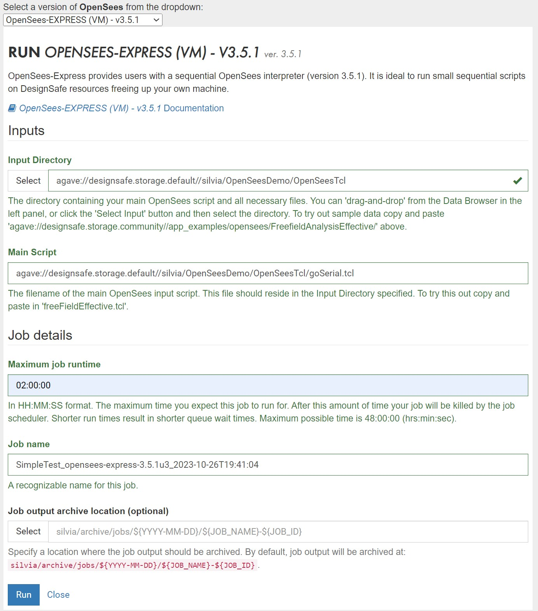
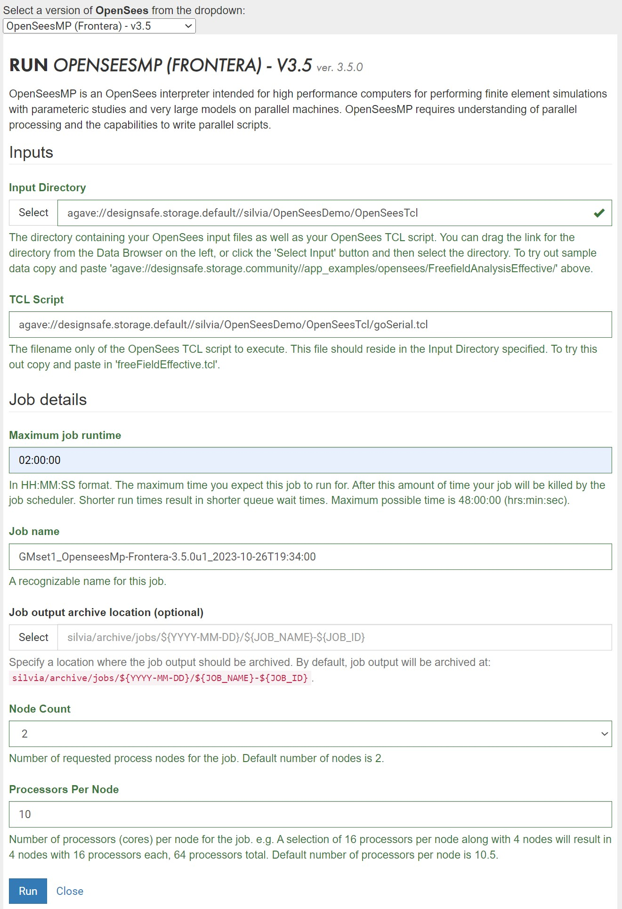

##### Web Portal Form Input Parameters

Here is a list and description of all the form input parameters for the Web Form <i>(Figure 1 and 2)</i>. 
Note: not all applications require all the input: 
OpenSees-Express: Figure 1 and OpenSeesMP: Figure2
    <ul>
        <li><b>Input Directory</b>: Directory containing all input files. This directory will be cloned to the HPC workspace and, once the job is complete, will be placed in the output location you specify below.  
        You can drag the link for the directory from the Data Browser on the left, or click the 'Select Input' button and then select the directory.</li>
        <li><b>Input Script</b>: The filename of the main OpenSees TCL script to execute. This file should reside in the Input Directory specified.</li>
        <li><b>Maximum job runtime</b>: In HH:MM:SS format. The maximum time you expect this job to run for, it does not include the time in queue. After this amount of time your job will be killed by the job scheduler. Shorter run times result in shorter queue wait times. Run-time limitations are platform-dependent and shown in the specs above, which are typically 48hr</li>
        <li><b>Job name</b>: The pre-filled name contains useful job metadata already. We recommend you add a descriptive identifier to it if you submit more than one job. This name is used by the Job-Status side bar as well as in the name of the default output location. </li>
        <li><b>Job output archive location (optional)</b>: Specify a location where the job output should be archived. By default, job output will be archived at: {username}/archive/jobs/${YYYY-MM-DD}/${JOB_NAME}-${JOB_ID}. 
        This archive will contain the clone of the Input Directory from the time the job was submitted as well as any new files created by the OpenSees runs. You will need to move the relevant output files into your data directory once the job is finished.</li>
        <li>HPC jobs only (OpenSeesSP and OpenSeesMP):
            <ul>
                <li><b>Node count</b>: Number of requested process nodes for the HPC job. Nodes are equivalent to computers. Default number of nodes is 2, which is the maximum for the small queue in Frontera. Be conservative to not exceed per-user limits if you plan to submit many jobs.</li>
                <li><b>Processors Per Node</b>: Number of processors (cores) <b>per node</b> for the HPC job. <i>TotalProcesses=NodeCount x ProcessorsPerNode</i>. There is no real need to go with less than the maximum allowed.</li>
            </ul>
        </li>
    </ul>

<small><i><b>Figure 1</b>: Sample Form for OpenSees-Express</i> </small>
{ width=75% , align=center}  
<small><i><b>Figure 2</b>: Sample Form for OpenSeesMP</i> </small>
{ width=75% , align=center}  

