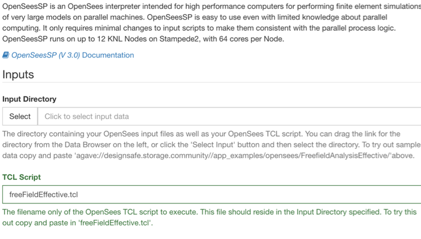

### [How to Submit an OpenSees Job in the Workspace](#submit) { #submit } 

1. Select the OpenSees application from the simulation tab in the workspace.

2. Choose the application that is best suited for your work.

	

	

3. Locate your OpenSees input files and TCL script in the Data Depot and follow the onscreen directions to provide your Input Directory and TCL Script in the form.

4. To test out a tutorial case you can copy paste the link in the description for working directory as well as the TCL script name. As shown in the figure below.

	

5. Enter a maximum job runtime in the form. See guidance on form for selecting a runtime.

6. Enter a job name (Optional).

7. Enter an output archive location or use the default provided. 

8. Node Count: Number of requested process nodes for the job.

9. Processors per Node: numbers of cores per node for the job. The total number of cores used is equal to <i style="">NodeCount x ProcessorsPerNode</i>.

10. Click Run to submit your job.

	

11. Check the job status by clicking on the arrow in the upper right of the job submission form.

	

