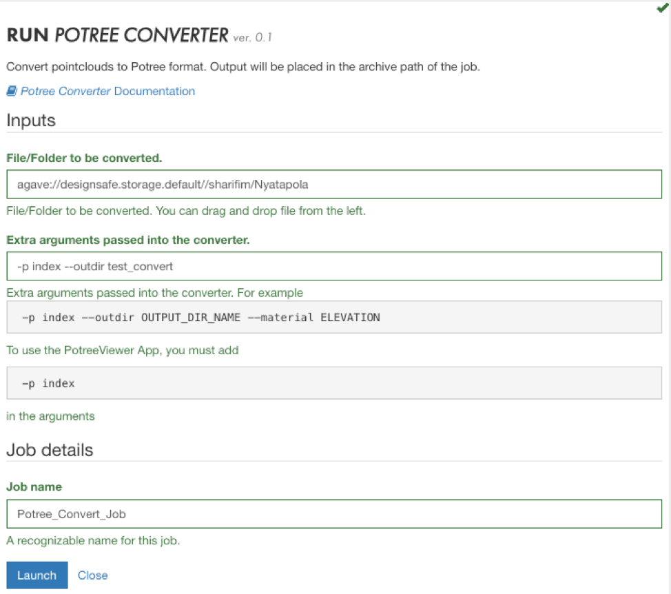

## Potree Converter User Guide

The Potree Converter converts point clouds to a format compatible with the Potree Viewer. Several options are available for you to customize your conversion, and can be found on the Potree Converter Github site.

POTREE Converter can be found under Visualization tab in DesignSafe Workspace. This application converts non-proprietary point cloud data formats (e.g. las, laz, binary ply, xyz or ptx) to a POTREE readable data structure (octree). The output directory from this application can next be visualized in POTREE Viewer.

### [How to Submit a Potree Converter Job in the Workspace](#submit) { #submit }

Similar to most applications in DesignSafe, you will have to fill out a form to submit your job that asks for following information:

{: class="align-center" }

<ol>
<li>File/Folder to be converted: 
	You can simply drag and drop either a file or a folder containing multiple point cloud files from Data Depot Browser (to the left of this form) in this place.</li>
<li>Extra arguments passed into the converter: 
	“-p index” should be passed as a minimum in this section. This creates a html index file which is necessary for POTREE viewer to run. Additionally, you will be able to pass more arguments. For instance, you can type the name of the output directory shown as below -p index –outdir OUT_DIR_NAME. Please note that the output directory will be placed in “MyData.”</li>
<li>Job name: 
	You will need to provide a recognizable name for this job.</li>
</ol>

The job log files will be stored at archive folder in “Mydata”: {username}/archive/jobs/${YYYY-MM-DD}/${JOB_NAME}-${JOB_ID}

{: class="align-center" }

When the form is completed, you can click “Launch” to submit your job. The job status can be monitored to the right of this form. It will change from “Pending” to “Staged”, “Submitted” and “Running” before it is successfully “Finished.”

### [FAQ](#faq) { #faq }

<ol>
<li>My job’s status will change swiftly from Running to Finished with no converted output directory? 
	  
	This most likely means that the process is not completed and the job is failed. This is usually as a result of the presense of special characters (e.g. &#42; ^, !, $, % and etc.) in your input file or directory. Please re-submit a job after removing these characters by renaming the input files or directory. If the problem persists, please submit a ticket for further assistance.</li>
<li>I want to convert a file/folder located in My Projects. What should I do? 
	  
	From the Data Depot Browser to the left of job submission form, you can browse to your desired project and select the file/folder to be converted.</li>
</ol>
