# DesignSafe Use Case Template

## A Guide to Adding Your Use Case Project

<a id="fork-repo">

1. The Principal Investigator (PI) should [Fork](https://docs.github.com/en/pull-requests/collaborating-with-pull-requests/working-with-forks/fork-a-repo) the [DS User Guide repo][DS-User-Guide] to their own account. If prompted, select an organziation to create the fork.

    | fork the repo |
    | - |
    | 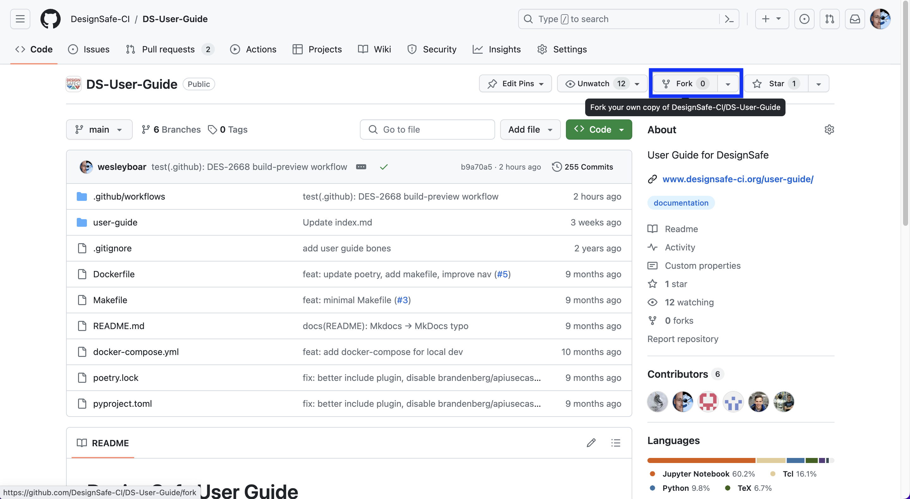 | |

    | forking in progress |
    | - |
    | 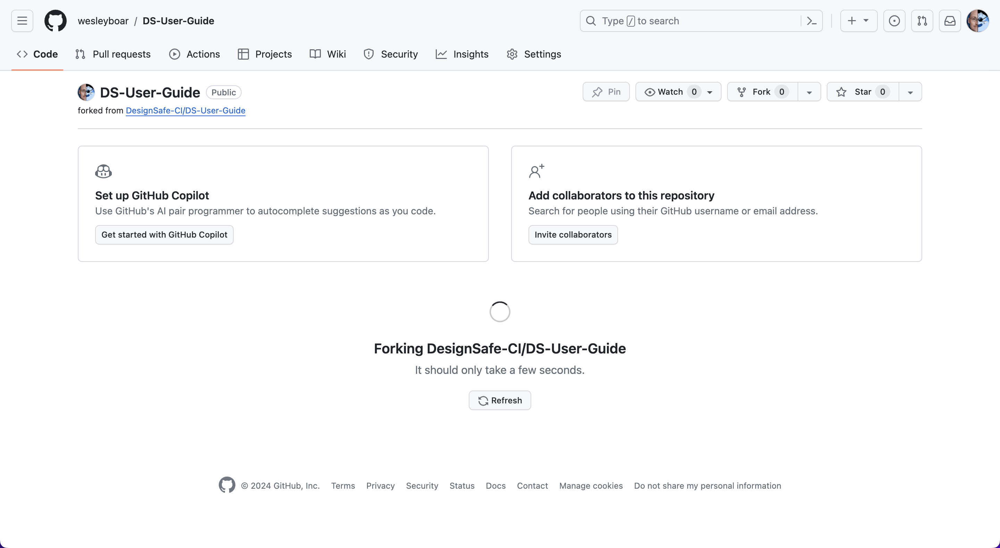 |

    The PI can later [add their students as collaborators in the Settings page](https://docs.github.com/en/account-and-profile/setting-up-and-managing-your-personal-account-on-github/managing-access-to-your-personal-repositories/inviting-collaborators-to-a-personal-repository):

    | add collaborators |
    | - |
    | 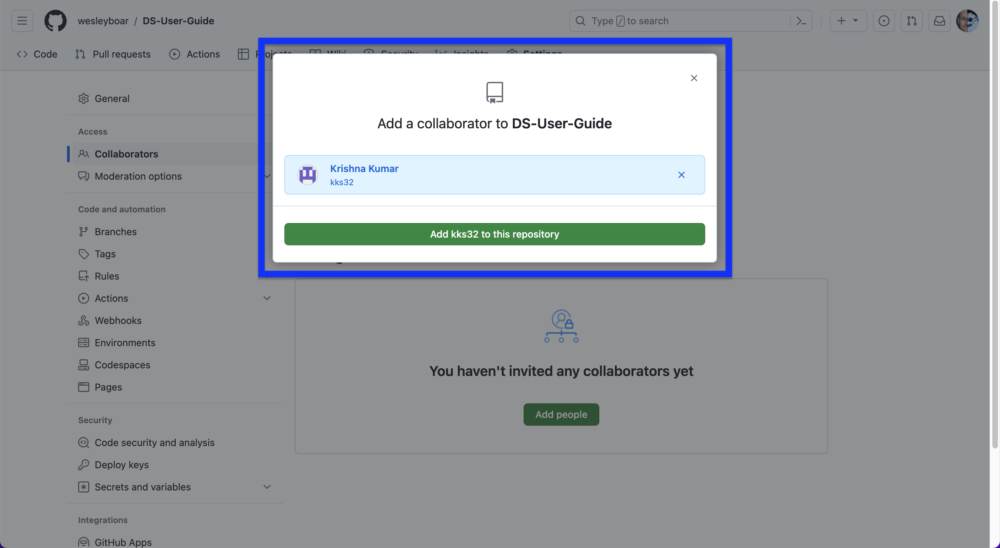 |

    <a id="fork-success">

2. GitHub will create a forked repo in your user account.

    > **Note:**
    > The new repo will say it was forked from the original [DS-User-Guide].

    | the repo fork |
    | - |
    | 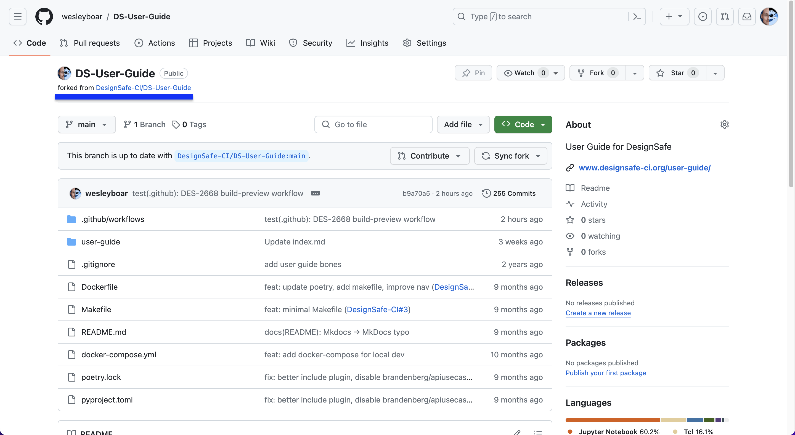 |

    <a id="find-usecase">

3. Navigate to your use case folder, which is located in the `user-guide/docs/usecases` folder. The folders are named after the PI, so find the folder with your name to edit your template. **Always check you are only editing your use case folder**.

    | PI use case folder |
    | - |
    | 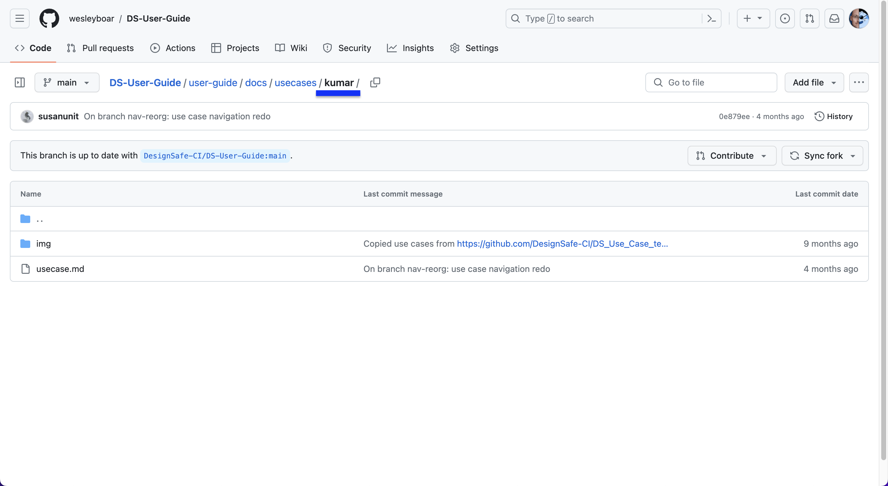 |

    <a id="edit-usecase">

4. Click on the `usecase.md` file in your usecase folder to [Edit](https://docs.github.com/en/repositories/working-with-files/managing-files/editing-files) your use case.

    > **Note:**
    > - The document is written in plain text.
    > - The document supports [Markdown syntax (extended)](https://www.markdownguide.org/extended-syntax/) (we use [MkDocs'](https://www.mkdocs.org/user-guide/writing-your-docs/#writing-with-markdown)).
    > - Avoid HTML (because Markdown is easier to maintain in this repository).
    > - You can add attributes via [python-markdown "Attribute Lists"](https://python-markdown.github.io/extensions/attr_list/).
    > - Do **not** use deprecated HTML e.g. [`name` attribute](https://developer.mozilla.org/en-US/docs/Web/HTML/Element/a#deprecated_attributes).
    > - Do **not** use `<b>` or `<i>` unless `**` or `_` _(or `<strong>` or `<em>`)_ is inadequate.

    | to edit document |
    | - |
    | 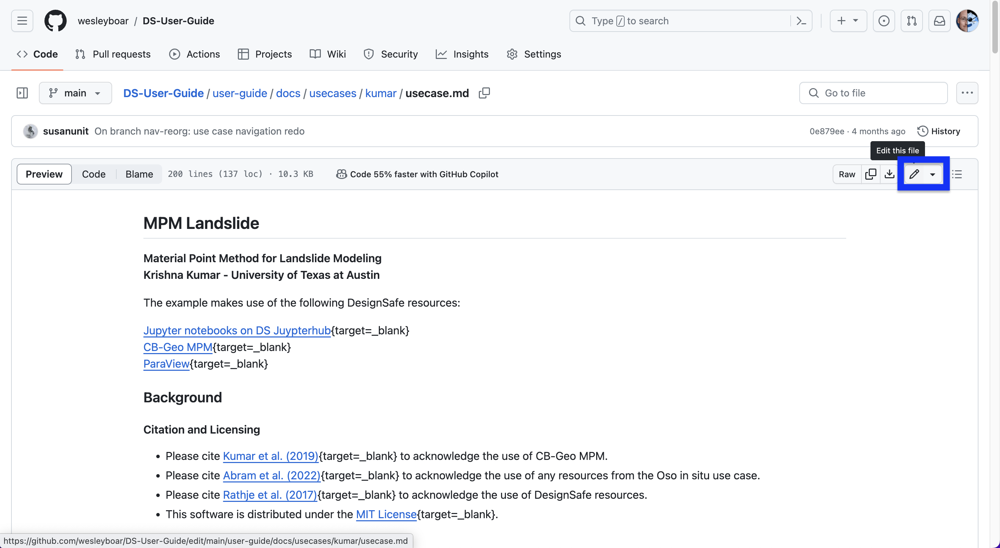 |

    | editing document |
    | - |
    | 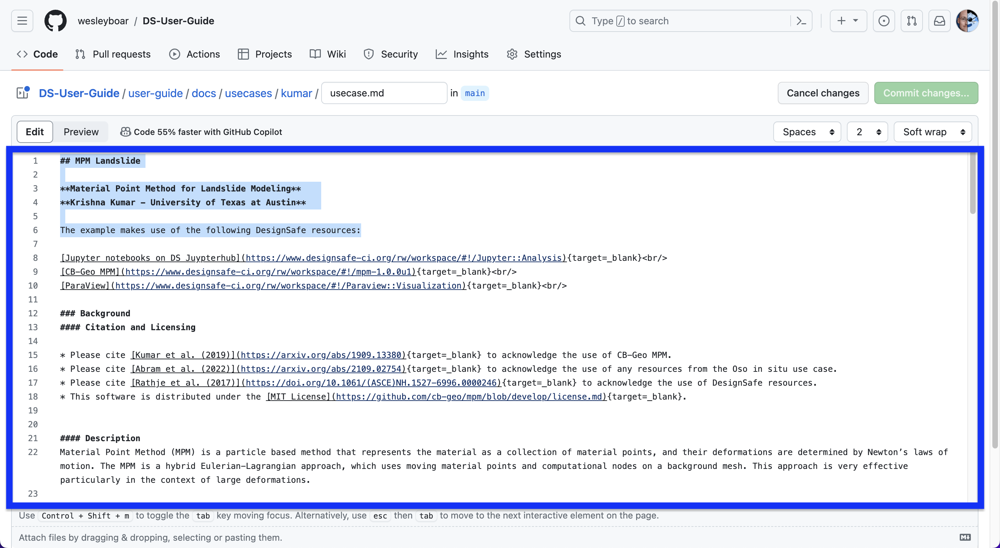 |

    <a id="save-changes">

5. Once you have completed editing your use case, you save your changes by [commiting](https://docs.github.com/en/pull-requests/committing-changes-to-your-project/creating-and-editing-commits/about-commits). Scroll down to the bottom of the page and type a descriptive phrase explaining the changes you have made and click "Commit changes". These changes will be saved only on your repo and will not be reflected in the [original DS User Guide repo][DS-User-Guide] until you create a Pull Request (PR) (that step is explained later).

    | commit your edits |
    | - |
    | 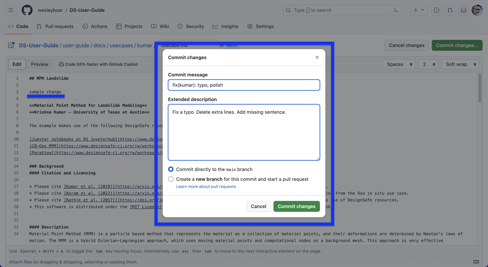 |

    <a id="add-images">

6. To add images to your use case, navigate to your use case folder and select the `img` folder. **Ensure that you are in your usecase `img` folder** before adding images.

    | the image folder |
    | - |
    | 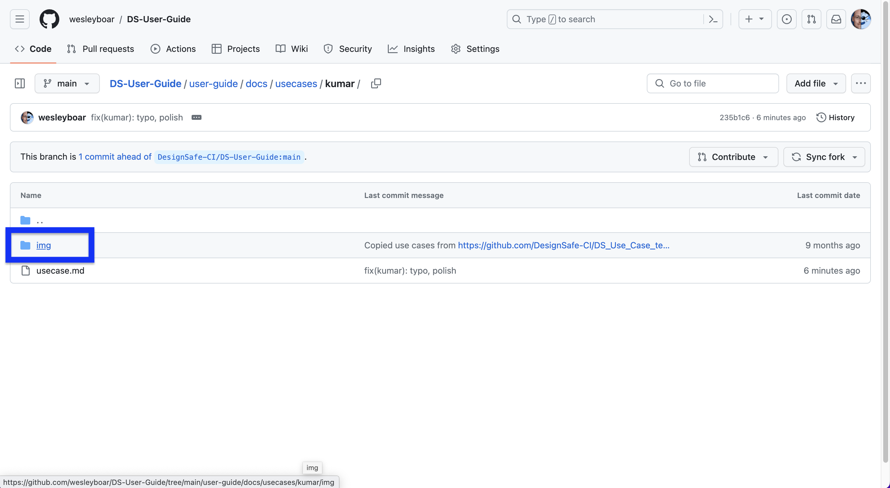 |

    | to upload image(s) |
    | - |
    | 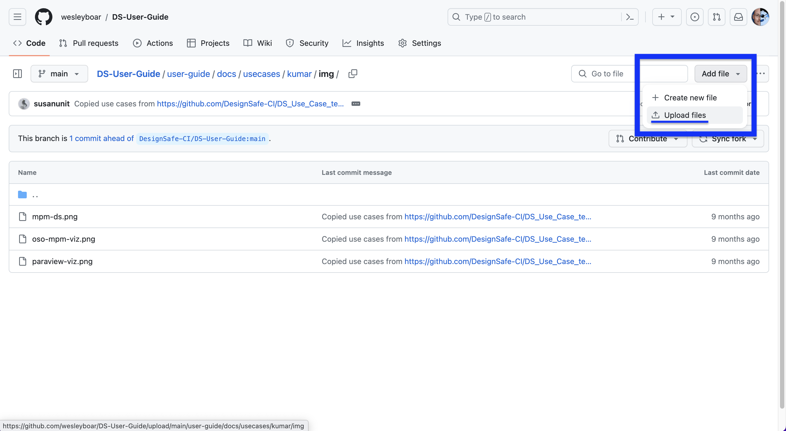 |

7. [Select image files (you can select multiple files) and upload.](https://docs.github.com/en/repositories/working-with-files/managing-files/adding-a-file-to-a-repository) Once the images are added, type a descriptive commit message and click "Commit changes" to add relevant images to your folder.

    | uploading image(s) |
    | - |
    | 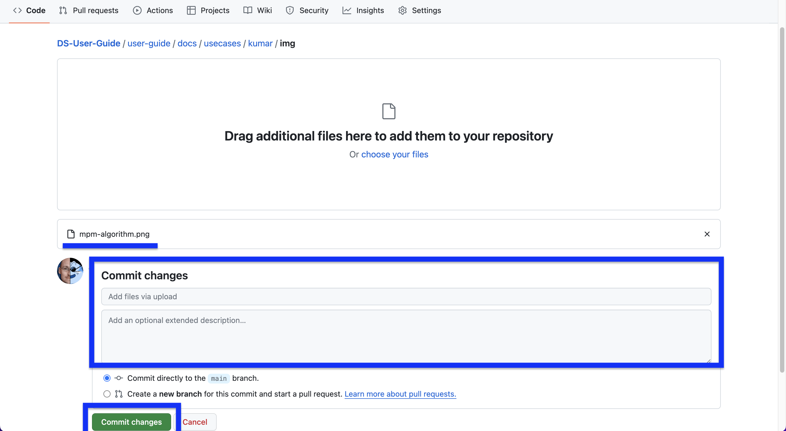 |

    <a id="insert-image">

8. To insert the image in your `usecase.md` file, add syntax like this into the text:

    ```md
    
    ```

    In this case, we added an image called `mpm-algorithm.png`, which is located in the use case folder `img`. We can reference it in the text usingg:

    ```md
    
    ```

    > **Note:**
    > Use a relative path `img/mpm-algorithm.png`, **do not use a full path** (e.g., [`https://github.com/DesignSafe-CI/DS-User-Guide/user-guide/docs/usecases/kumar/img/mpm-algorithm.png`](https://github.com/DesignSafe-CI/DS-User-Guide/user-guide/docs/usecases/kumar/img/mpm-algorithm.png) |).

    You can use the "Preview" tab to check images and text formatting before commiting your changes.

    | previewing addition of image |
    | - |
    | 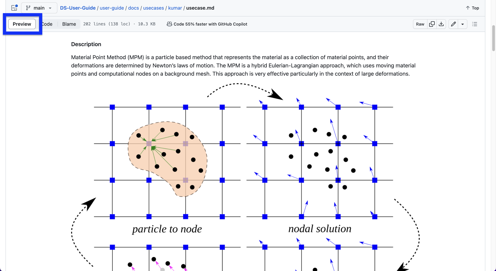 |

    Commit your changes to GitHub with a meaningful message.

    | comitting addition of image |
    | - |
    | 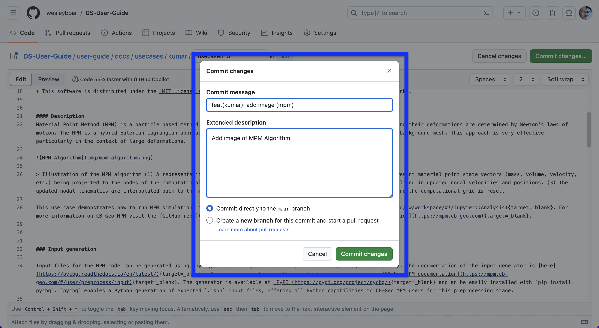 |

    <a id="sync-fork">

9. Before you are ready to make changes to the [original DS-User-Guide repo][DS-User-Guide]. Make sure your repository on GitHub is up to date with all the changes from the original repo. You can do this by navigating your repo and click on "Fetch upstream". It will probably say there is nothing new to fetch.

    | no upstream changes to fetch |
    | - |
    | 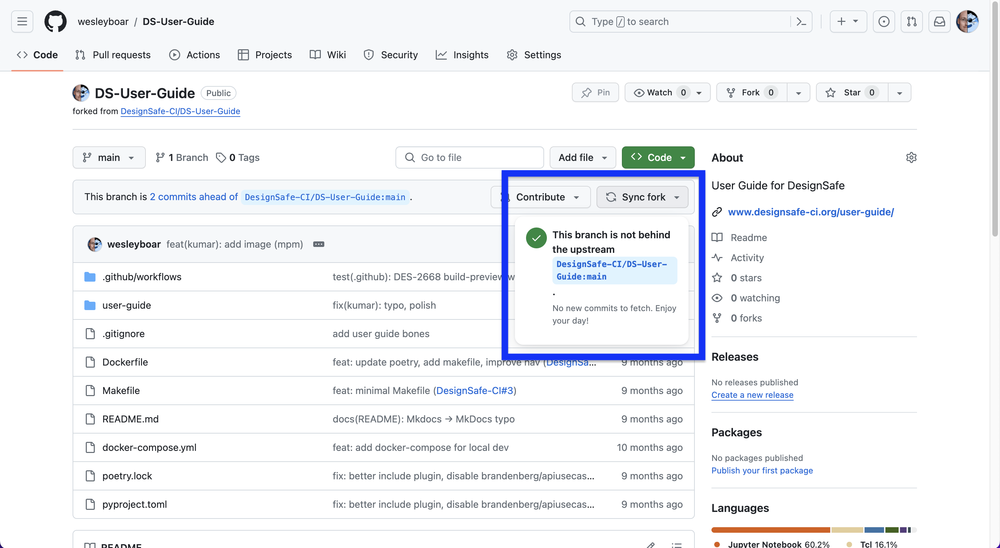 |

    If there are any new changes you can fetch and merge.

    | fetch upstream changes |
    | - |
    |  |

    <a id="request-review">

10. Once you have completed making changes, you'll now [create a Pull Request (PR)](https://docs.github.com/en/pull-requests/collaborating-with-pull-requests/proposing-changes-to-your-work-with-pull-requests/creating-a-pull-request) to request that your changes be merged to the main DesignSafe Use Case repo. Go to your repo on GitHub (in my case it is https://github.com/wesleyboar/DS-User-Guide). And select "Contribute". Before opening a pull request, verify the page states:

    > This branch is _N_ commit(s) **ahead** of DesignSafe-CI master

    | begin to open a PR |
    | - |
    | 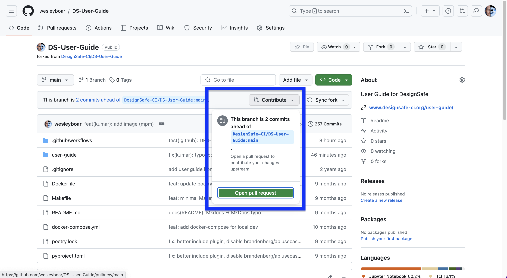 |

    Verify the changes you've made and select "Create pull request".

    | verify the changes |
    | - |
    | 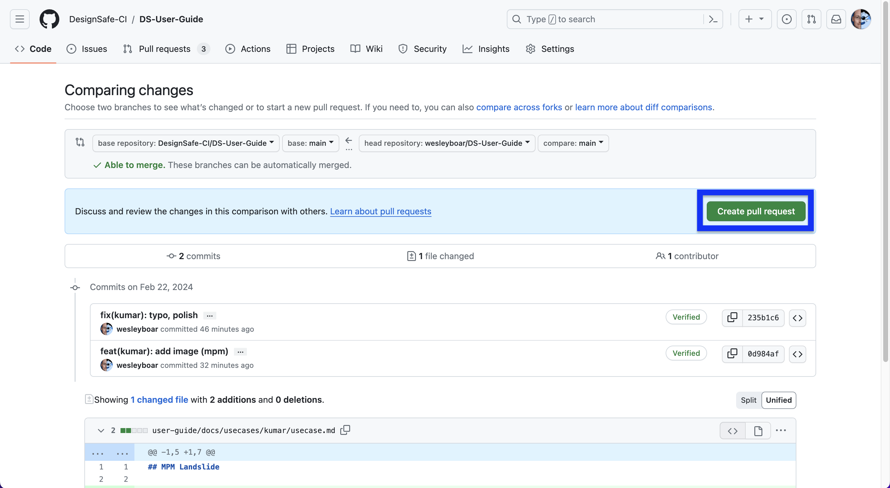 |

    Complete the title and description of your PR and select "Open pull request".

    | create the PR |
    | - |
    | 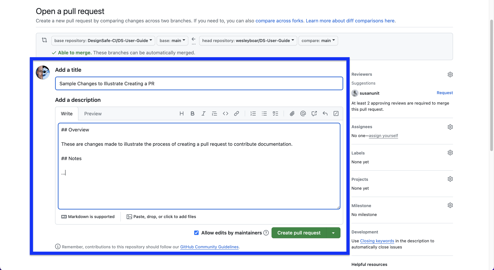 |

    The PR will show all the changes you have made in the "Files changed" tab.

    | files changed |
    | - |
    | 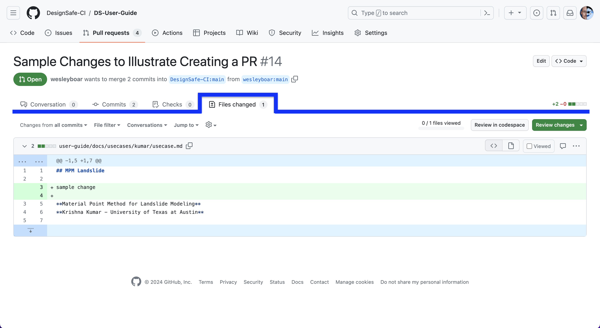 |

    <a id="test-changes">

11. You can [**test your changes** on your local machine](../../../README#testing) using a command prompt (very few commands).

    > **Note:**
    > GitHub preview is an inaccurate representation of what will appear on the site.
    >
    > - Markdown rendering is less forgiving than [Github's](https://docs.github.com/en/get-started/writing-on-github/getting-started-with-writing-and-formatting-on-github/basic-writing-and-formatting-syntax) e.g.
    >     - Use 4 spaces to indent.
    >     - Add a new line before starting a list.
    > - Image paths must be:
    >     - **either** absolute starting at `/user-guide/` ([example](https://github.com/DesignSafe-CI/DS-User-Guide/pull/35/commits/956fc03))
    >     - **or** relative to page that includes document that loads image

    The <a href="https://github.com/DesignSafe-CI/DS_Use_Case_template/blob/c32d48a/README.md?plain=1#L76-L80">"preview deployment" feature from `DS_Use_Case_template`</a> is **not** available **yet**.</summary>

    <details><summary>Preview Deployment — ⚠️ Feature Not Available Yet</summary>

    11. After a minute or so a preview deployment of your use case will be available on the pull request page. Select the preview link generated by Netlify to view your changes similar to how it would be rendered in the final version. If you want to make some tweaks. Visit *your* GitHub repo of the DS Use Case and make changes. As long as the current PR remains open GitHub will automatically pull your changes.

        | link to preview of deployment |
        | - |
        | ⚠️ Feature unavailable. Until feature is available, you may view an [outdated image](docs/images/21-pr.png). |
        <!--  | -->

        | preview of deployment |
        | - |
        | ⚠️ Feature unavailable. Until feature is available, you may view an [outdated image](docs/images/22-preview.png). |
        <!--  | -->

    </details>

[DS-User-Guide]: https://github.com/DesignSafe-CI/DS-User-Guide/
[DS_Use_Case_template]: https://github.com/DesignSafe-CI/DS_Use_Case_template/
