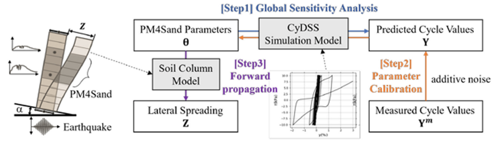
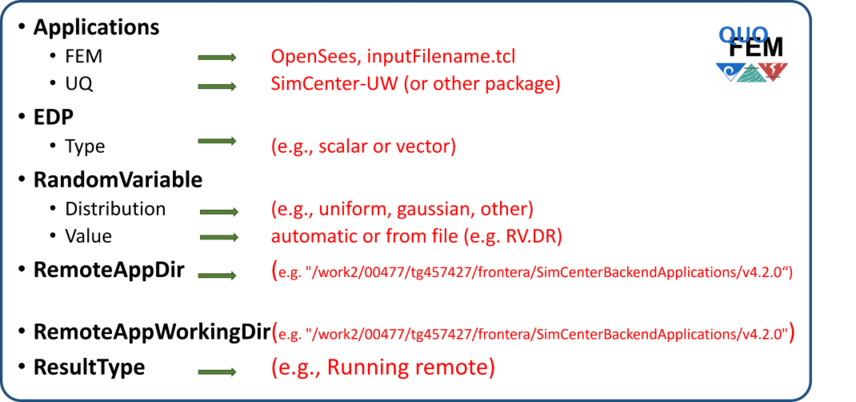
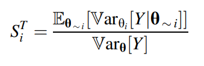
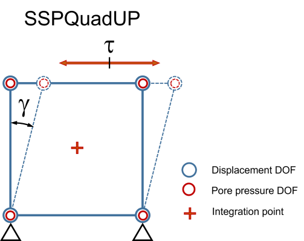
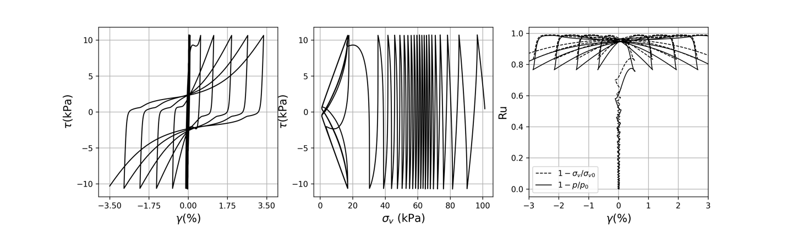
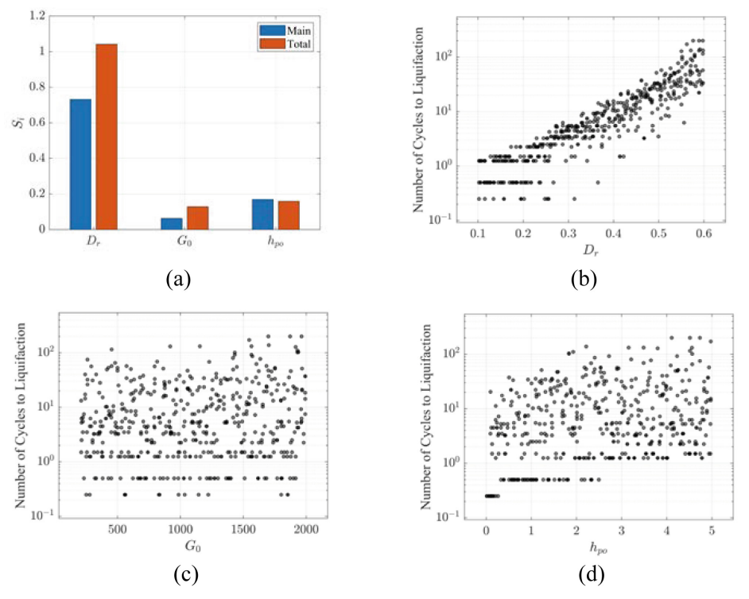
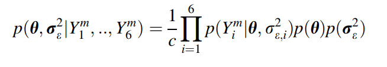
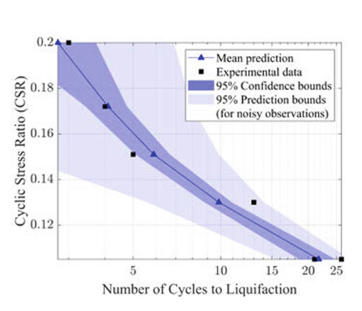
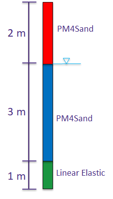
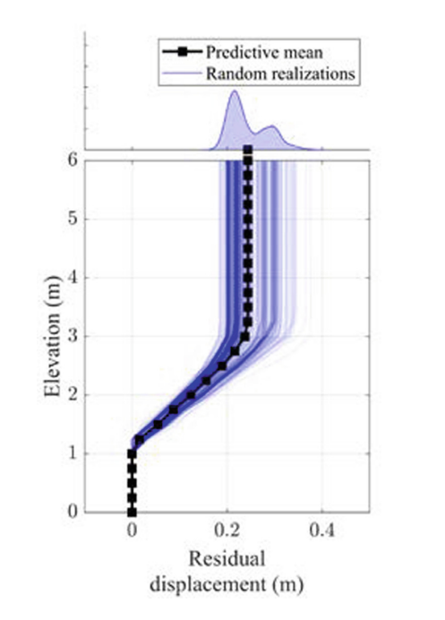

# Sensitivity Analysis, Bayesian Calibration and Forward Propagation of Uncertainties Using quoFEM

**Pedro Arduino - University of Washington** <br/>
**Sang-Ri Yi and** <br/>
**Aakash Bangalore Satish - SimCenter, UC Berkeley**

This use-case outlines a Bayesian updating framework that integrates probabilistic calibration of a soil constitutive model and probabilistic prediction of lateral spreading due to seismic liquefaction. To accomplish this, the SimCenter **quoFEM** tool and SimCenter UQ backend applications are utilized alongside a collection of jupyter notebooks that enhance the functionality of quoFEM within the DesignSafe infrastructure [1].

[SimCenter - quoFEM](https://simcenter.designsafe-ci.org/research-tools/quofem-application)<br/>
[Simulation on DS - OpenSees](https://www.designsafe-ci.org/rw/workspace/#!/OpenSees::Simulation)<br/>
[Jupyter notebooks on DS Juypterhub](https://www.designsafe-ci.org/rw/workspace/#!/Jupyter::Analysis)<br/>

## Background 
### Citation and Licensing

* Please cite [Aakash B. Satish et al. (2022)](https://doi.org/10.1007/978-3-031-11898-2_152) to acknowledge the use of resources from this use case. <br/>

* Please cite [Sang-Ri Yi et al. (2022)](https://doi.org/10.1007/978-3-031-30125-4_6) to acknowledge the use of resources from this use case. <br/>

* Please cite [Rathje et al. (2017)](https://doi.org/10.1061/(ASCE)NH.1527-6996.0000246) to acknowledge the use of DesignSafe resources. <br/>  

* This software is distributed under the [GNU General Public License](https://www.gnu.org/licenses/gpl-3.0.html).  

## Problem Description

This illustrative use_case demonstrates several UQ techniques using the parameters of the PM4Sand constitutive model, a liquefaction-capable soil model in OpenSees. This complex material model is often calibrated using a small number of experimental results which yields imperfect information about its parameters. This leads to uncertain model predictions. Quantifying such uncertainties and inspecting the uncertainty bounds of model predictions can provide more information about the importance of each model parameter. Recognizing these uncertainties can incentivize more sophisticated modeling and calibration techniques that can better utilize the available data from experiments to reduce these bounds and provide more robust and higher fidelity simulations.

In this use case, the amount of reduction in the uncertainty in PM4Sand parameters calibrated to Cyclic Direct Simple Shear (CyDSS) test data is inspected, and the resulting uncertainty is propagated in an earthquake excitation simulation of a soil column. Three steps of UQ analyses, schematically shown in Fig. 1, are presented:

1. **Global sensitivity analysis** to get an insight into which parameters are critical in triggering liquefaction. This is an important first step to decide which parameters need to be included in the calibration process.

2. **Bayesian calibration** to obtain the posterior probability distribution of the PM4Sand parameters based on the CyDSS test dataset.

3. **Forward propagation** to investigate how the uncertainty that remains after the Bayesian calibration (characterized by the posterior probability distribution) affects the prediction of an earthquake response.


<p align="center">

</p>
<p align="center"> <b>Fig.1 - Probabilistic calibration of soil model (step 2) with sensitivity analysis (step 1) and prediction of uncertainty in estimation of lateral sperading (step 3)</b> </p>


## Uncertainty Quantification Using quoFEM

Accurate quantification of uncertainty requires well-established workflows that incorporate sophisticated UQ techniques with advanced simulation models and frameworks. The SimCenter quoFEM tool streamlines this process by offering comprehensive workflows in a single tool, which can be accessed locally or remotely through a web browser using the DCV client on DesignSafe. Furthermore, users can utilize the Jupyter Hub environment on DesignSafe to manage the same, or additional, runs via Python scripts, defining job variables and submitting jobs through the Tapis system. This allows for seamless collaboration and efficient job management, resulting in faster and more effective UQ analysis.

In this context, the notebooks included in this use-case complement input generated by quoFEM and therefore must be considered together. Details on how to run this example using the quoFEM desktop can be found here[]. In this document three complementary notebooks are discussed that correspond to each of the steps mentioned above. A link to each notebook is included at the beginning of each section.

To connect SimCenter applications and Jupyter notebooks in DesignSafe, it's essential to ensure that all required tools are accessible from both frameworks. The SimCenter's vision is well-aligned with this concept and offers all of the necessary functionality through backend applications installed in DesignSafe that can be accessed via Tapis apps. This is schematically shown in Fig 2. Additionally, all SimCenter workflows are stored in JSON files that represent all steps in a workflow. This file is readily accesible using a JSON parser.

<p align="center">

</p>
<p align="center"> <b>Fig.2 - Running quoFEM analysis using remote computing resources at DesignSafe</b> </p>

In quoFEM, the workflow data is stored in a tmp.SimCenter folder that can be accessed from the quoFEM desktop, sent to an HPC, or accessed from a notebook. For the examples presented in this document, the  information included in this folder is sufficient to run all cases.

In order to facilitate the discussion of each notebook, it is helpful to first identify common aspects that are present in all workflows run from Jupyter. These include:

1. Setup Tapis App job 
2. Display job workflow
3. Run Tapis job
4. Post-process results 

Instructions for (1) setting up and (2) running Tapis jobs can be found [here](https://jupyter.designsafe-ci.org/user/name/lab/workspaces/auto-J/tree/CommunityData/Jupyter%20Notebooks%20for%20Civil%20Engineering%20Courses/University_of_Washington/freeFieldJupyterPM4Sand/freeFieldJupyterPM4Sand_Community.ipynb). These steps are generally applicable for launching any Tapis app from a Jupyter notebook in DesignSafe. The most significant step in this process is determining the appropriate Tapis app to utilize.  To perform uncertainty quantification within SimCenter backend applications, the following Tapis app is used:

``` python
#Select tapis-app
app_name   = 'simcenter-uq-frontera'
app_id     = 'simcenter-uq-frontera-4.0.0u4'
storage_id = 'designsafe.storage.default'

# Get Tapis app
app = ag.apps.get(appId=app_id)
```

Post-processing of results is specific to the problem being solved and can be achieved using Python to access output data stored in archived files. For this purpose it is important to identify the location of data files. This is explained [here](https://jupyter.designsafe-ci.org/user/name/lab/workspaces/auto-J/tree/CommunityData/Jupyter%20Notebooks%20for%20Civil%20Engineering%20Courses/University_of_Washington/freeFieldJupyterPM4Sand/freeFieldJupyterPM4Sand_Community.ipynb). 

Displaying a quoFEM job workflow is useful for understanding the data and steps followed in the workflow. These include: simulation tools, input variables, UQ methods used, and remote directories/folders. An schematic of a typical quoFEM workflow is shown in Fig. 3. 

<p align="center">

</p>
<p align="center"> <b>Fig.3 - Elements of quoFEM workflow (only relevant elements for launching notebook from JupyterHub)</b> </p>

To display the JSON file the IPython.display module can be used:
 
 ```python
 # Display Workflow in JSON file
import IPython.display
import json
jsonPath = os.getcwd()+"/tmp.SimCenter/templatedir/"+parameters["inputFile"]
with open(jsonPath) as f:
    jsonInfo = json.load(f)
IPython.display.JSON(jsonInfo)
```
To modify the workflow, the user can either manually change the workflow files within the tmp.SimCenter folder or regenerate the workflow using quoFEM. Regenerating the workflow using quoFEM is the preferred approach, as the quoFEM desktop is specifically designed to facilitate workflow creation. On the other hand, Jupyter notebooks offer more flexibility in terms of post-processing, generating plots, and manipulating data.


## Step 1 – Global Sensitivity Analysis

 [quoFEM-Sensitivity.ipynb](https://jupyter.designsafe-ci.org/user/name/lab/workspaces/auto-J/tree/CommunityData/Jupyter%20Notebooks%20for%20Civil%20Engineering%20Courses/University_of_Washington/quoFEM_Example1/GlobalSensitivity/quoFEM-Sensitivity.ipynb).


The PM4Sand constitutive model has 24 parameters. Among them, apparent relative density $D_r$, shear modulus coefficient $G_o$, and contraction rate parameter $h_{po}$, are known to be important for predicting liquefaction responses [2]. Therefore, these three parameters $\theta = \{D_r,G_o,h_{po}\}$ are considered in the UQ analyses and their prior distributions are assumed to be uniform distributions with the ranges shown in Table 1. These prior distributions shall capture a plausible wide range that includes all possible parameter values for the target soils. The experimental data will be used to constrain this wide range to the domain that best describes the behavior exhibited by the specimen during the experiments. 

<p align="center"><b>Table 1. - Prior distributions of PM4Sand parameter</b> </p>

<p align="center">

| Parameter | Distribution | Range    |
| :-------: | :---------:  | :------- |
| $D_r$     | Uniform      | 0.1-0.6     |
| $G_o$     | Uniform      | 200 - 2000 |
| $h_{po}$  | Uniform      | 0.01 - 5   |

</p>

The sensitivity analysis is performed for a simulation model that reproduces the CyDSS test shown in Figs. 4 and 5. The output quantity of interest is the number of cycles until the onset of liquefaction (denoted as Y). The onset of liquefaction is defined as the time step when the shear strain shown in Fig. 4 exceeds 3.5%. Liquefaction capacity is affected by the initial shear stress typically characterized by the cyclic shear stress ratio ($CSR$; i.e., ratio of horizontal cyclic shear stress to vertical consolidation stress). In this sensitivity analysis, a $CSR$ of 0.175 is considered. Two variance-based global sensitivity indices are evaluated:

<!--
<p align="center">

(1)
</p>

<p align="center">

(2)
</p>
-->

$$
S_i=\frac{\operatorname{Var}_{\theta_i}\left[\mathbb{E}_{\boldsymbol{\theta}_{\sim i}}\left[Y \mid \theta_i\right]\right]}{\operatorname{Var}_{\boldsymbol{\theta}}[Y]}
\qquad(1)
$$

$$
S_i^T=\frac{\mathbb{E}_{\boldsymbol{\theta}_{\sim i}}\left[\operatorname{Var}_{\theta_i}\left[Y \mid \boldsymbol{\theta}_{\sim i}\right]\right]}{\operatorname{Var}_{\boldsymbol{\theta}}[Y]}
\qquad(2)
$$

where $\theta_i$ is the parameter of interest (i.e., one of the $\{D_r,G_o,h_{po}\}$ ) , $\boldsymbol{\theta}_{\sim i}$ denotes the other two parameters, $\mathbb{E}_{\boldsymbol{X}}[.]$ and $\operatorname{Var}_{\boldsymbol{X}}[.]$ denote mean and variance of function over $\boldsymbol{X}$, respectively, and the vertical bar denotes ‘conditional on’. The former index, called the main-effect index, quantifies how much of the variance of $Y$ is attributed to the parameter $\theta_i$, while the latter index, called the total-effect index, also considers the joint contributions of $\theta_i$ and other parameters [3].

<p align="center">

</p>
<p align="center"> <b>Fig.4 - Single element FE model used in sensitivity analysis and Bayesian calibration</b> </p>

<p align="center">

</p>
<p align="center"> <b>Fig.5 - (a) simulated cyclic stress-strain curve; (b)stress path during the simulated cyclic direct simple shear test; (c) evolution of pore water pressure ratio during the simulated CyDSS test</b> </p>

The sensitivity analysis is performed using the algorithm in Weirs et al. (2012) through the Dakota engine that interfaces with quoFEM [3]. 2500 simulations were performed using the prior distributions in Table 1. The resulting sensitivity is shown in Fig. 6(a) which indicates that $D_r$ is the dominating parameter for the response $Y$. This is also confirmed by inspecting the scatter plot of Fig. 6(b): $D_r$ (horizontal axis) demonstrates a stronger influence on the output (vertical axis) compared to the influence of the other parameters shown in (c) and (d). Based on this, we can expect that the CyDSS observations will help constrain the uncertainty in $D_r$, while the reduction of uncertainty in $h_{po}$ and $G_o$ will be relatively limited. Additionally, different types of experiments would be needed to better characterize those other parameters.

<p align="center">

</p>
<p align="center"> <b>Fig.6 - (a) Sensitivity analysis results for the critical number of cycles given CSR = 0.172; (b)–
(d) Individual input-output scatter plots</b> </p>


## Step 2 – Bayesian Parameter Calibration

[quoFEM-Bayesian.ipynb](https://jupyter.designsafe-ci.org/user/name/lab/workspaces/auto-J/tree/CommunityData/Jupyter%20Notebooks%20for%20Civil%20Engineering%20Courses/University_of_Washington/quoFEM_Example1/BayesianCalibration/quoFEM-Bayesian.ipynb)

Consider now the observations of the CyDSS experiment in Table 2, that are publicly available on the DesignSafe data depot [4]. We assume that the observed count of cycles at different CSR values, denoted as $Y_i^m$ $(i = 1,…,6)$, is given by the simulation model predictions and an added Gaussian noise. The latter captures various inaccuracies such as inherent uncertainty in the phenomenon, the imperfection of our simulation model, and measurement error. Given the above assumptions, we can denote the relationship between the data and model prediction, $Y_i(\theta)$, as

<!--
<p align="center">

(3)
</p>
-->

$$
Y_i^m=Y_i(\boldsymbol{\theta})+\varepsilon_i
\qquad (3)
$$

where noise $\epsilon_i$ is assumed to have zero-mean and unknown variance $\sigma^2_{\epsilon,i}$. Given the six
measurement values, we can use a Bayesian approach to evaluate the posterior distribution of the parameters of PM4Sand and the unknown noise variances:

<!--
<p align="center">

(4)
</p>
-->

$$
p\left(\boldsymbol{\theta}, \boldsymbol{\sigma}_{\varepsilon}^2 \mid Y_1^m, . ., Y_6^m\right)=\frac{1}{c} \prod_{i=1}^6 p\left(Y_i^m \mid \boldsymbol{\theta}, \sigma_{\varepsilon}^2\right) p(\boldsymbol{\theta}) p\left(\boldsymbol{\sigma}_{\varepsilon}^2\right)
\qquad (4)
$$

where $p(∙)$ denotes the (joint) probability distribution, and $c$ is the normalization constant that ensures the area under the posterior distribution is one. From Eq. (3),

$p(Y^m_i | \theta, \sigma^2)$ is a Gaussian distribution with mean $Y_i(\theta)$ and variance of $\sigma^2$. The prior distribution of $\theta$ is in Table 1. Following best practices, inverse Gamma priors with the shape parameter $\alpha = 3$ and scale parameter $\beta = 2$ are introduced for the $\sigma^2$ measurement variances [5]. The posterior sample of $\theta$ in this example is obtained using the transitional Markov chain Monte Carlo (TMCMC) sampling technique [6] that is available in quoFEM through the UCSD-UQ engine. This is an expensive calculation that greatly benefits from the available HPC resources at DesignSafe.

<p align="center"><b>Table 2. -Cyclic direct simple shear (CyDSS)
test experimental data</b> </p>
<center>

| Cyclic Shear stress ratio (CSR) | Number of cycles to onset of liquefaction|
| :-------: | :---------:  |
| 0.105     | 26           |
| 0.105     | 21           |
| 0.130     | 13           |
| 0.151     | 5            |
| 0.172     | 4            |
| 0.200     | 3            |

</center>

<p align="center">

</p>
<p align="center"> <b>Fig.7 - Comparison of calibrated model predictions and experimental data </b> </p>

Figure 7 compares the experimental data with the calibrated model predictions of the load-cycle counts, while Fig. 8 shows the calibrated parameter sample from the joint posterior distribution. Figure 8 shows that uncertainty in all variables is reduced by calibrating to the observed data, but the reduction was most apparent in $D_r$. This is in line with our expectations from the earlier sensitivity analysis. The results also highlight a strong dependency between $D_r$ and $h_{po}$, indicating that multiple combinations of $D_r$ and $h_{po}$ produce near-optimal solutions. None of these features are captured by a deterministic estimator that results from a conventional error-minimizing optimization approach (e.g., red diamond marker shown in the same figure). It is also important to recognize that a non-negligible amount of uncertainty remains in the parameter estimates, and this produces substantial uncertainty in the model predictions. The dark blue bounds in Fig. 7 show the level of uncertainty in the estimated number of cycles to liquefaction, but this simulation model was prepared to reproduce the experimental setup. When the calibrated constitutive model is applied in another simulation, the responses can exhibit different scales of uncertainties. 

<p align="center">

</p>
<p align="center"> <b>Fig.8 - PM4Sand model parameters sampled from the joint posterior distribution</b> </p>

## Step 3 – Forward Propagation

[quoFEM-Propagation.ipynb](https://jupyter.designsafe-ci.org/user/name/lab/workspaces/auto-J/tree/CommunityData/Jupyter%20Notebooks%20for%20Civil%20Engineering%20Courses/University_of_Washington/quoFEM_Example1/ForwardPropagation/quoFEM-Propagation.ipynb)

A forward propagation analysis is helpful to characterize uncertainties in a simulation model. For this purpose it is good practice to run such an analysis and characterize the effect of uncertainties on application-specific quantities of interest before practically applying these parameter values in a simulation for decision making.

The obtained samples of the soil parameters in Fig. 8 are used to predict the uncertainty in the lateral spreading response of a site subjected to an earthquake (Loma Prieta Gilroy Array #2) with peak ground acceleration of 0.37 g. The soil column model shown in Fig. 9 is introduced in which the liquefiable layer in the middle is modeled using PM4Sand and the other parts are assumed to remain elastic throughout the shaking. 


<p align="center">

</p>
<p align="center"> <b>Fig.9 - Schematic of 1D soil layer with liquefiable soil used in the forward propagation analysis. </b> </p>

The results of 500 simulations are shown in Fig. 10. The mean and standard deviation of the residual displacement at the surface level (6 m) are 0.24 m and 0.02 m, respectively. Depending on the application, the uncertainty in these results can be considered reasonably low. The sample of the predictive distribution shown on the top of the vertical profile can further be utilized in reliability and risk assessment workflows

    
<p align="center">

</p>
<p align="center"> <b>Fig.10 - Predicted earthquake
response of soil column</b> </p>


## References

1. McKenna, F., et al.: NHERI-SimCenter/quoFEM: Version 3.0.0. Zenodo (2022).

2. Boulanger, R.W., Ziotopoulou, K.: PM4Sand (Version 3.1): A sand plasticity model for earthquake engineering applications. Department of Civil and Environmental Engineering, University of California, Davis, Davis, CA, Report UCD/CGM-17/01 (2017).

3. Weirs, V.G., et al.: Sensitivity analysis techniques applied to a system of hyperbolic conservation laws. Reliab. Eng. Syst. Saf. 107, 157–170 (2012).

4. Morales, B., Humire, F., Ziotopoulou, K.: Data from: Cyclic Direct Simple Shear Testing of Ottawa F50 and F65 Sands, 1 February 2021. Distributed by Design Safe-CI Data Depot.
https://doi.org/10.17603/ds2-eahz-9466. Accessed 28 June 2021.


5. Ching, J., Chen, Y.C.: Transitional Markov chain Monte Carlo method for Bayesian model updating, model class selection, and model averaging. J. Eng. Mech. 133(7), 816–832 (2007).

6. Carlin, J.B., Vehtari, A., Stern, H.S., Rubin, D.B., Gelman, A., Dunson, D.B.: Bayesian Data Analysis, 3rd edn. Taylor & Francis, United Kingdom (2014).
