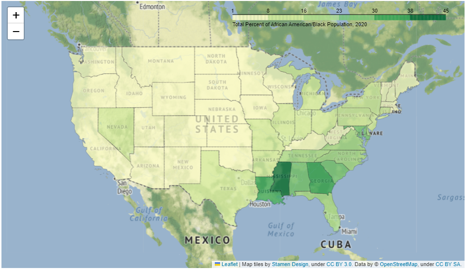
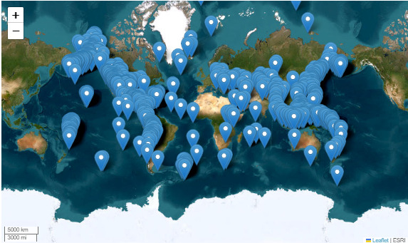

## Application Programming Interfaces

__Scott J. Brandenberg and Meera Kota, UCLA__

This use case provides some background information on application programming interfaces (API's) followed by examples that utilize the Python requests package to pull data from API's maintained by NASA, the US Census Bureau, the US Geological Survey, and the National Oceanic and Atmospheric Administration. 

Key Words: API, Application Programming Interface, Jupyter, Python, requests, US Census, USGS, NASA, NOAA

### Resources

<table>
 <tr>
  <th>Use Case Name</th>
  <th>Packages Used</th>
  <th>Link</th>            
 </tr>
 <tr>
  <td>NASA astronomy photo of the day</td>
  <td>io, json, requests, pillow</td>
  <td><a href="https://jupyter.designsafe-ci.org/hub/user-redirect/notebooks/CommunityData/Use%20Case%20Products/APIs/api_background.ipynb"></a></td>
 </tr>
 <tr>
  <td>US Census map</td>
  <td>folium, geopandas, requests, json, getpass</td>
  <td><a href="https://jupyter.designsafe-ci.org/hub/user-redirect/notebooks/CommunityData/Use%20Case%20Products/APIs/us_census_api.ipynb"></a></td>
 </tr>
 <tr>
  <td>USGS map of recent earthquakes</td>
  <td>folium, geopandas, requests, json</td>
  <td><a href="https://jupyter.designsafe-ci.org/hub/user-redirect/notebooks/CommunityData/Use%20Case%20Products/APIs/usgs_recent_earthquakes_api.ipynb"></a></td>
 </tr>
 <tr>
  <td>USGS Shakemap contours</td>
  <td>folium, geopandas, requests, json, pandas</td>
  <td><a href="https://jupyter.designsafe-ci.org/hub/user-redirect/notebooks/CommunityData/Use%20Case%20Products/APIs/usgs_shakemap_api.ipynb"></a></td>
 </tr>
 <tr>
  <td>NOAA hourly wind data</td>
  <td>folium, matplotlib, requests, json</td>
  <td><a href="https://jupyter.designsafe-ci.org/hub/user-redirect/notebooks/CommunityData/Use%20Case%20Products/APIs/noaa_api.ipynb"></a></td>
 </tr>
</table>

### Description

#### What is an API?

An Application Programming Interface (API) is software that enables communication between two components, typically on different computers. For simplicity, we'll refer to a client and a server as the two different software components. Many API's are configured such that the client submits information to the server via a query string at the end of a Uniform Resource Locator (URL). The server receives the URL, parses the query string, runs a script to gather requested information often by querying a relational database, and returns the data to the client in the requested format. Example formats include html, xml, json, or plain text.

A primary benefit of API's is that users can retrieve information from the database using intuitive query string parameters, without requiring users to understand the structure of the database. Furthermore, databases are generally configured to reject connections originating from another computer for security reasons. The API is a middle-layer that allows users to submit a request to the server, but the query itself then originates from the same server that hosts the database.

#### Authentication, Authorization, Keys, and Tokens

Authentication verifies the identity of a user, generally by entering a username and password, and sometimes through additional measures like multi-factor authentication. When a user authenticates through a website, the server may store information about that user in a manner that persists through the user session. 

Authorization determines the access rights extended to a user. For example, a particular user may have access to only their own data when they log in to a website, but they are not permitted to see other users' data.

API's are often stateless, meaning that the server does not store any information about the client session on the server-side. As a result, the request submitted by the client must contain all of the necessary information for the server to verify that the user is authorized to make the request. This is often achieved using keys and/or tokens, which are text strings that are generated by the server and provided to the user. The user must then pass the key or token from the client to the server as part of their request.

API keys are designed to identify the client to the server. In some cases you may need to request a key for a particular API. This often requires you to create an account and authenticate. Generally that key will remain the same and you'll need to include it with your API requests. Note that you typically do not need to authenticate each time a request is made. Simply including the key is adequate.

Tokens are similar to keys in that they are text strings, but they often carry additional information required to authorize the user (i.e., the token bearer). Tokens are often generated when a user authenticates, and set to expire after a specified time period, at which point the user must re-authenticate to obtain a new token.  

#### HTTP Status Codes
 
By default, the print(r) command above contains information about the HTTP status code, which indicates whether the request was succesful. A successful request will result in a 3-digit HTTP status code beginning with 2 (i.e., 2xx), with "Response \[200\]" indicating that the request was successful. Status code 1xx means that the request was received but has not yet been processed, 3xx means that the user must take additional action to complete the request, 4xx indicates a client error, and 5xx indicates that the server failed to fulfill a request
 
More about HTTP status codes: https://en.wikipedia.org/wiki/List_of_HTTP_status_codes 

### Implementation

The use cases below provide a description of each API followed by code required to run the API, and output produced at the time the documentation was written. The code provided in the documentation has been shortened; a more fully-documented version of the code exists in the Jupyter notebooks, where code is often distributed among multiple cells with annotations prior to each cell. The output presented in the documentation may differ from the output obtained by running one of the notebooks. This is because the notebooks pull live data from an API, and will therefore be different from the data that was pulled at the time the documentation was created.

#### NASA Astronomy Picture of the Day

<a href="https://jupyter.designsafe-ci.org/hub/user-redirect/notebooks/CommunityData/Use%20Case%20Products/APIs/api_background.ipynb"></a>

NASA maintains a number of open API's to make NASA data, including imagery, available to the public. Here we focus on the Astronomy Picture of the Day, or APOD. Many of NASA's API's require an API key, which can be obtained by signing up through their form at https://api.nasa.gov/. We have elected to use APOD because a demo key can be used to retrieve photos. Therefore this example will work for users who do not have a NASA API token. Below is an example query.

https://api.nasa.gov/planetary/apod?api_key=DEMO_KEY

If you click on the link above, or paste the URL in your web browser, you will see a JSON string that contains information about the image, including a copyright, date, explanation, hdurl, media_type, service_version, title, and url. The JSON string looks like a Python dictionary, and may easily be converted to one using the Python JSON package. While entering the URL into a web browser returns useful information in the form of the JSON string, it does not actually display the image. Rather, the hdurl or url fields contain links to the image, and users could click these links to view the image. But the real power of the API is unlocked by interacting with it programatically rather than through a browser window. 

```python
# Step 1: import packages
import requests
import json
from PIL import Image
from io import BytesIO

# Step 2: Submit API request and assign returned data to a variable called r. We are using DEMO_KEY here for our API key.
# If you have your own API key, you can replace "DEMO_KEY" with your own key here.

r = requests.get('https://api.nasa.gov/planetary/apod?api_key=DEMO_KEY')

# Step 3: Display variable r. If the request was successful, you should see <Response [200]>.
print('HTTP Status Code: ' + str(r) + '\n')
#Step 4: Display the text of variable r. If the request was successful, you should see a JSON string.
if(r.status_code == 200):
    json_string = r.text
else:
    json_string = 'Request was not successful. Status code = ' + str(r.status_code)
    
# Step 5: Convert the JSON string to a python dictionary using the json package
r_dict = json.loads(r.text)

# Step 6: Extract explanation and hdurl fields from r_dict
title = r_dict['title']
explanation = r_dict['explanation']
url = r_dict['url']
copyright = r_dict['copyright']

# Step 7. Retrieve image using Python requests package and open the image using the PIL Image method
r_img = requests.get(url)
img = Image.open(BytesIO(r_img.content))

# Step 8. Display the image and explanation
print('Title: ' + title + '\n')
print('Copyright: ' + copyright + '\n')
print('url: ' + url + '\n')
img.show()
print('Explanation: ' + explanation + '\n')
```

HTTP Status Code: Response [200]

Title: IC 4592: The Blue Horsehead Reflection Nebula
Copyright: 
Antoine & Dalia Grelin

url: https://apod.nasa.gov/apod/image/2309/BlueHorse_Grelin_1080.jpg


Description: Do you see the horse's head? What you are seeing is not the famous Horsehead nebula toward Orion, but rather a fainter nebula that only takes on a familiar form with deeper imaging. The main part of the here imaged molecular cloud complex is a reflection nebula cataloged as IC 4592. Reflection nebulas are actually made up of very fine dust that normally appears dark but can look quite blue when reflecting the visible light of energetic nearby stars. In this case, the source of much of the reflected light is a star at the eye of the horse. That star is part of Nu Scorpii, one of the brighter star systems toward the constellation of the Scorpion (Scorpius). A second reflection nebula dubbed IC 4601 is visible surrounding two stars above and to the right of the image center.

#### US Census Map

<a href="https://jupyter.designsafe-ci.org/hub/user-redirect/notebooks/CommunityData/Use%20Case%20Products/APIs/us_census_api.ipynb"></a>

This use case demonstrates how to pull data from a US Census API request and plot it using Folium. The Jupyter notebook is more heavily annotated and divided into cells. This page presents an abridged version highlighting key details. Details about the US Census API can be found at https://www.census.gov/data/developers/guidance/api-user-guide.html. This use case focuses on the American Community Survey (ACS) https://www.census.gov/programs-surveys/acs, which is a survey conducted by the US Census which details housing and population counts for the nation. A US Census API Key is required to use this use case product. So go over to https://api.census.gov/data/key_signup.html and get your API key now! We'll be here when you get back.

```python
## Import packages and prompt user to enter US Census API key using getpass
import requests 
import numpy as np
import pandas as pd
import folium
import json
from tempfile import TemporaryDirectory
import geopandas as gpd
from getpass import getpass
CENSUS_KEY = getpass('Enter Census key: ')
```
```python
# total population and African American population use Census codes B01001_001E and B02001_003E, respectively
census_variables = ('B01001_001E', 'B02001_003E')
year = 2020
url = (
    f"https://api.census.gov/data/{year}/acs/acs5?get=NAME,{','.join(census_variables)}"
    f"&for=state:*&key={CENSUS_KEY}"
)
response = requests.get(url)
columns = response.json()[0]
pd.set_option('display.max_rows',10)
df = pd.read_json(response.text)
df = pd.DataFrame(response.json()[1:]).rename(columns={0: 'NAME', 1: 'total_pop', 2: 'aa_pop', 3: 'state_id'})
df['total_pop'] = pd.to_numeric(df['total_pop'])
df['aa_pop'] = pd.to_numeric(df['aa_pop'])
df['aa_pct'] = (df['aa_pop'] / df['total_pop'] * 100).round()

with TemporaryDirectory() as temp_dir:
    with open(f"{temp_dir}/states.zip", "wb") as zip_file:
        zip_file.write(shape_zip)
    
    with open(f"{temp_dir}/states.zip", "rb") as zip_file:
        states_gdf = gpd.read_file(zip_file)
        #states_gdf.rename(columns={5: 'state'})

states_json = states_gdf.merge(df, on="NAME").to_json()
pop_map = folium.Map(tiles= 'Stamen Terrain',height=500)

# Bounds for contiguous US - starting bounds for map
map_bounds = (
    (24.396308, -124.848974), (49.384358, -66.885444)
)
pop_map.fit_bounds(map_bounds)

cp = folium.Choropleth(
    geo_data=states_json,
    name="choropleth",
    data=df,
    columns=["NAME", "aa_pct"],
    key_on="feature.properties.NAME",
    fill_color="YlGn",
    fill_opacity=0.7,
    line_opacity=0.2,
    legend_name=f"Total Percent of African American/Black Population, {year}",
)
tooltip = folium.GeoJsonTooltip(
    fields=['NAME','aa_pct', 'aa_pop', 'total_pop'],
    aliases=['Name: ','African American pop %: ', 'African American Population', 'Total Population'],
)

tooltip.add_to(cp.geojson)
cp.add_to(pop_map)

display(pop_map)
```


#### USGS recent earthquake map

<a href="https://jupyter.designsafe-ci.org/hub/user-redirect/notebooks/CommunityData/Use%20Case%20Products/APIs/usgs_recent_earthquakes_api.ipynb"></a>

This Jupyter notebook demonstrates the USGS API for retrieving details of earthquakes over a certain magntiude that occured over a specific time period. The goal of this notebook is to take the USGS hourly/weekly/monthly earthquake RSS feed ( https://earthquake.usgs.gov/earthquakes/feed/) and plot the earthquakes and their relevant magnitudes using the Folium Python package(https://python-visualization.github.io/folium/). This API does not require a key.

```python
import requests
import numpy
import json
import pandas as pd
import folium

url = 'https://earthquake.usgs.gov/earthquakes/feed/v1.0/summary/2.5_month.geojson'
r = requests.get(url)
json_data= r.json()

lat1 = []
lon1 = []
captions = []
for earthquake in json_data['features']:
    lat,lon,depth= earthquake['geometry']['coordinates']
    longitude=(lon)
    latitude = (lat)
    lat1.append(lat)
    lon1.append(lon)
    labelmarkers= earthquake['properties']['title']
    names=(labelmarkers)
    captions.append(names)

mapinfo_list  = list (zip(lat1,lon1, captions))

df = pd.DataFrame(mapinfo_list,columns =['latitude','longitude','title'])

title_html = '''
     <head><style> html { overflow-y: hidden; } </style></head>
     ''' 
my_map=folium.Map(zoom_start=10, control_scale=True,tiles= 'https://server.arcgisonline.com/ArcGIS/rest/services/World_Imagery/MapServer/tile/{z}/{y}/{x}',
                        attr='ESRI')
for index, location_info in df.iterrows():
    folium.Marker([location_info["longitude"], location_info["latitude"]],popup=location_info["title"], color ='purple').add_to(my_map)
my_map.get_root().html.add_child(folium.Element(title_html))

my_map
```


#### USGS Shakemap contours

<a href="https://jupyter.designsafe-ci.org/hub/user-redirect/notebooks/CommunityData/Use%20Case%20Products/APIs/usgs_shakemap_api.ipynb"></a>

This Jupyter notebook will walk through how to access an USGS Shakemap API. The goal of this example is to use an API request to retrieve a USGS Shakemap (https://earthquake.usgs.gov/data/shakemap/) and plot the shakemap for the earthquake using a Python Package called Folium (https://python-visualization.github.io/folium/)

```Python
import requests
import numpy as np
import json
import pandas as pd
import folium
from folium.features import DivIcon

url = 'https://earthquake.usgs.gov/product/shakemap/40161279/ci/1675464767472/download/cont_pga.json'
r = requests.get(url)
json_data= r.json()

m=folium.Map(locations=[40.525,-124.423],zoom_start=25,control_scale=True,tiles= 'Stamen Terrain',
                        attr='ESRI')

# Bounds for contiguous US - starting bounds for map
map_bounds = (
    (35.87036874083626, -120.7759234053426), (32.560670391680134, -115.87929177039352)
)
m.fit_bounds(map_bounds)

for feature in json_data['features']:
   
    pga = feature['properties']['value']

    for shape_data in feature['geometry']['coordinates']:
        shape = np.flip(np.array(shape_data).reshape(-1, 2), (0, 1))
        folium.PolyLine(shape,color='#E97025',weight=5, opacity=0.8).add_to(m)
        
        first_point = shape[0]
        
        folium.map.Marker(first_point,
          icon=DivIcon(
              icon_size=(30,30),
              icon_anchor=(5,14),
              html=f'<div style="font-size: 14pt">%s</div>' % str(pga),
          )
         ).add_to(m)
m
```


#### NOAA hourly wind data

<a href="https://jupyter.designsafe-ci.org/hub/user-redirect/notebooks/CommunityData/Use%20Case%20Products/APIs/noaa_api.ipynb"></a>

The following use case will detail data from the NOAA Co-OPS Data Retrieval API. You can learn more information here :https://api.tidesandcurrents.noaa.gov/api/prod/. Data regarding tidal/water levels, wind data, temperature data, air temperature/pressure, conductivity, visibility, humidity, and salinity are available. The locations where data is availble is based on buoy and instrumentation location. Predictions as well as reviewed NOAA data is available to users.

```Python
import requests 
import numpy as np
import pandas as pd
import folium
import json
import matplotlib.pyplot as plt
from pandas import json_normalize

url = ("https://api.tidesandcurrents.noaa.gov/api/prod/datagetter?begin_date=20210701&end_date=20210731&station=8724580&product=wind&time_zone=lst_ldt&interval=h&units=english&application=DataAPI_Sample&format=json")

r = requests.get(url)
json_data= r.json()
data = json_data['data']
df = json_normalize(data)
df["s"] = pd.to_numeric(df["s"], downcast="float")

fig, ax = plt.subplots()
FL =ax.plot(df["t"], df["s"], label= 'Windspeed (knots)')
ax.set_xticks(ax.get_xticks()[::50])
ax.set_yticks(ax.get_yticks()[::])
fig.autofmt_xdate()
fig.set_size_inches(13, 8)
ax.set_title("Hourly Wind Data in Key West July 2021")
ax.set_xlabel("Date")
ax.set_ylabel("Wind Speed (knots)")
ax.grid(True,alpha=0.5)
```


### Citations and Licensing

- Please cite <a href="https://doi.org/10.1061/(ASCE)NH.1527-6996.0000246">Rathje et al. (2017)</a> to acknowledge use of DesignSafe resources.
- This software is distributed under the [MIT License](license.md).
