<!-- # Grouping and Tagging Image Files -->
## Taggit User Guide: Grouping and Tagging Image Files

**Using Taggit to categorize image files with groups and tags**  
**Fred Haan – Calvin University**
**Key Words: Taggit, HazMapper, image tagging, image grouping, image labeling**

### Resources 

The example makes use of the following DesignSafe resources:

* <https://hazmapper.tacc.utexas.edu/hazmapper/>
* <https://hazmapper.tacc.utexas.edu/taggit/>

### Description

This user guide demonstrates how to use Taggit on DesignSafe to organize image files into groups and to tag images. The groups and tags can then be saved for use in other programs (for example, for machine learning applications) or be used to present a set of images in a clear and organized way.

**NOTE**: You always start a Map/Gallery file in HazMapper. HazMapper and Taggit should be considered different ways of viewing the same set of images. You see a thumbnail Gallery of those images when you use Taggit, and you see a Map of those images when you use HazMapper, but it is the same *.hazmapper file in both cases. Also, at this time you cannot publish a Map/Gallery but this functionality is coming soon.

Taggit enables you to organize images into groups and to tag images. This document shows you how to create groups and tags with Taggit.

NOTE: Galleries in Taggit and Maps in HazMapper are actually the same thing. Taggit and HazMapper are just different ways of viewing the same Gallery/Map. 

All browsing/mapping starts with HazMapper and you can switch back and forth between the apps as you wish.

This example begins with a Gallery that has already been created. If you do not know how to create a Gallery yet, start with the Basic Browsing and Mapping document and then come back to this one. 

### Creating Groups and Using the Taggit View

As an example workflow, we will consider a damage survey dataset from the December 2021 Midwest tornado outbreak (see below) and create some groups to organize these images.

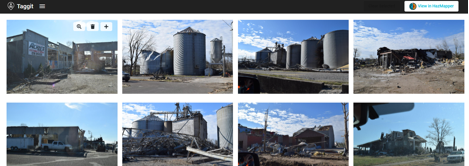  

Clicking on any of the images, will put a blue border around the image and cause a Create Group to appear in the upper right corner as shown here:

<!-- 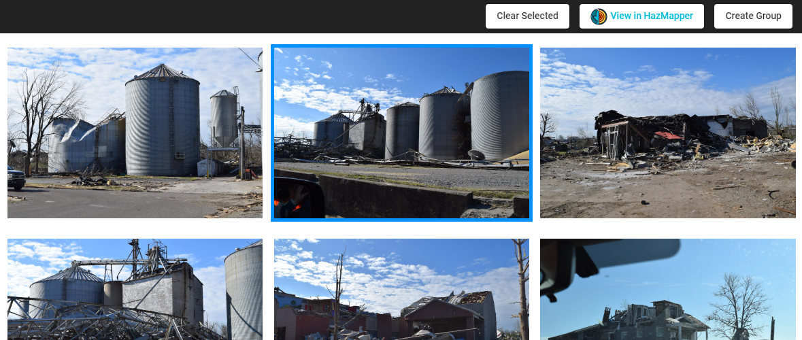 -->

Clicking on Create Group will bring up a window in which to type in a name for your new group as show here. I am creating a group for all the Grain bins. 

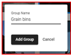

Two things then happen when you add this group. First, that image you selected become a part of the group, and you'll see a small colored square that indicates it is a part of the group (see below). Second, the Taggit button will appear in the upper right corner. 

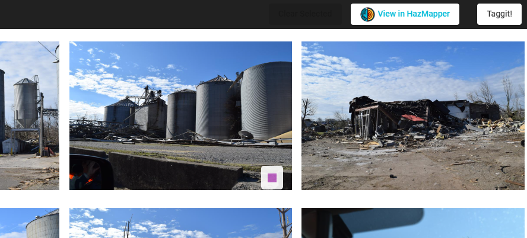

If you hover your mouse near the colored square, you will see the name of the group like this:

<!-- 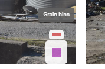 -->

If you click the Taggit button, the screen will switch from the Gallery view to the Taggit view as shown below. This view will show the groups you have created and the images that are in each group. You can click on each image name to show them enlarged on the left. The Gallery/Map button in the upper right will send you back to the Gallery view.

### Adding Images to Groups

To add more images to a group, you have two options. One option is to hover over an image and use the icons that appear (see below). The plus icon will bring up the option to add this image to a group. The magnifying glass and recycle bin allow you to enlarge the image or remove it from the Gallery, respectively. 

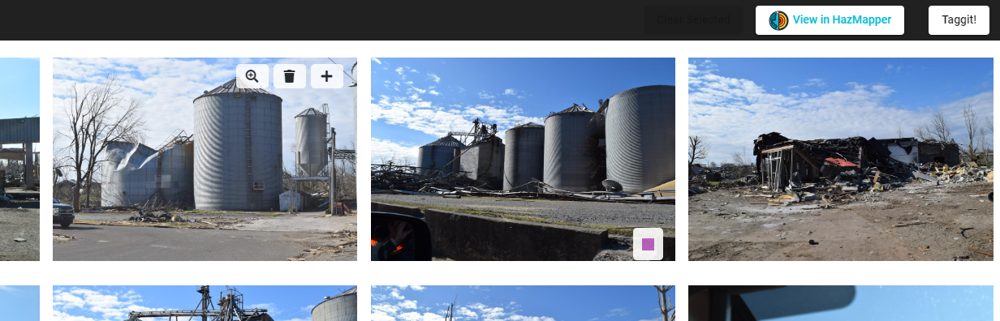

The other option is to select a few images and then use the Add to Group button that appears when you select images as shown here. I selected two more grain bin images for this example.

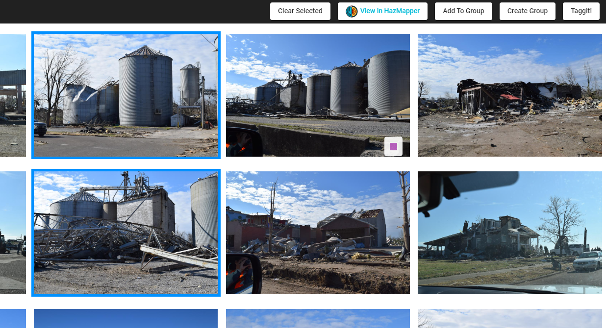

Any given image can belong to multiple groups as illustrated by the group icons here:

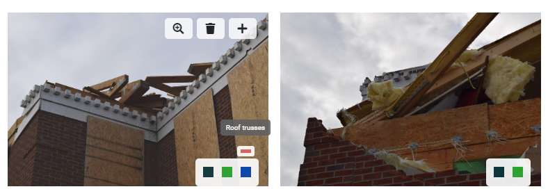

When you create more groups and assign images to each group, the Taggit view will list them all as show here:

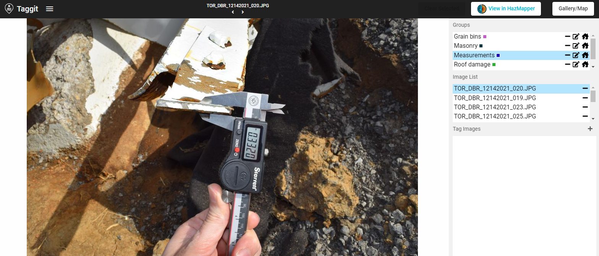

### Changing icons for each group

In the list of Groups in the Taggit view (shown below), each group's icon is shown on the right. If you click on that icon, you can change use a pull-down menu to change it if you wish.

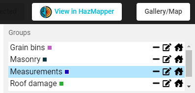

Modified icons are shown below for each of the groups. These icons are then used when that group's images are plotted in HazMapper. 

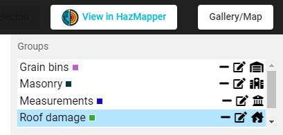

### Creating Tags within each Group

Within a given group, you can create custom Tags by clicking on the “+” icon in the Tag Images portion of the Taggit view (see below):

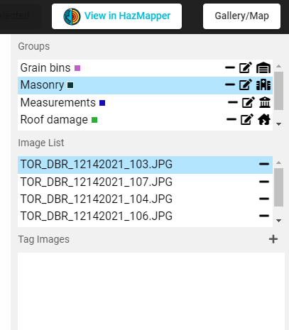

This will show the options for the types of Tags as shown below. You can create Tags that are just a text box (Text), a checkbox list, a radio button list, a dropdown menu of tag options, or a color tag. The color tag can be used to change the color that is displayed in HazMapper.

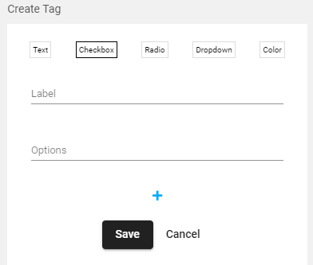

For this example, I am creating a Checkbox tag. The Tag itself has a Label and then you add as many Options are you wish by entering the name of each Option and then pressing the “+” button to add it to the list.  In what is shown below, I added “CMU” as an Option, pressed the “+” to add it.  Now I am adding Red brick as an Option, and am about to press the “+” to add it.

Once I have added all my options with the “+” button, then I press Save and I now have a Checkbox for each image in my Masonry group.

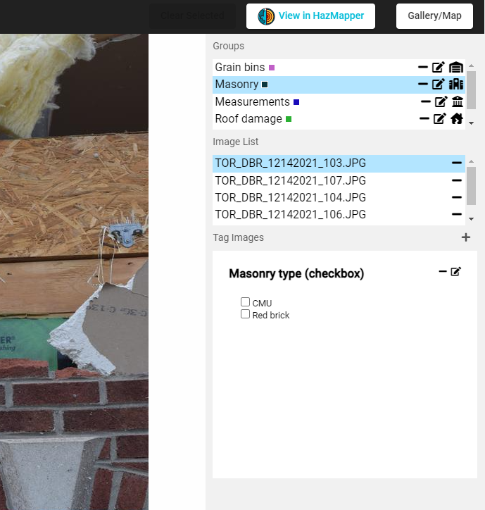

Clicking one of the Checkbox options will cause a Save Tags button to appear (as shown below). You do not have to click the Save Tags button between every Tag you enter, but you will need to click it before leaving the tagging of that group and going back to Gallery view.

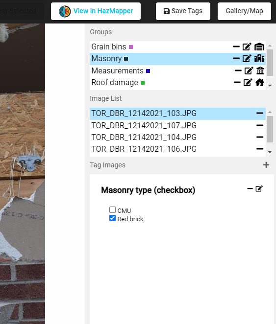

Groups and Tags can be exported using the Export Tags/Groups option in the pull-down menu. You can export to your local machine or to a folder in DesignSafe. This export option will generate one json file and also separate csv files for each group in the Gallery. 

### References

* Kijewski-Correa et al. (2021) for PRJ-3349 StEER - 10 December 2021 Midwest Tornado Outbreak.
