<!--# Multi-Data Set Image Analysis in Taggit -->
## Multi-Data Set Image Analysis in Taggit

**Combining Taggit analysis results with external data sets to do further analysis on image files**
**Fred Haan – Calvin University**  
**Key Words: Taggit, QGIS, NWS Damage Assessment Toolkit (DAT), image tagging**  

### Resources

The example makes use of the following DesignSafe resources:

* <a href="https://hazmapper.tacc.utexas.edu/hazmapper/">https://hazmapper.tacc.utexas.edu/hazmapper/</a>
* <a href="https://hazmapper.tacc.utexas.edu/taggit/">https://hazmapper.tacc.utexas.edu/taggit/</a>

The example also makes use of the following National Weather Service resource, the Damage Assessment Toolkit:

* <a href="https://apps.dat.noaa.gov/StormDamage/DamageViewer">https://apps.dat.noaa.gov/StormDamage/DamageViewer</a> 

### Description

This use case demonstrates how to combine grouping and tagging work that you’ve previously done in Taggit with external data sources to do further analysis. In this case, the National Weather Service Damage Assessment Toolkit (DAT) is used as a source of wind speed estimates that are combined with Taggit results to estimate wind speeds that caused the damage indicated in various image files.  NOTE: You always start a Map/Gallery file in HazMapper. HazMapper and Taggit should be considered different ways of viewing the same set of images. You see a thumbnail Gallery of those images when you use Taggit, and you see a Map of those images when you use HazMapper, but it is the same \*.hazmapper file in both cases.

### Implementation

Taggit enables you to organize images into groups and to tag images. These groups and tags can be used in numerous ways for analysis, and in this document one particular example will be illustrated. In this case, we will combine groupings of images from Taggit with an external data set on a QGIS map to estimate the wind speed that was required to cause a particular type of damage. The external data set will be wind speed estimates from the U.S.  National Weather Service.

#### Gathering the Necessary Data Files

For this example, we will consider a case of a water tower that collapsed during the 10 December 2021 tornado in Mayfield, Kentucky.  Numerous photos were taken of this collapsed debris of the water tower including photos of measurements of the structural components on the ground.  Using Taggit, these photos were organized into a Group called “Measurements.” NOTE: These photos were grouped according to the instructions in the documentation file Grouping and Tagging Image Files. See that document if you do not know how to group and tag images with Taggit. 

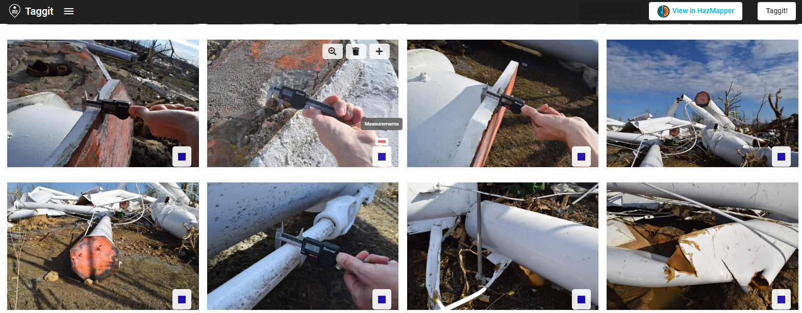

The Export Tags/Groups function in Taggit (see below) will generate json and csv files that contain all the groups and tags you have done with Taggit. The csv files can be used to generate points on a QGIS map.

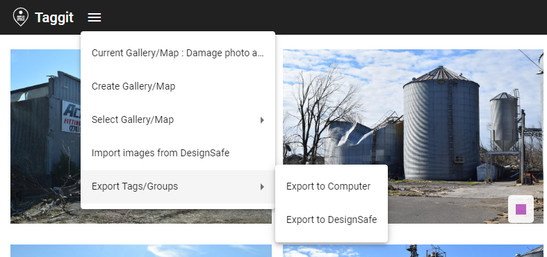

The csv files that Taggit generates look like what is shown below. In this case, the csv file contains all the photos that were included in the group called “Measurements.” 

The U.S. National Weather Service (NWS) maintains a database called the Damage Assessment Toolkit that contains data collected from all damage-producing wind storms in the U.S. (<a href="https://apps.dat.noaa.gov/StormDamage/DamageViewer">https://apps.dat.noaa.gov/StormDamage/DamageViewer</a>). The database has instructions for how to search for a particular event. In this case, the Mayfield, Kentucky tornado of 10 December 2021. Shapefile data can then be downloaded that contains point wind speed estimates that come from damage surveys done after the tornado. In the next section, this shapefile data will be plotted in QGIS along with the Taggit data.

### Plotting Data Sets in QGIS

<!--  -->

QGIS is used in this example both to demonstrate how it works and to show how nicely it displays the NWS wind speed estimates. Launch QGIS from the Visualization tab of the DesignSafe Tools &amp; Applications menu. Select QGIS Desktop 3.16. 

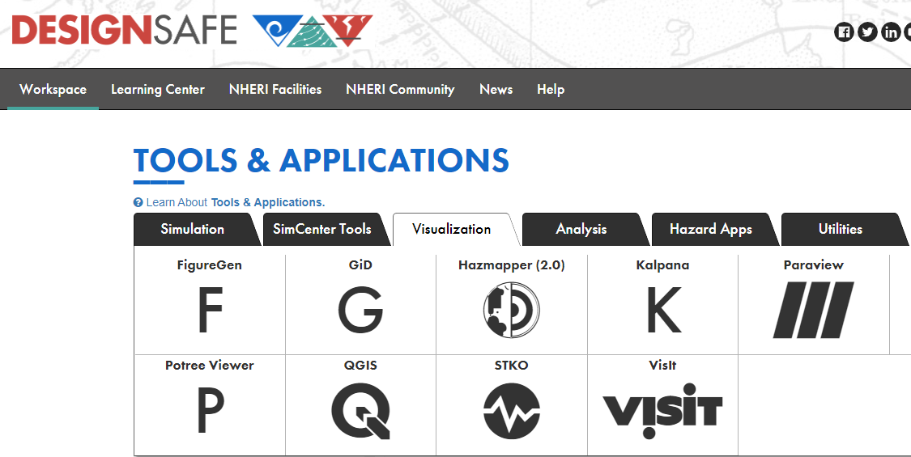

A full tutorial on the use of QGIS is beyond the scope of this document, but to be clear on how this example was done the initial setup of the map is explained in what follows. The coordinate reference system (CRS) can be found in the lower right corner as shown below. If you click there, you can confirm that the standard CRS of WGS 84 with Authority ID ESPG: 4326 was used. This is adequate for most projects.

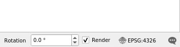

We can add a base map by double-clicking on OpenStreetMap as shown here:

This displays a map and lists the OpenStreetMap in the Layers list on the lower left:

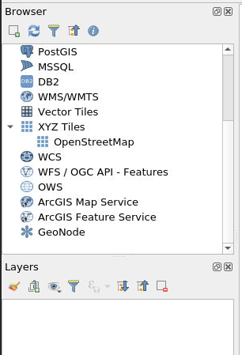

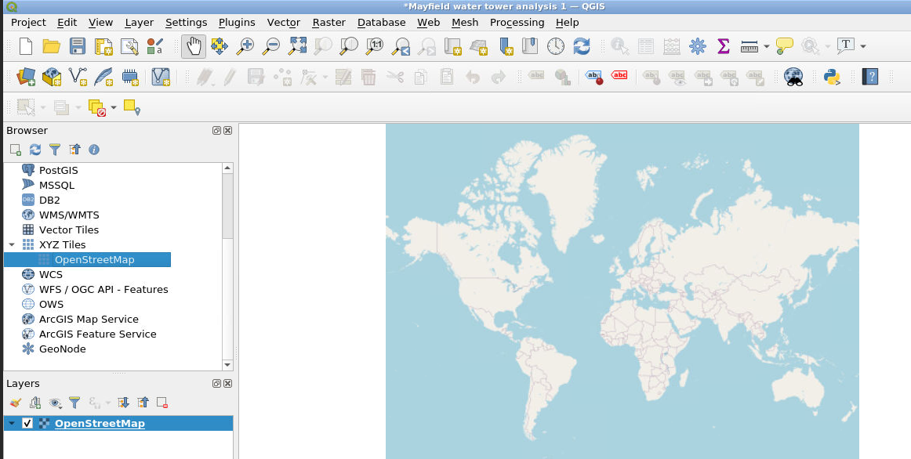

The shapefile data from the NWS DAT can then be loaded by selecting Layer, Add Layer, Add Vector Layer as shown below. 

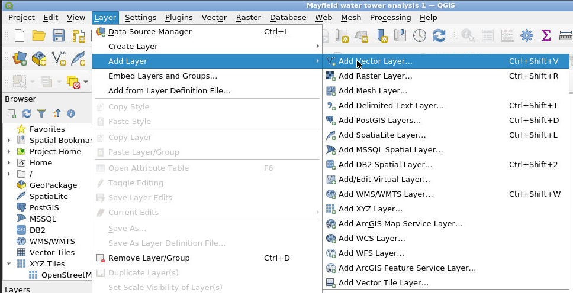

Click on the … symbol to select your DAT output files (which can be an entire zip file), click Add, then click Close. NOTE: your DAT output files will need to be in DesignSafe either in your MyData or in a Project you have access to. 

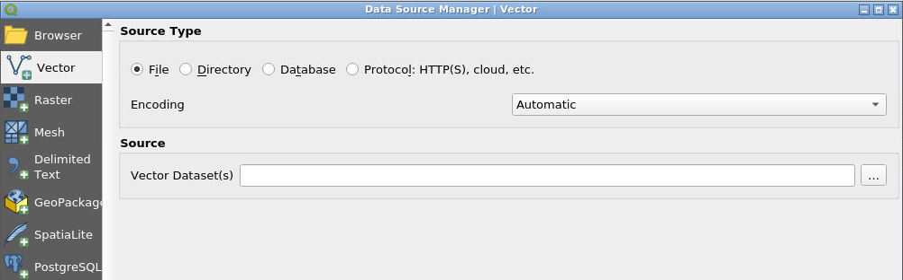

Zoom in on the portion of the map we’re interested in. For our example, we zoom in on Mayfield, Kentucky. Notice the “nws_dat” layer has been added to the Layers list. 

<!--  -->

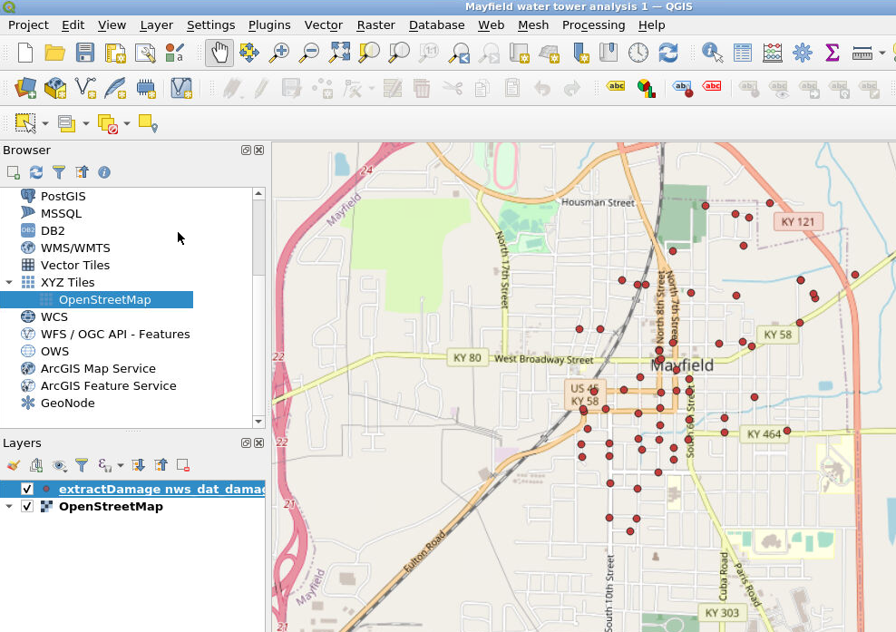

Now we will load the csv data that we generated with Taggit.  Select the csv file that corresponds to the “Measurements” group mentioned earlier by selecting Layer, Add Layer, Add Delimited Text Layer.

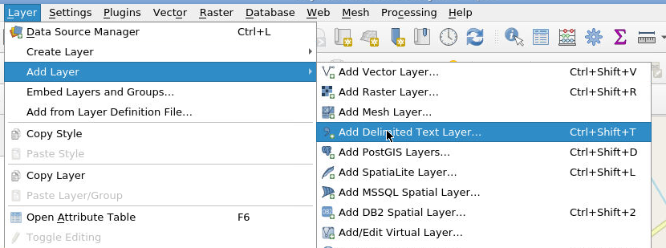

As before, click on the … symbol and select the csv file, click Add, then click Close.

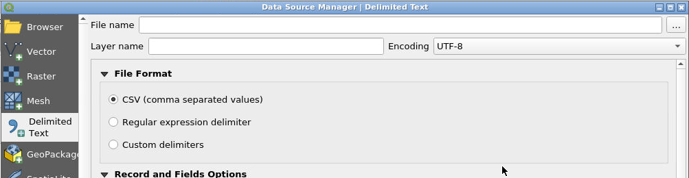

Now we can zoom in on the location where these new Taggit symbols appeared (see below). The Taggit symbols are the layer shown here as “group-1.” On the map, the red points are from the NWS database, and the yellow points are from the Taggit data. 

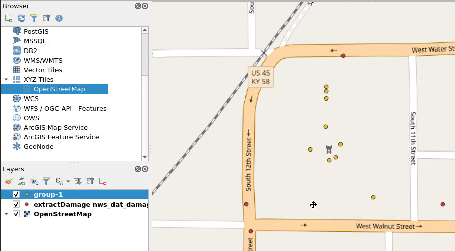

To see the wind speeds from the NWS DAT data, select the nws_dat layer from the Layer list and select the Identify Features button from the icons across the top (see red arrows below). Once you have selected these, you can then click on any of the NWS DAT points and see the metadata for that point. The metadata includes a wind speed estimate (see the black arrows below). 

<!--  -->

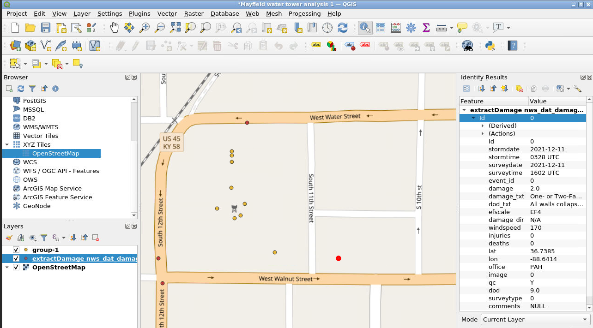

In this example, the NWS wind speeds were found to be 170 mph to the southeast, 155 mph to the southwest, and 135 mph to the north. This gives a researcher a good idea of the range of wind speeds that the water tower experienced during the passage of the tornado.  This example represents just one way that Taggit image analysis data can be combined with other data sets to conduct data re-use and research.

###  Citations and Licensing

* Please cite Kijewski-Correa et al. (2021) to acknowledge PRJ-3349 StEER - 10 December 2021 Midwest Tornado Outbreak.
* Please cite NOAA, National Weather Service Damage Assessment Toolkit, <a href="https://apps.dat.noaa.gov/StormDamage/DamageViewer">https://apps.dat.noaa.gov/StormDamage/DamageViewer</a>. 
* Please cite <a href="https://doi.org/10.1061/(ASCE)NH.1527-6996.0000246" target="_blank">Rathje et al. (2017)</a> to acknowledge the use of DesignSafe
resources.
