# Using Taggit to browse and tag Hurricane Irma damage survey images on DesignSafe

**Fred L. Haan, Jr - Calvin University**  

Taggit allows users to browse images files on DesignSafe and tag them for later use in analysis or mapping applications. It also easily connects to HazMapper to map image locations. This use case illustrates how photos from a 2017 damage survey in the Florida Keys after Hurricane Irma were organized into groups and tagged for later analysis. The example makes use of the following DesignSafe resources:

[Taggit](https://taggit-tacc.github.io/){target=_blank} 
[HazMapper](https://www.designsafe-ci.org/rw/workspace/#!/Hazmapper-1.0){target=_blank}

## Background
### Citation and Licensing

* Please cite [Rathje et al. (2017)](https://doi.org/10.1061/(ASCE)NH.1527-6996.0000246){target=_blank} to acknowledge the use of DesignSafe resources.  

* This software is distributed under the [GNU General Public License](https://www.gnu.org/licenses/gpl-3.0.html){target=_blank}.  

## Getting Started and Creating a Gallery 
The collapsed menus icon (shown below) opens the main menu of Taggit and enables creating a gallery, selecting from existing galleries, and opening the file browser. For this project, "Create Gallery" was selected to get started. 

## Loading Image Files

Image files can be loaded into an existing project by selecting "File Browser" from the main menu. This enables access to all parts of DesignSafe including My Data, Community Data, Published Project, and My Projects. For this project, the PI's images from the Irma damage survey were selected.

Clicking Import brings the selected files into the gallery, and you see thumbnails of the images as shown below.

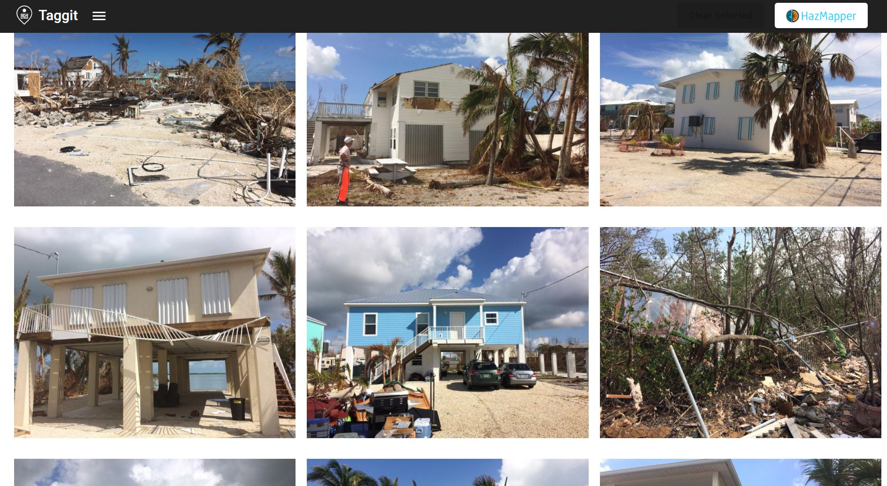

## Creating Groups and Organizing Images

Groups were created for this gallery to organize the photos into types of structures and types of damage. Clicking on one or more images generates a green border that denotes selected images. The Add Group button (see below) was used to create names for groups.

The add group dialog box enables naming the groups.

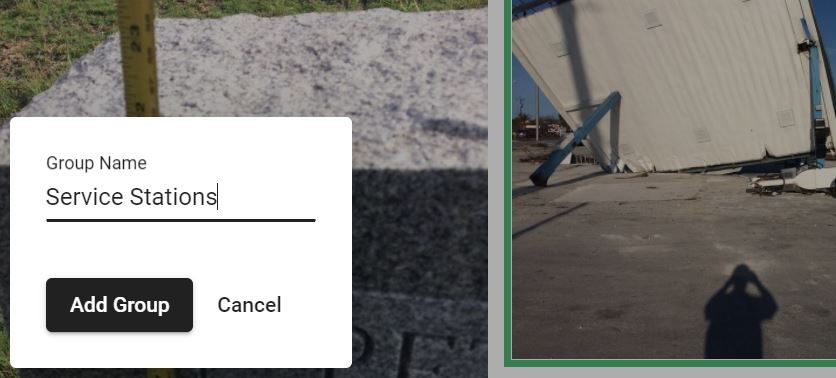

Once a group or groups is created, the Taggit button appears (see below). The Taggit button takes you to the Taggit screen where you can see the images in their groups and begin to create tags.

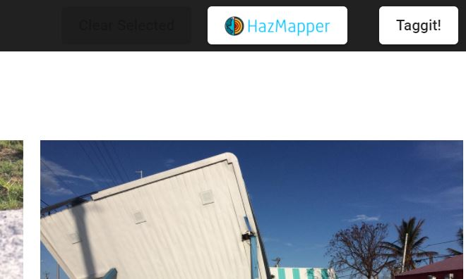

The Taggit screen is shown below. Here you can see the groups that have been created and the images in each group. The Gallery button toggles back to the thumbnail gallery.

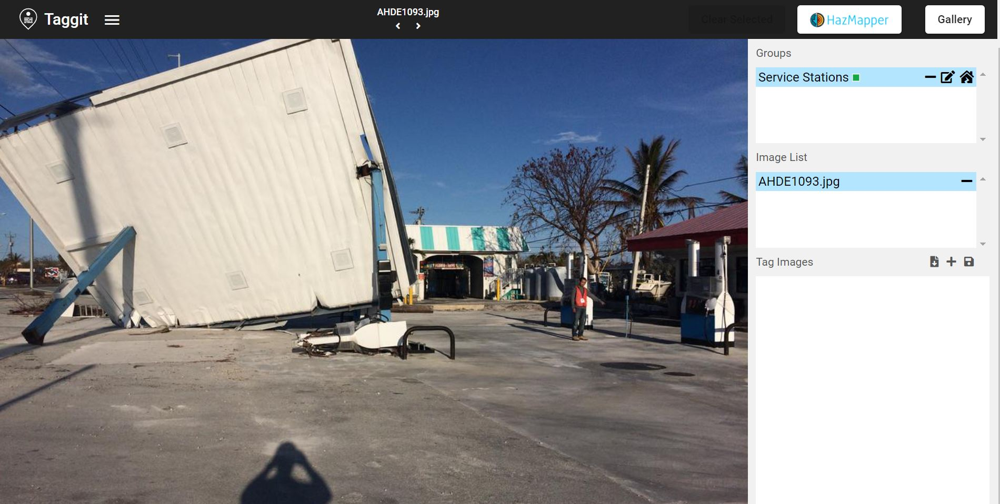

When hovering over any given image in the thumbnail gallery, several icons will appear. The Zoom, Remove, and Add to Group buttons appear in the upper right. The Add To Group button provides another way to add an image to a group. The box in the lower right shows colored boxes representing each group this image belongs to.

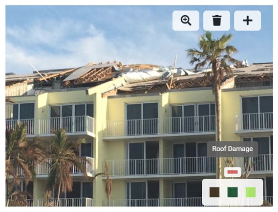

After creating a number of groups and adding images to those groups, the Taggit view looks like the image below. From this view, you can browse through the groups and through the images in each group.

The icons associated with each group were customized by clicking on the icon and selecting different ones from the list.

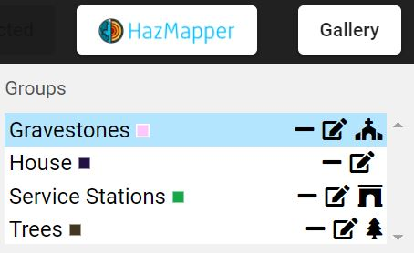

## Creating Tags for Images

The Tag Images area below the Image List was used to create custom tags for images. 

For this group, a Color Tag representing damage was created (see below).

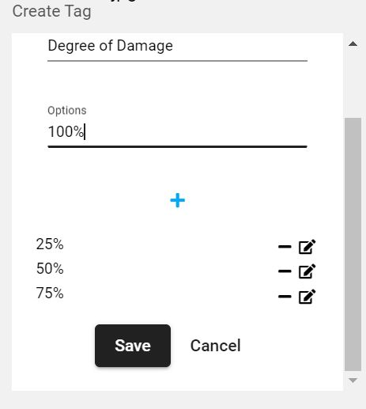

The colors assigned with a Color Tag will be used if the user decides to map the image using HazMapper.

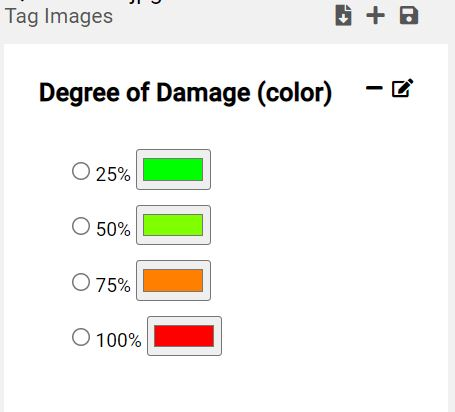

## Plotting Images Locations with HazMapper

Clicking the HazMapper button launches HazMapper to see all the photos from this gallery located on a map.

For this gallery, a Roads layer was added to the map.

The locations of collections of images are denoted with numbers on the map.

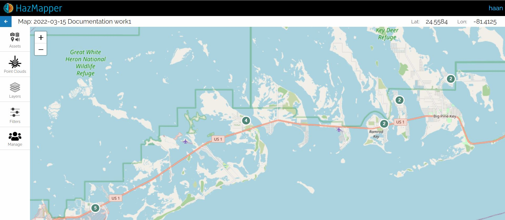

Zooming in to regions where images were taken shows that a generic camera icon or a user-selected icon denotes image location. If a Color tag was assigned to a given image, then that color will be used for the HazMapper icon.

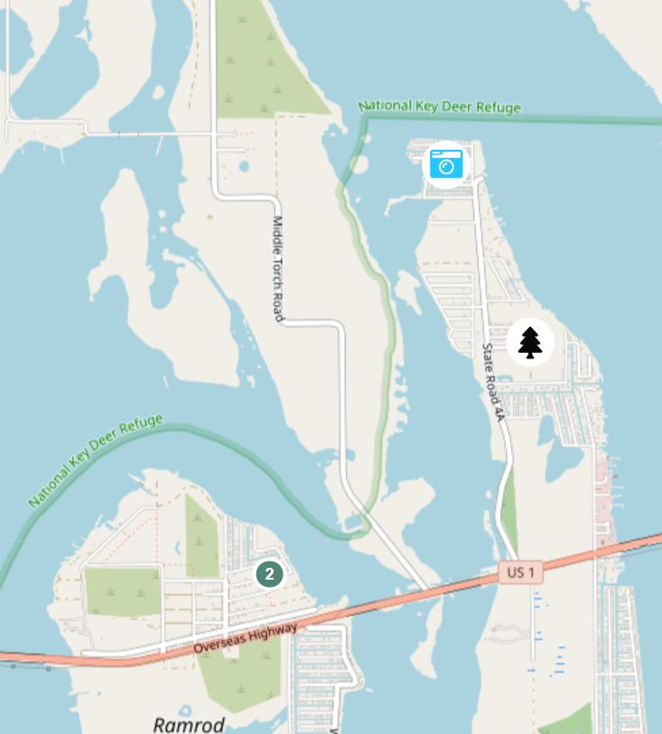

## Exporting Tag Data as CSV Files

From the main menu, the user can select several options (see below) for exporting the group and tag information from the current project. These files can be used for further analysis or for machine learning applications.

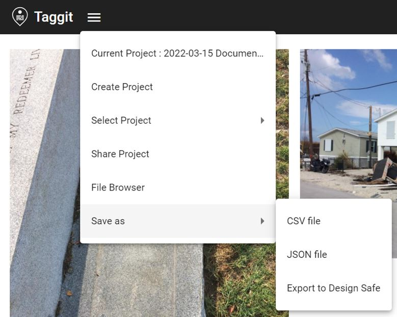

