## Taggit User Guide: Basic Image Browsing and Mapping
**Using HazMapper and Taggit to browse thumbnails of large numbers of images and map their locations**   
**Fred Haan – Calvin University Key Words: Taggit, HazMapper, image browsing**

### Resources 

The example makes use of the following DesignSafe resources:

* <https://hazmapper.tacc.utexas.edu/hazmapper>
* <https://hazmapper.tacc.utexas.edu/taggit>

### Description

This user guide demonstrates how to use HazMapper and Taggit applications on DesignSafe to browse through large numbers of image files. HazMapper and Taggit should be considered different ways of viewing the same set of images. You see a thumbnail Gallery of those images when you use Taggit, and you see a Map of those images when you use HazMapper, but it is the same *.hazmapper file in both cases.

NOTE: You always start a Map/Gallery file in HazMapper. All browsing/mapping starts with HazMapper, and you can switch back and forth between the apps as you wish. Also, at this time you cannot publish a Map/Gallery but this functionality is coming soon.

**Creating a Map/Gallery and Browsing Images**

Taggit and HazMapper allow you to browse and map image files that are on DesignSafe. This document shows you how to get started with Taggit and HazMapper for a set of images available on DesignSafe.

As an example workflow, we will consider a damage survey dataset from the December 2021 Midwest tornado outbreak (see below).

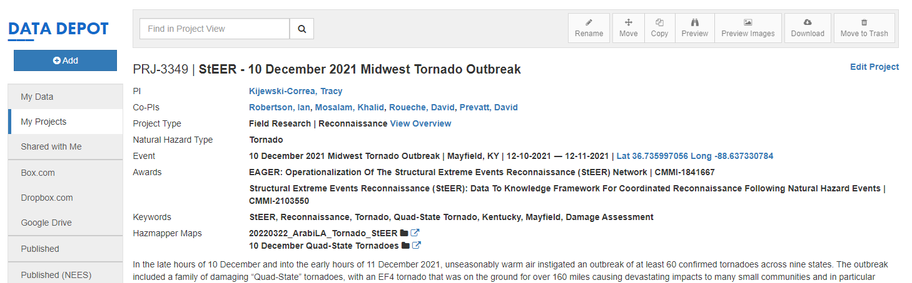

If you were looking at this project on DesignSafe, you might be interested in seeing the image files in the folder shown below.

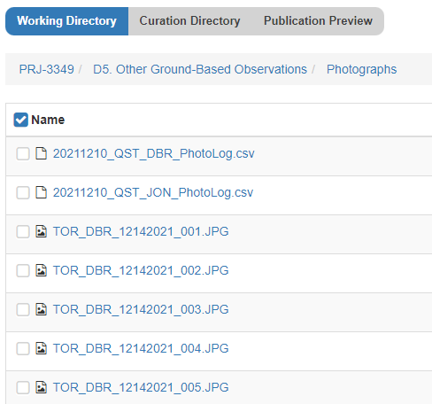

In order to browse thumbnail images of these photographs or see them laid out on a map, you can launch HazMapper to get started.

NOTE: All browsing/mapping starts with HazMapper. HazMapper and Taggit are just different ways of viewing the same Map/Gallery.

So to get started, we launch HazMapper from the Visualization tab of the Tools and Applications page of the DesignSafe Workspace.

<!-- 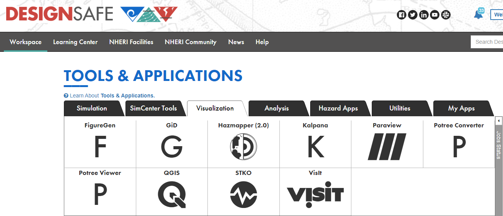 -->

Once HazMapper is up, click on “Create a New Map” as shown below:

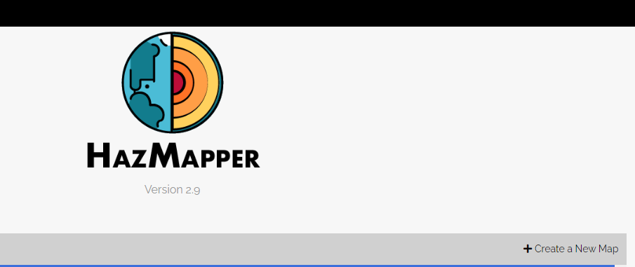

Fill out a name and description of the “Map” you will create. This Map will also be a Gallery in Taggit. You then select a Save Location for your Map/Gallery by pulling down the menu on the right:

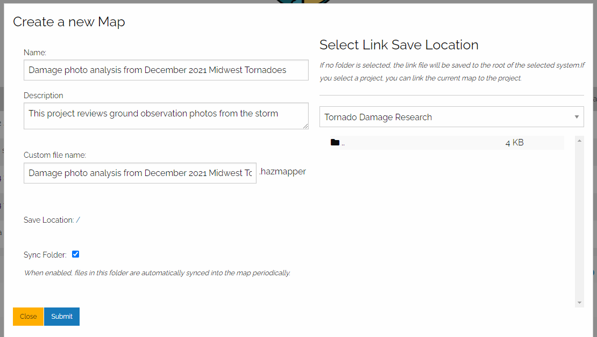

When you are selecting a Save Location, you should probably select from MyProjects. That way, you can share your Map/Gallery with other users. I selected a project called “Tornado Damage Research” as shown below. 

<!-- 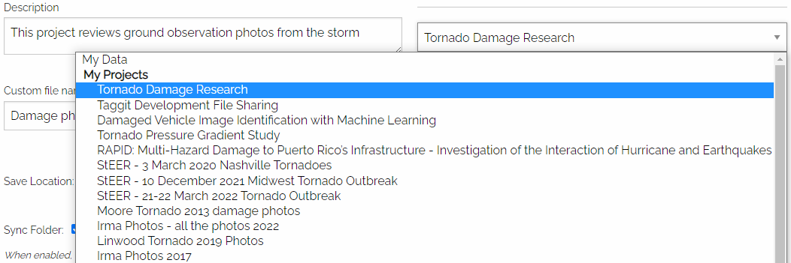 -->

Next you click on Assets and Import from DesignSafe to load the images you want to see:

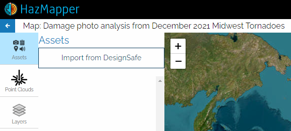

I'm going to select files from the StEER – 10 December 2021 Midwest Tornado Outbreak project:

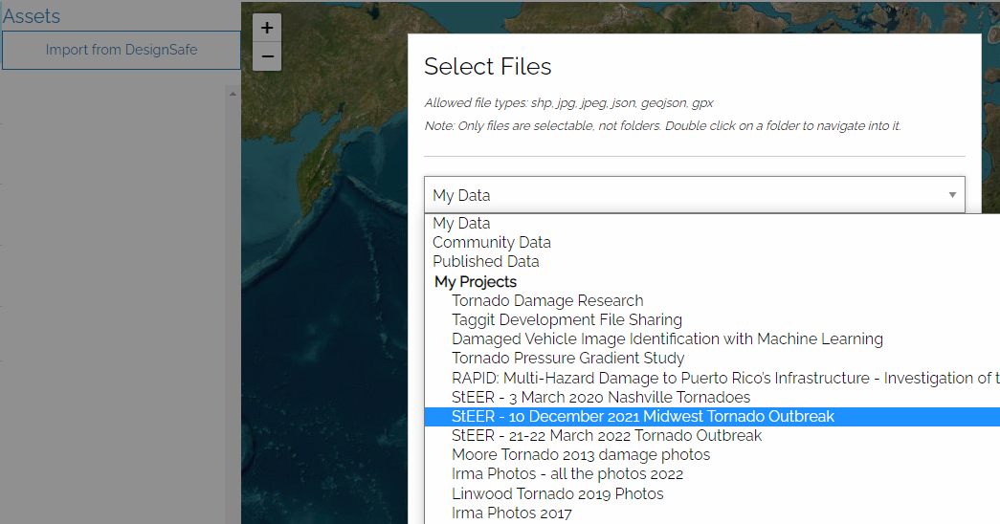

Once you navigate to the folder containing the image files you want, you can use shift-select to select multiple files to import:

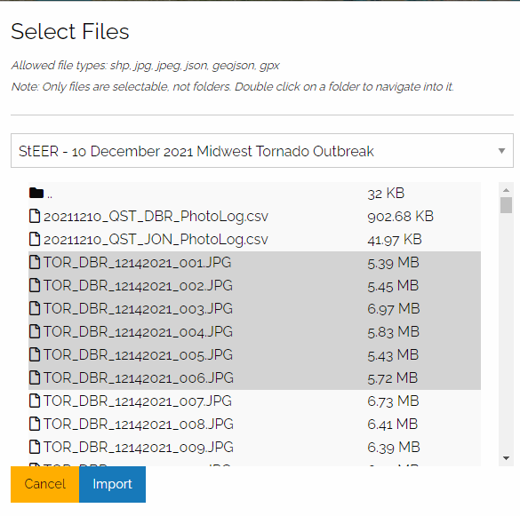

Once you press Import, you will see messages about successful imports on the right side of the screen:

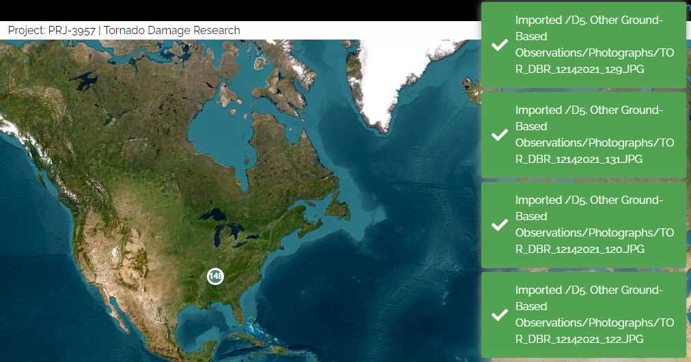

### Browsing Thumbnail Images in Taggit

Once you've loaded your images, you can zoom in on your map to see the location of each photo. However, for this Taggit workflow demonstration, we will click on Manage and select View in Taggit as show below:

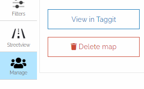

This will launch Taggit and show thumbnail images of all the photos that were just loaded in HazMapper. You can now browse through all the photos as shown below.

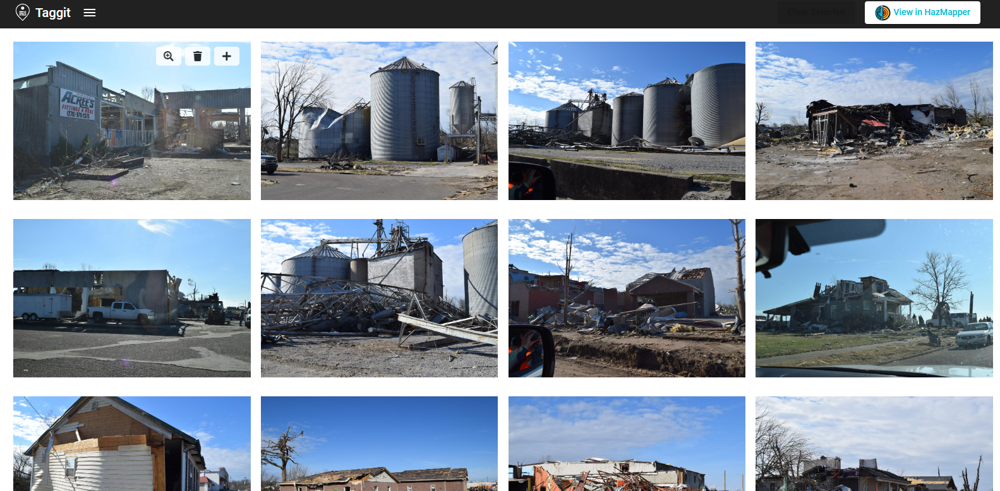

You can then add more photos to the Gallery using the pull-down menu in the upper-left corner. Selecting Import image from DesignSafe gives you access to all the files on DesignSafe.

If you want to go back to HazMapper and put all the photos on a map, click the View in HazMapper button in the upper right corner of the screen.

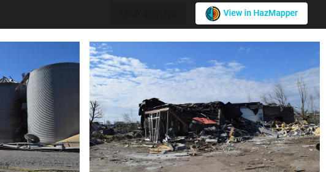

### References

* Kijewski-Correa et al. (2021) for PRJ-3349 StEER - 10 December 2021 Midwest Tornado Outbreak.
