/// html | header

## CFD Analysis of Winds on Low-Rise Building

Low-Rise Building CFD Simulations with Jupyter Notebook

///

**Ahsan Kareem - [NatHaz Modeling Laboratory](https://nathaz.nd.edu/){target=_blank}, University of Notre Dame**

Implementation of ASCE Wind Speed Profiles and User-defined Wind Speed Profiles

### Resources
 
#### Jupyter Notebooks
The following Jupyter notebooks are available to facilitate the analysis of each case. They are described in details in this section. You can access and run them directly on DesignSafe by clicking on the "Open in DesignSafe" button.

| Scope | Notebook |
| :-------: | :---------:  |
| abcd3fg | Filename.ipynb    |

#### DesignSafe Resources

The following DesignSafe resources were leveraged in developing this use case.

[OpenFoam](https://www.designsafe-ci.org/rw/workspace/#!/OpenFOAM::Simulation){target=_blank}  

### Background
#### Citation and Licensing

* Please cite [Ding and Kareem (2021)](https://tigerprints.clemson.edu/cgi/viewcontent.cgi?article=1025&context=aawe){target=_blank} to acknowledge the use of any resources from this use case.
* Please cite [Rathje et al. (2017)](https://doi.org/10.1061/(ASCE)NH.1527-6996.0000246){target=_blank} to acknowledge the use of DesignSafe resources.
* This software is distributed under the [GNU General Public License](https://www.gnu.org/licenses/gpl-3.0.html){target=_blank}.

### Description

This provides documentation of the workflow of generating flow around low-rise buildings exposed to ASCE-defined wind speed profiles using CFD with Jupyter Notebook. The available features of the existing Jupyter Notebook are simulations using a uniform inflow condition. In the new versions of the Notebooks inflow conditions provided by the ASCE 7 are incorporated along with two other options. One relates to user-defined inflow and the other further includes turbulent fluctuations in the inflow flowing a mean velocity profile.
The current Notebook referred to as the base case has uniform mean velocity with user-defined magnitude. It is illustrated in the following figure:

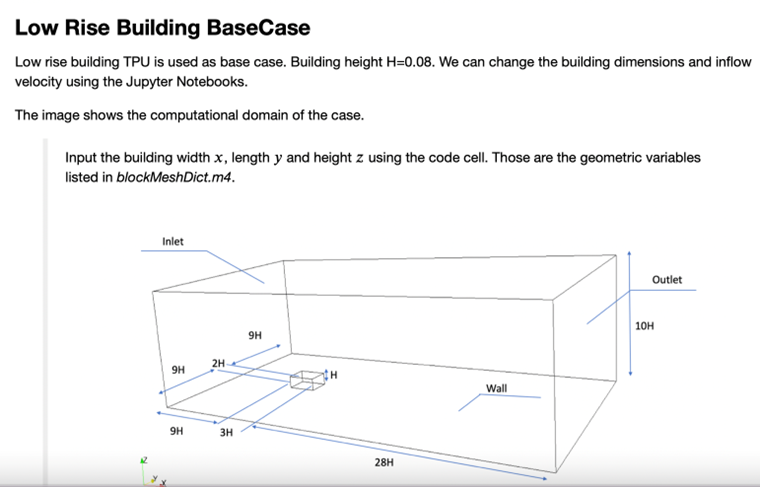

The overall workflow is described in the following schematic. 

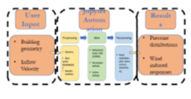

### New Features
The new features include the implementation of power-law inflow profiles in codes/standards and the introduction of the option of user-defined inflow conditions. The following Figure shows the difference between velocity profiles in the urban and suburban areas.  

The wind speed profile is described as 
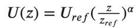

Where the user supplies 
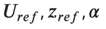

The details from ASCE 7 are reproduced here for a quick reference. 
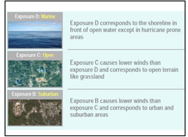

The workflow from the OpenFOAM to Jupyter Notebook is given below. The final outcome is the velocity profile shown in the bottom right of the figure.

 
### Running simulation using Low-Rise Jupyter Notebook 

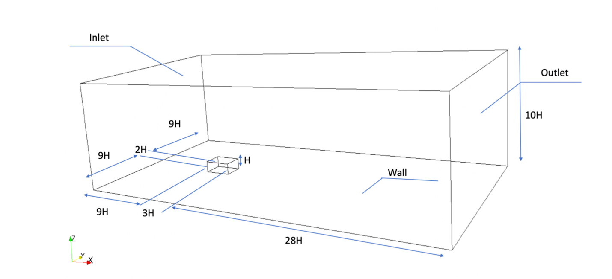

Computational domain 

#### User define input: 
1.	geometry of the low-rise building’s length, width and height.
2.	Inflow velocity:
Uniform velocity,
ASCE velocity profile,
Power-law velocity profile,
User-defined inflow velocity.

#### How to run it on Jupyter Notebook:

1.	Install and import modules
2.	CFD case of wind effect on low-rise building
	* (1) Uniform inflow
	* (2) ASCE inflow
	* (3) Power-law inflow
	* (4) User-defined inflow
3.	OpenFOAM case
	* (1) Brief introduction of general OpenFOAM case
	* (2) Input building dimension on Jupyter Notebook
	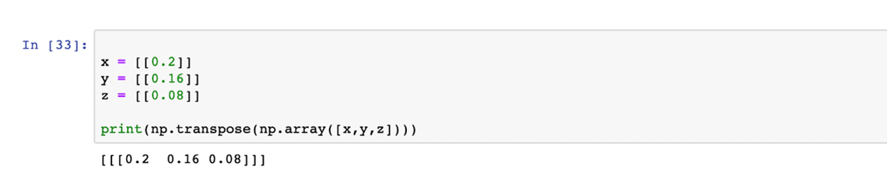
	* (3) Input inflow velocity on Jupyter Notebook
	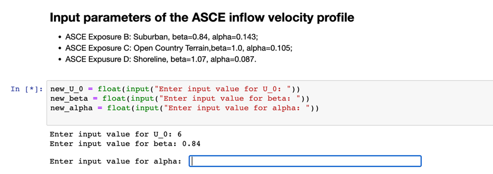
4.	Auto-generation of OpenFOAM case with user-defined building dimension and inflow velocity.
5.	Review the generated case
6.	Submit the OpenFOAM job
7.	Post-processing 

#### Simulation Result of desired and ASCE power law vertical profiles 
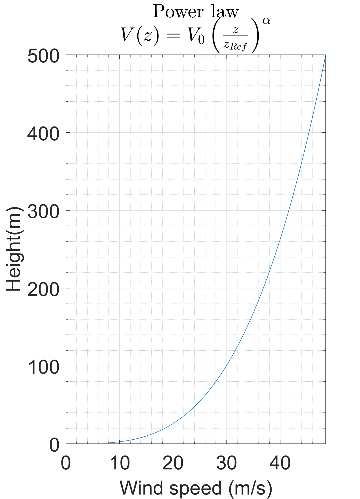{ width: "50%"}
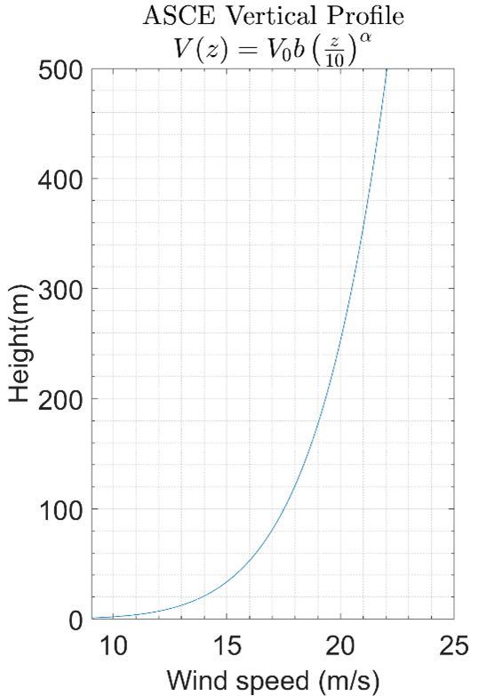{ width: "50%"}

#### User-Defined Profile Simulation and time histories of wind velocity fluctuations at a point
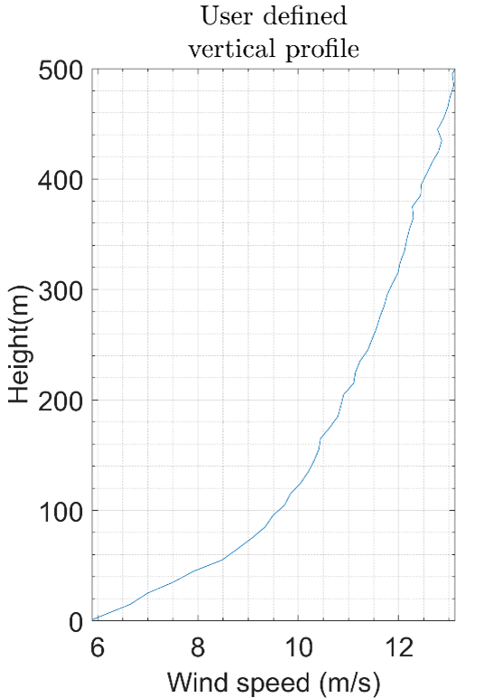

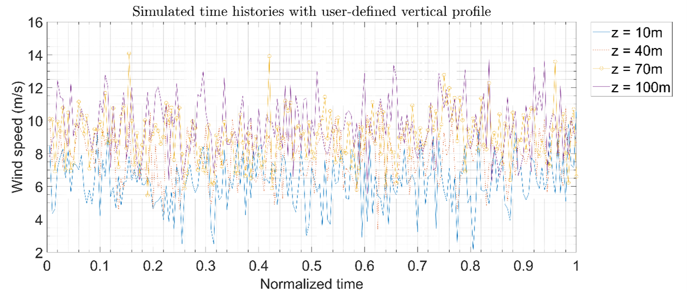

### References
[1] H. Jasak, A. Jemcov, Z. Tukovic, et al. OpenFOAM: A C++ library for complex physics simulations. In International workshop on coupled methods in numerical dynamics, volume 1000, pages 1-20. IUC Dubrovnik Croatia, 2007. 
[2] OpenFOAM wiki. Pyfoam. [https://openfoamwiki.net/index.php/Contrib/PyFoam](https://openfoamwiki.net/index.php/Contrib/PyFoam){target=_blank}. Online; accessed 24-Feb-2022. 
[3] Harish, Ajay Bangalore; Govindjee, Sanjay; McKenna, Frank. [CFD Notebook (Beginner)](https://www.designsafe-ci.org/data/browser/public/designsafe.storage.published/PRJ-2915){target=_blank}. DesignSafe-CI, 2020.  
