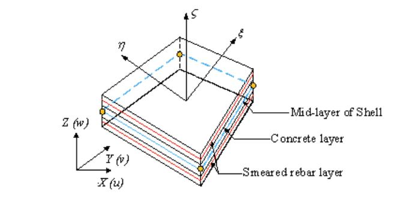
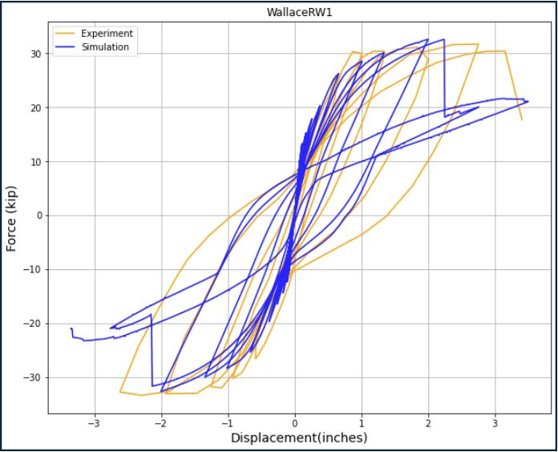
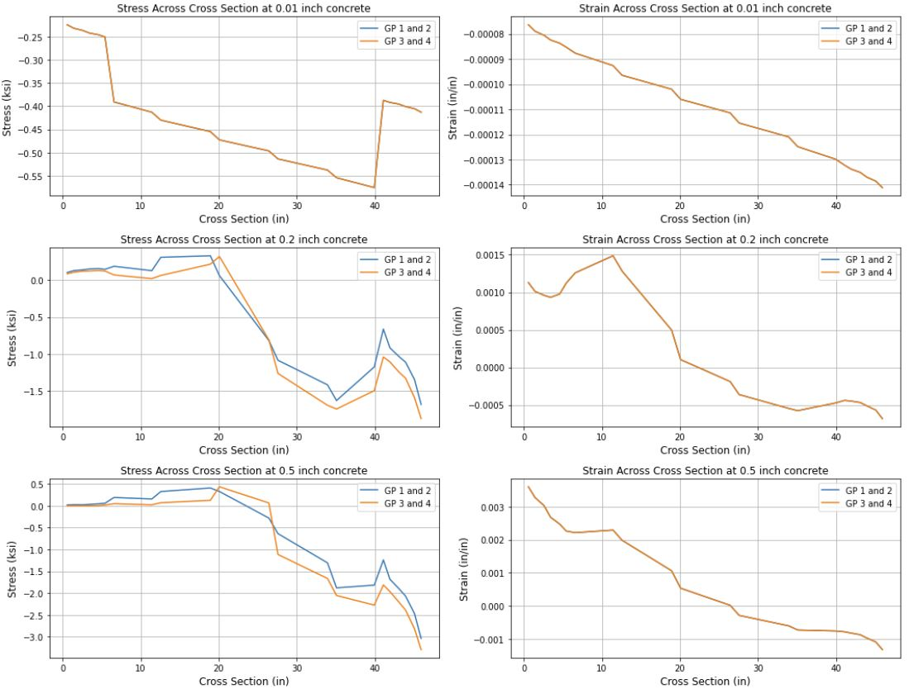
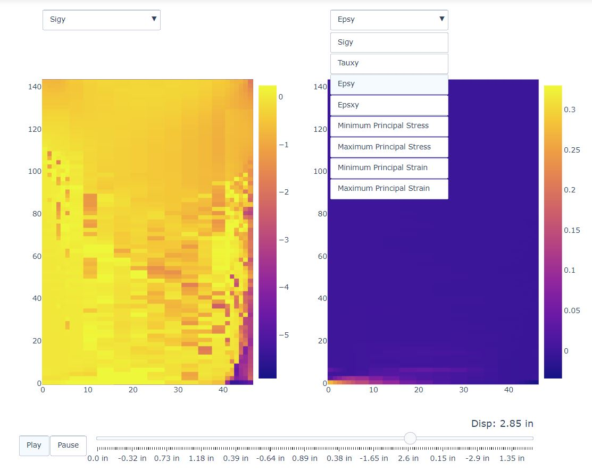
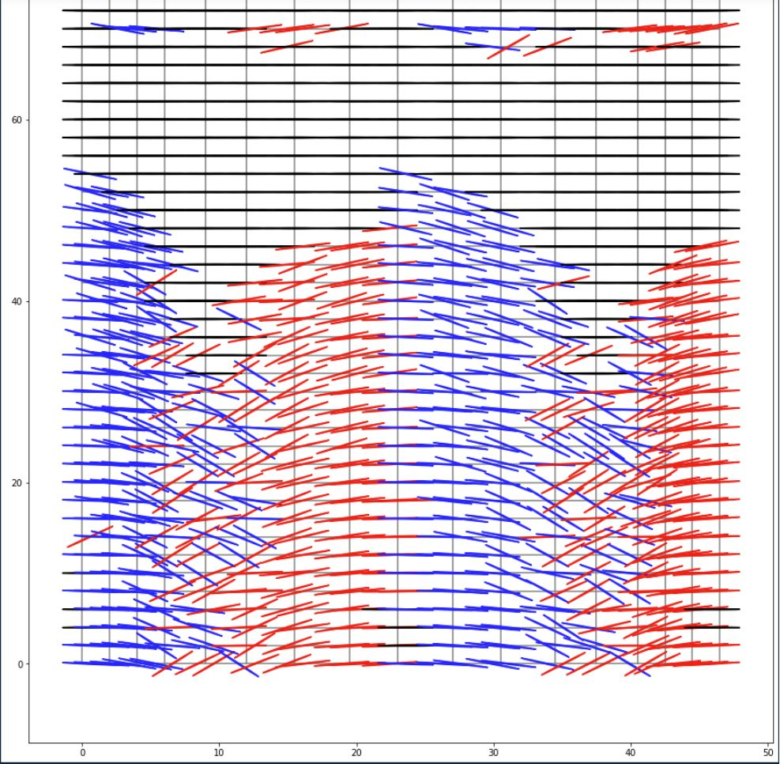

# Modeling Reinforced Concrete Walls with Shell Elements to Simulate Through Opensees and Using Jupyter to Post Process Results

**Josh Stokley and Laura Lowes - University of Washington**  

The purpose of this use case is to be able to model, simulate, and post process multiple reinforced concrete walls at once. This use case uses jupyter notebooks to model these walls with shell elements and uses OpenSeesMP on DesignSafe to simulate the models. The documentation of this use case will use a single wall, RW1, as an example to understand the workflow and objectives of this use case. The following DesignSafe resources are used:  

[Jupyter Notebook on DesignSafe](https://www.designsafe-ci.org/rw/workspace/#!/Jupyter::Analysis){target=_blank}<br/> 
[Opensees on DesignSafe](https://www.designsafe-ci.org/rw/workspace/#!/OpenSees::Simulation){target=_blank}  
  

## Background
### Citation and Licensing

* Please cite [Shegay et al. (2021)](https://doi.org/10.17603/ds2-r12q-t415){target=_blank} to acknowledge the use of any data from this use case.

* Please cite [Lu XZ et al. (2015)](http://www.luxinzheng.net/download/OpenSEES/En_THUShell_OpenSEES.htm){target=_blank} to acknowledge the use of the modeling strategy from this use case.

* Please cite [Rathje et al. (2017)](https://doi.org/10.1061/(ASCE)NH.1527-6996.0000246){target=_blank} to acknowledge the use of DesignSafe resources.  

* This software is distributed under the [GNU General Public License](https://www.gnu.org/licenses/gpl-3.0.html){target=_blank}.  

## Description
### Data  

The walls that are modeled are defined in a database provided by Alex Shegay. The database is a MATLAB variable of type 'structure'. The tree-like structure of the variable consists of several levels. Each level consists of several variables, each being a 1x142 dimension array. Each entry within the array corresponds to a separate wall specimen. The order of these entries is consistent throughout the database and reflects the order of walls as appearing in the 'UniqueID' array.  

### Modeling

The modeling techniques are inspired by the work of Lu XZ.
The modeling of these walls make use of the MITC4 shell element. This element smears concrete and steel in multiple layers through the thickness of the element. Figure 1 demonstrates this.  Within the shell element, only the transverse steel is smeared with the concrete. The shell elements are modeled to be square or close to square for best accuracy, an assumption that follows this is that cover concrete on the ends of the wall are not taken into account as it would produce skinny elements that would cause the wall to fail prematurely. The vertical steel bars are modeled as trusses up the wall to better simulate the stress of those bars.  The opensees material models that are used are:  

* PlaneStressUserMaterial- Utilizes damage mechanisms and smeared crack model to define a multi-dimensional concrete model  
    * Variables include: compressive strength, tensile strength, crushing strength, strain at maximum and crushing strengths, ultimate tensile strain, and shear retention factor
    * Model can be found in Lu XZs citation  
   
* Steel02- Uniaxial steel material model with isotropic strain hardening
    * Variables include: yield strength, initial elastic tangent, and strain hardening ratio
    * Model can be found here: [Steel02 OpenSees](https://opensees.berkeley.edu/wiki/index.php/Steel02_Material_--_Giuffr%C3%A9-Menegotto-Pinto_Model_with_Isotropic_Strain_Hardening) {target=_blank} 

  
Figure 1: Smeared shell element representation  

## Example 

RW1 is modeled from the database to produce a tcl file that represents the geometry, material, and simulation history of the wall. The wall is 150 inches high, 46.37 inches long, and 4 inches thick. It consists of 1292 amount of nodes, 1200 amount of shell elements, and 900 amount of steel truss elements. MITC4 shell elements are used to smear the concrete and transverse steel into the thickness while the vertical reinforce bars are modeled as truss elements. RW1 had a compression buckling failure mode in the lab. More information on RW1 and its experimental results can be found here: [Wallace et al. (2004)](https://ascelibrary.org/doi/10.1061/%28ASCE%290733-9445%282004%29130%3A4%28618%29#:~:text=Application%20of%20displacement%2Dbased%20design,for%20a%20given%20top%20displacement.){target=_blank}  

The use case workflow involves the following steps:

* Using Jupyter notebook modeling script to create input file for OpenSees
* Running input file through HPC on DesignSafe
* Using Jupyter notebook post processing scripts to evaluate model


## Create Input File using Modeling Script

The modeling script is broken up into 2 notebooks, the first notebook imports the variables to build the wall into an array. The second notebook builds out the tcl file that will be ran through openseees. The sections defined below are from the second notebook.  
The matlab to python script can be found here: [Matlab_to_Python.ipynb](https://www.designsafe-ci.org/data/browser/public/designsafe.storage.community/Use%20Case%20Products/QUOFEM){target=_blank}  
The jupyter notebook that creates the OpenSees input file can be found here: [TCL_Script_Creator.ipynb](https://www.designsafe-ci.org/data/browser/public/designsafe.storage.community/Use%20Case%20Products/QUOFEM){target=_blank}

### Reinforced Concrete Wall Database   

Each wall in the database has a number corresponding to its unique ID. This number will be the single input to the modeling script to create the script. The use case will loop through multiple numbers to create multiple files at once and run them through opensees. Variables are separated in the database by sections. For example, under the section 'Geometry', one can find the heights of the walls, the thickness of walls, the aspect ratios, and so on. By parsing through these sections, the necessary information can found and imported into the modeling script to build out the wall.

RW1 is wall 33 in the database (with the first wall index starting at 0) and using that index number, the modeling script can grab everything that defines RW1.  

### Modeling Script  

The sections of the modeling script are:  
#### Section 1: Initialization of the model
   * The degrees of freedom and the variables that carry uncertainty are defined.  
  
#### Section 2: Defines nodal locations and elements 
   * Nodes are placed at the locations of the vertical bars along the length of the wall.
   * If the ratio of the length of the wall to the number of elements is too coarse of a mesh, additional nodes are placed in between the bars.
   * The height of each element is equal to the length of the nodes in the boundary to create square elements up the wall.  
  
#### Section 3: Defines material models and their variables
   * The crushing energy and fracture energy are calculated and wrote to the .tcl file. The equations for these values come from ([Nasser et al. (2019)](https://ascelibrary.org/doi/pdf/10.1061/%28ASCE%29ST.1943-541X.0002311){target=_blank}) Below is the code: 

```python
self.gtcc = abs((0.174*(.5)**2-0.0727*.5+0.149)*((self.Walldata[40]*1000*conMult)/1450)**0.7) #tensile energy of confined
self.gtuc = abs((0.174*(.5)**2-0.0727*.5+0.149)*((self.Walldata[40]*1000)/1450)**0.7) # tensile energy of unconfined
self.gfuc = 2*self.Walldata[40]*6.89476*5.71015 #crushing energy of unconfined
self.gfcc = 2.2*self.gfuc #crushing energy of confined
```

   * The crushing strain (epscu) and fracture strain (epstu) can then be calculated from the energy values.
   * The material models are then defined.
   * The concrete material opensees model: nDmaterial PlaneStressUserMaterial $matTag 40 7 $fc $ft $fcu $epsc0 $epscu $epstu $stc.
      * 'fc' is the compressive strength, 'ft' is the tensile strength, 'fcu' is the crushing strength, and 'epsc0' is the strain at the compressive strength.
   * The steel material opensees model: uniaxialMaterial Steel02 $matTag $Fy $E $b $R0 $cR1 $cR2.
      * 'Fy' is the yield strength, 'E' is the youngs modulus, 'b' is the strain hardening ratio, and 'R0', 'cR1', and 'cR2' are parameters to control transitions from elastic to plastic branches.
   * minMax wrappers are applied to the steel so that if the steel strain compresses more than the crushing strain of the concrete or exceeds the ultimate strain of the steel multiplied by the steel rupture ratio, the stress will go to 0.  
  
#### Section 4: Defines the continuum shell model
   * The shell element is split up into multiple layers of the cover concrete, transverse steel, and core concrete.
   * The cover concrete thickness is defined in the database, the transverse steel thickness is calculated as:
      * total layers of transverse steel multiplied by the area of the steel divided by the height of the wall.
   * The total thickness of the wall is defined in the database so after the cover concrete and steel thicknesses are subtracted, the core concrete takes up the rest.
  
#### Section 5: Defines the elements
   * The shell element opensees model is: element ShellMITC4 $eleTag $iNode $jNode $kNode $lNode $secTag
      * 'eleTag' is the element number, the next four variables are the nodes associated to the element in ccw, and 'secTag' is the section number that defines the thickness of the element.
   * There are usually two sections that are defined, the boundary and the web. Based on how many nodes are in the boundary, the script will print out the elements for the left side of the boundary, then for the entire web region, and lastly for the right side of the boundary. This process is repeated until the elements reach the last row of nodes.
   * For the vertical steel bars, the truss element opensees model is used: element truss $eleTag $iNode $jNode $A $matTag.
      * The node variables are defined as going up the wall so if a wall has 10 nodes across the base, the first truss element would connect node 1 to node 11.
      * 'A' is the area of the bar and 'matTag' is the material number applied to the truss element.
   * The script prints out truss elements one row at a time so starting with the left furthest bar connecting to each node until the height of the wall is reached and then next row is started the bar to the right.  
      
#### Section 6: Defines constraints
   * The bottom row of nodes are fixed in all degrees of freedom.

#### Section 7: Defines recorders
   * The first two recorders capture the force reactions in the x-direction of the bottom row of nodes and the displacements in the x-direction of the top row of nodes. These recorders will be used to develop load-displacement graphs.
   * The next eight recorders capture stress and strain of the four gauss points in the middle concrete fiber of all the elements and store them in an xml file. These recorders will be used to develop stress and strain profile movies, give insight to how the wall is failing, and how the cross section is reacting.
   * The last two recorders capture the stress and strain of all the truss elements. These will be used to determine when the steel fails and when the yield strength is reached.
   * Recorders are defined as below where 'firstRow' and 'last' are the nodes along the bottom and top of the wall 'maxEle' is the total amount of shell elements and 'trussele' is the total elements of shell elements and truss elements in the wall. 

```python
self.f.write('recorder Node -file baseReactxcyc.txt  -node {}  -dof 1 reaction\n'.format(' '.join(firstRow)) )         
self.f.write('recorder Node -file topDispxcyc.txt    -node {}  -dof 1 disp \n'.format(' '.join(last)))
self.f.write('recorder Element -xml "elementsmat1fib5sig.xml"  -eleRange 1 ' + str(self.maxEle) + ' material 1    fiber 5    stresses\n')
self.f.write('recorder Element -xml "elementsmat2fib5sig.xml"  -eleRange 1 ' + str(self.maxEle) + ' material 2    fiber 5    stresses\n')
self.f.write('#recorder Element -xml "elementsmat3fib5sig.xml"  -eleRange 1 ' + str(self.maxEle) + ' material 3    fiber 5    stresses\n')
self.f.write('#recorder Element -xml "elementsmat4fib5sig.xml"  -eleRange 1 ' + str(self.maxEle) + ' material 4    fiber 5    stresses\n')
self.f.write('recorder Element -xml "elementsmat1fib5eps.xml"  -eleRange 1 ' + str(self.maxEle) + ' material 1    fiber 5    strains\n')
self.f.write('recorder Element -xml "elementsmat2fib5eps.xml"  -eleRange 1 ' + str(self.maxEle) + '  material 2    fiber 5    strains\n')
self.f.write('#recorder Element -xml "elementsmat3fib5eps.xml"  -eleRange 1 ' + str(self.maxEle) + '  material 3    fiber 5    strains\n')
self.f.write('#recorder Element -xml "elementsmat4fib5eps.xml"  -eleRange 1 ' + str(self.maxEle) + ' material 4    fiber 5    strains\n')
self.f.write('recorder Element -xml "trusssig.xml"  -eleRange ' + str(self.maxEle+1) + ' ' + str(self.trussele)+ ' material stress\n')
self.f.write('recorder Element -xml "trussseps.xml" -eleRange ' + str(self.maxEle+1) + ' ' + str(self.trussele)+ ' material strain\n')
```

#### Section 8: Defines and applies the gravity load of the wall
   * The axial load of the wall is defined in the database and distributed equally amongst the top nodes and a static analysis is conducted to apply a gravity load to the wall.
  
#### Section 9: Defines the cyclic analysis of the wall
   * The experimental displacement recording of the wall is defined in the database and the peak displacement of each cycle is extracted.
   * If the effective height of the wall is larger than the measured height, a moment is calculated from that difference and uniformly applied in the direction of the analysis to each of the top nodes.
   * The displacement peaks are then defined in a list and ran through an opensees algorithm.
      * This algorithm takes each peak and displaces the top nodes of the wall by 0.01 inches until that peak is reached, it then displaces by 0.01 inches back to zero where it then takes on the next peak. This process continues until failure of the wall or until the last peak is reached.  
  
The last section of this notebook creates a reference file that holds variables needed for postprocessing. In order, those variables are:
  * Total nodes along the width of the wall
  * Total nodes along the width of the wall that are connected to a truss element
  * Total nodes in the file
  * Total elements in the file
  * Displacement peaks in the positive direction
  * Fracture strength of the concrete
  * total layers of elements in the file
  * Unique ID of the wall
  * filepath to the folder of the wall
  * filepath to the tcl file  

  
## Running Opensees through HPC

(Script needs to be established on design safe. I have a working notebook, just need to connect it with modeling script)


## Post Processing

After the script is finished running through OpenSees, there are multiple post-processing scripts that can be used to analyze the simulation and compare it to the experimental numbers.

### Load-Displacement Graph

The Load-Displacement script compares the experimental cyclic load history to the simulated cyclic load output. The x axis is defined as drift % which is calculated as displacement (inches) divided by the height of the wall. The y axis is defined as shear ratio and calculated as force (kips) divided by cross sectional area and the square root of the concrete compressive strength.  This Script can be found here: [DisplacementLoadHistory.ipynb](https://www.designsafe-ci.org/data/browser/public/designsafe.storage.community/Use%20Case%20Products/QUOFEM){target=_blank}



### Cross Sectional Analysis of Concrete and Steel

The cross sectional script shows stress and strain output across the cross section of the first level for the concrete and steel at various points corresponding with the positive displacement peaks.  This script can be found here: [CrossSectionSteelConcreteProfile.ipynb](https://www.designsafe-ci.org/data/browser/public/designsafe.storage.community/Use%20Case%20Products/QUOFEM){target=_blank}   

  

  

### Stress and Strain Profile Movies

The Stress/Strain profile movie script utilizes plotly to create an interactive animation of stresses and strains on the wall throughout the load history. The stress animations are vertical stress, shear stress, and maximum and minimum principal stress. The strain animations are vertical strain, shear strain, and maximum and minimum principal strain. This script can be found here: [Movies.ipynb](https://www.designsafe-ci.org/data/browser/public/designsafe.storage.community/Use%20Case%20Products/QUOFEM){target=_blank}

  

### Crack Angle of Quadrature Points

The crack angle script will show at what angle each quadrature point cracks. When the concrete reaches its fracture strength in the direction of the maximum principal stress, it is assumed that it cracked and the orientation at that point is then calculated shown on the graph. The blue lines indicates the crack angle was below the local x axis of the element and the red line means the crack angle was above the local x axis of the element.  This script can be found here: [CrackedModel.ipynb](https://www.designsafe-ci.org/data/browser/public/designsafe.storage.community/Use%20Case%20Products/QUOFEM){target=_blank}  

  