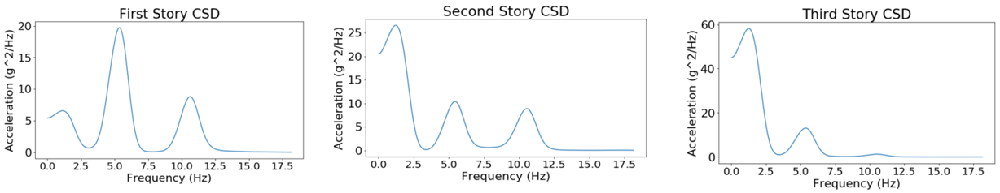
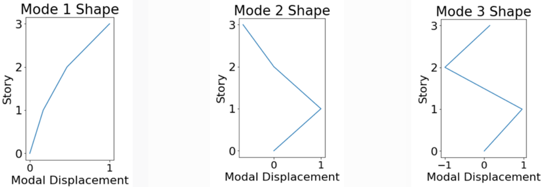

/// html | header

## Experimental Shake Table Testing

Integrated Workflow of Experiments using Jupyter Notebooks: *From Experimental Design to Publication*

///

**Enrique Simbort - University of California, San Diego**  
**Gilberto Mosqueda - University of California, San Diego**  

*Key Words: Jupyter, Interactive Data Analysis, UCSD NHERI Facility*

Jupyter Notebooks can provide fully integrated workflows of experiments from documentation of experimental design through analysis and publishing of data using the DesignSafe cyberinfrastructure. A series of Notebooks are being developed to demonstrate their use in the experimental workflow including notebooks showing how to view and analyzed past published data and data from testing of a reconfigurable, modular test bed building planned to be tested on the NHERI@UC San Diego Experimental Facility. The Python-based code is implemented in a modular fashion so that components can be used as desired in other experiments and are transferable to other experimental facilities. In the examples provided, the Notebook can be used to evaluate shake table performance as well as dynamic properties of the structure. A key functionality is to increase the integration and collaboration between researchers at local or remote sites to view and analyze the experimental data during and after testing including after the data is published. As Notebooks are developed to view experimental data by the research team, they can also be published with the data allowing other researchers to quickly view the data for promoting data reuse. Examples are providing for viewing data from past shake table experiments including NEES and more current NHERI data repositories.  

### Resources
 
#### Jupyter Notebooks
The following Jupyter notebooks are available to facilitate the analysis of each case. They are described in details in this section. You can access and run them directly on DesignSafe by clicking on the "Open in DesignSafe" button.

| Scope | Notebook |
| :-------: | :---------:  |
| Shake-Table Performance | Case 1. Shake table performance.ipynb    |
| Structural Response and System Identification | Case 2: Structural Response and System Identification.ipynb    |
| Experimental Workflow | Case 3: Experimental Workflow.ipynb    |

#### DesignSafe Resources
The following DesignSafe resources were used in developing this use case.

* [Jupyter notebooks on DS Juypterhub](https://www.designsafe-ci.org/rw/workspace/#!/Jupyter::Analysis){:target="_blank"}   

### Background 
#### Citation and Licensing

* Please cite [Mosqueda et al. (2017)](https://12ncee.org/){:target="_blank"}  to acknowledge the use of resources from this use case with additional data sources referenced below.
* Please cite [Rathje et al. (2017)](https://doi.org/10.1061/(ASCE)NH.1527-6996.0000246){:target="_blank"}  to acknowledge the use of DesignSafe resources.
* This software is distributed under the [GNU General Public License](https://www.gnu.org/licenses/gpl-3.0.html){:target="_blank"} .

### Description

As the cyberinfrastructure for The Natural Hazard Engineering Research Infrastructure (NHERI), DesignSafe, see [Rathje et al. (2020)](https://doi.org/10.3389/fbuil.2020.547706){:target="_blank"} , provides a collaborative workspace for cloud-based data analysis, data sharing, curation and publication of models and data. Within this workspace, Jupyter Notebooks can be applied to perform data analysis in an interactive environment with access to published data. A rich set of data from natural hazard experiments and field studies is available from NHERI projects and its predecessor the Network for Earthquake Engineering Simulation (NEES). Since one of the major goals of DesignSafe is to provide a collaborative workspace by means of data sharing and access for data reuses, the main objective of this document is to demonstrate the use of Jupyter Notebook for viewing and analyzing published data using cloud-based tools.

This use case includes a series of Jupyter Notebooks aimed to serve as a learning tool for viewing and analyzing data from shake table experiments including:

1.	The first module examines the performance of Hybrid Simulation Experiments conducted on the 1D Large High Performance Outdoor Shake table at UC San Diego with the data published in DesignSafe by [Vega et al. (2018)](https://doi.org/10.17603/DS2C687){:target="_blank"} . This module focuses on the response of the shake table including tools to compare different signals. Data extraction and processing of measured sensor data includes comparison of time history signals, comparison of signals in the frequency domain using FFT and comparison of response spectra that show for example target and measured table response.  

2.	The second module examines the use of Jupyter Notebooks including Python libraries for structural response and system identification. In this case data from a past NEES experiment conducted by [Mosqueda et al. (2017)](https://www.buffalo.edu/mceer/catalog.host.html/content/shared/www/mceer/publications/MCEER-13-0003.detail.html){:target="_blank"}  of three-story moment frame structure is examined. The data published in DataDepot under as a NEES project. Using selected sensors at each story of the structure and white noise excitation, the frequencies and mode shapes of the structure are identified. The processing tools rely on existing libraries in Python demonstrating the wealth of access to subroutine that can be applied for analysis.

3.	The third module is a Jupyter notebook for viewing and analyzing data from tests on a 3-story steel Modular Testbed Building (MTB2) conducted on the recently upgrades 6DOF shake table at the UC San Diego NHEIR Experimental Facilty as reported by [Van Den Einde et al (2020)](https://doi.org/10.3389/fbuil.2020.580333){:target="_blank"} . These tests will examine the shake table performance and structural response for the 3D structure.  These tests are currently in progress with the notebook under development concurrently.

### Jupyter Notebooks for Experimental Data
Jupyter Notebooks work as an interactive development environment to code and view data in a report format. Within the notebook, the combination of cells enables formatted text and interactive plotting for viewing and analyzing data.  Users can select data files and data channels for viewing and processing with the ability to view and print complete reports. Jupyter Notebooks are accessible in DesignSafe through the workspace analysis tools and can access private or public data in Data Depot. Sample modules are presented here that have been developed using published data in Data Depot including those by [Vega et al. (2018)](https://doi.org/10.17603/DS2C687){:target="_blank"}  and [Masroor et al. (2010)](https://doi.org/10.4231/D3HH6C57D){:target="_blank"} . These modules will be configured and applied within the workflow of the MTB2 during shakedown testing.

#### Case 1. Shake table performance
* [Jupyter Notebook for shake table peformance](https://jupyter.designsafe-ci.org/hub/user-redirect/lab/tree/CommunityData/Use%20Case%20Products/Shake%20Table%20Experimental%20Data/Case%201.%20Shake%20table%20performance.ipynb){:target="_blank"} 

A set of modules have been developed to evaluate the performance of the shake table using data from past experiments conducted to demonstrate the hybrid testing capabilities of LHPOST, see [Vega et al (2020)](https://www.inderscienceonline.com/doi/abs/10.1504/IJLCPE.2020.108939){:target="_blank"} . For these hybrid tests, separate Jupyter Notebooks have been developed to consider the various sources of generated data including i) Shake Table Controller, ii) the primary Data Acquisition System (DAQ), and iii) additional computational sources for hybrid testing. In a typical shake table test, the first two sources of data would be included plus any other user specified data acquisition system.  
Data collected by the shake table controller is expected to be standard across most tests and useful to verify the performance of the shake table in reproducing the ground motions. Here, data from the shake table controller is used to compare reference command and measured feedback data to evaluate the fidelity of the shake table in reproducing the desired ground motions, see [Vega et al. (2018)](https://doi.org/10.17603/DS2C687){:target="_blank"}  for an example. The Jupyter notebook functionality includes interactive plotters for viewing either a single channel or multiple channels to compare the reference input and feedback, for example, by viewing the time history, Fourier Transform or Response Spectra (Fig 1). The shake table controller sampling rate was set to a frequency of 2048 [Hz] for this test.  Initial implementation of the code required about 3.5 minutes to run. To improve the run-time, various options were explored including down sampling and use of tools such as those being developed by [Brandenberg, S., J., & Yang, Y. (2021)](https://doi.org/10.5281/zenodo.5621169){:target="_blank"}  to calculate the spectral acceleration. By using these tools, the run time was reduced to approximately 10 s. The module was implemented for the previous 1-D capability of LHPOST but can be easily extended for its newly upgraded 6DOF capabilities.

Figure 1. Evaluation of shake table performance through comparison of command reference and feedback including a) Fourier Transform and b) response spectra .

#### Case 2. Module for Structural Response and System Identification

* [Jupyter Notebook for Module for Structural Response and System Identification](https://jupyter.designsafe-ci.org/hub/user-redirect/lab/tree/CommunityData/Use%20Case%20Products/Shake%20Table%20Experimental%20Data/Case%202%3A%20Structural%20Response%20and%20System%20Identification.ipynb){:target="_blank"} 

The primary goal of the structural response module is to quickly and accurately analyze experimental data.  For development and testing of available algorithms, experimental data from a previous dynamic experiment involving a ¼ scale three-story steel moment frame structure were used. For detailed information see [Mosqueda et al. (2017)](https://www.buffalo.edu/mceer/catalog.host.html/content/shared/www/mceer/publications/MCEER-13-0003.detail.html){:target="_blank"} , with the data available in [Masroor et al. (2010)](https://doi.org/10.4231/D3HH6C57D){:target="_blank"} . A cross spectral density function (CSD) is applied to compare the white noise acceleration input at the platen to the acceleration at each floor. To improve code clarity and compatibility for future investigators, the CSD function from the SciPy signal package, developed by [Virtanen et al (2020)](https://doi.org/10.1038/s41592-019-0686-2){:target="_blank"} , is implemented, which is well documented. The CSD for each floor is plotted using the matplotlib library. The resulting CSD plots are shown up to 20 Hz in Fig. 2 and identify the natural frequencies of the structure. 
Modal displacements can also be calculated directly from the CSD function outputs. This is accomplished by using the frequency-power relation between acceleration spectral density functions and displacement spectral density functions. The modal displacements for each story occur at frequencies where the CSD has a local maximum. To obtain these values for the test data of the three-story structure, the frequencies of the first three local maxima were recorded. For future use of this code, the desired number of mode shapes can be scaled by adding or removing local maxima terms at the start of the mode shapes code section. Using the CSD function does not take into account the sign of the modal displacement, however, since these functions are strictly positive over their domain. To account for this, the output of the CSD function at the local maxima frequencies is reexamined without considering the absolute values of its components to identify if the parameters yield a negative number at the corresponding frequency. The rough shape of the modal displacements is plotted as shown in Fig. 3. Future work for this notebook includes generating a smoothing function for the mode shapes and comparison of data from different tests to identify changes in dynamic properties through the testing series that could be indicative of damage.

Figure 2. System identification of three story moment frame, by [Masroor et al. (2010)](https://doi.org/10.4231/D3HH6C57D){:target="_blank"} , subjected to white noise from CSD function outputs.

Figure 3. Mode shapes estimation from 3-story building subjected to white noise on shake table.

#### Case 3. Integration of Notebooks in Experimental Workflow

* [Jupyter Notebook for experimental workflow](https://jupyter.designsafe-ci.org/hub/user-redirect/lab/tree/CommunityData/Use%20Case%20Products/Shake%20Table%20Experimental%20Data/Case%203%3A%20Experimental%20Workflow.ipynb){:target="_blank"} 

The primary goal of this module is to develop the Jupyter Notebooks through the experimental program.  The experiments are in planning and thus, this module would be programmed based on draft instrumentation plans. This module will plot the primary structural response such as story accelerations and drifts as well as employ system identification routines available in Python and previously demonstrated.  Current work is exploring use of machine learning libraries for applications to these modules.  

The Modular Testbed Building (MTB2), described in Morano et al. (2021), is designed to be a shared-use, reconfigurable experimental structure. The standard 3-story building can simulate braced frame and moment frame behavior through replaceable fuse type components including buckling restrained braced frames and Durafuse shear plate connections, respectively. The unique connection scheme allows for yielded fuse type members to be easily replaced to restore the structure to its original condition. The MTB2 can be constructed in various configurations with three examples shown in Fig 4. The lateral framing system in the 2-bay direction can be modeled as moment frames or braced frames. The single bay direction has a span of 20 feet and is a braced frame. Each span in the double bay direction is 16 feet. The story height for all floors is 12 feet with columns that extend 4 feet above the top floor.  The Special Moment Frame (SMF) configuration utilizes replaceable shear fuse plates while the braced frame utilizes Buckling-Restrained Braces.

Figure 4.   MTB2 building: a) SMF configuration (left), b) BRB-1 configuration (center), and c) BRB-2 configuration (right).

### Summary
The Jupyter Notebooks developed for use through DesignSafe will facilitate the viewing and analysis of data sharing with collaborators from testing through data publication. A key advantage is the cloud-based approach that facilitates interactive data viewing and analysis in a report format without having to download large datasets. These tools are intended to make data more readily accessible and promote data reuse. The Jupyter Notebook presented here includes routines to evaluate the performance of the shake table and carry out system identification of structural models. 

#### References

* [Rathje et al. (2020)](https://doi.org/10.3389/fbuil.2020.547706){:target="_blank"}  “Enhancing research in natural hazard engineering through the DesignSafe cyberinfrastructure”. Frontiers in Built Environment, 6:213.
* [Vega et al (2020)](https://www.inderscienceonline.com/doi/abs/10.1504/IJLCPE.2020.108939){:target="_blank"}  “Implementation of real-time hybrid shake table testing using the UCSD large high-performance outdoor shake table”. Int. J. Lifecycle Performance Engineering, Vol. 4, p.80-102.
* [Vega et al. (2018)](https://doi.org/10.17603/DS2C687){:target="_blank"}  "Five story building with tunned mass damper", in NHERI UCSD Hybrid Simulation Commissioning. DesignSafe-CI.
* [Mosqueda et al. (2017)](https://www.buffalo.edu/mceer/catalog.host.html/content/shared/www/mceer/publications/MCEER-13-0003.detail.html){:target="_blank"}  “Seismic Response of Base Isolated Buildings Considering Pounding to Moat Walls”. Technical report MCEER-13-0003.
* [Van Den Einde et al (2020)](https://doi.org/10.3389/fbuil.2020.580333){:target="_blank"}  “NHERI@ UC San Diego 6-DOF Large High-Performance Outdoor Shake Table Facility.” Frontiers in Built Environment, 6:181.
* [Masroor et al. (2010)](https://doi.org/10.4231/D3HH6C57D){:target="_blank"}  "Limit State Behavior of Base Isolated Structures: Fixed Base Moment Frame", DesignSafe-CI.
* Vega et al (2020), “Implementation of real-time hybrid shake table testing using the UCSD large high-performance outdoor shake table”. Int. J. Lifecycle Performance Engineering, Vol. 4, p.80-102.
* [Brandenberg, S., J., & Yang, Y. (2021)](https://doi.org/10.5281/zenodo.5621169){:target="_blank"}  "ucla_geotech_tools: A set of Python packages developed by the UCLA geotechnical group" (Version 1.0.2) [Computer software].
* [Virtanen et al (2020)](https://doi.org/10.1038/s41592-019-0686-2){:target="_blank"}  “SciPy 1.0: Fundamental Algorithms for Scientific Computing in Python”. Nature Methods, 17, 261–272.
* Chopra A. K., Dynamics of Structures. Harlow: Pearson Education, 2012. 
* Morano M., Liu J., Hutchinson T. C., and Pantelides C.P. (2021), “Design and Analysis of a Modular Test Building for the 6-DOF Large High-Performace Outdoor Shake Table”, 17th World Conference on Earthquake Engineering, Japan.
* Mosqueda G, Guerrero N, Schmemmer Z., Lin L, Morano M., Liu J., Hutchinson T, Pantelides C P. Jupyter Notebooks for Data workflow of NHERI Experimental Facilities. Proceedings of the 12th National Conference in Earthquake Engineering, Earthquake Engineering Research Institute, Salt Lake City, UT. 2022.
