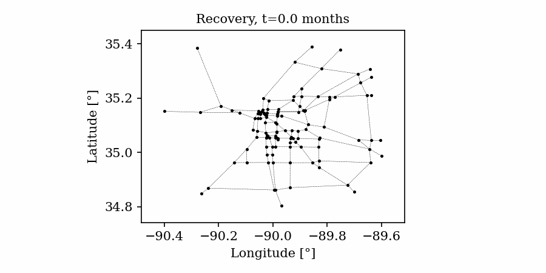

# Visualization of spatially distributed data 
## Jupyter notebook for visualization of spatially distributed data in risk and resilience analysis
**Raul Rincon - Dept. of Civil and Environmental Engineering, Rice University**  
**Jamie E. Padgett - Dept. of Civil and Environmental Engineering, Rice University**  
 
Keywords: visualization; risk and resilience; infrastructure systems; static, interactive, and animated maps and figures, effective communication

## Resources 
The examples presented make use of the following DesignSafe resources:  
Jupyter notebooks on DS Juypterhub 

## Description
Effective visualization tools for communication of risk and resilience metrics are needed to translate technical information into trustable and useful outputs for decision-making, and also to aid in the research process including sanity checks, verification, and validation steps, among others. Considering the diverse purposes, it may be desired to explore input, intermediate results, or final outcomes during the risk and resilience assessment (see [Figure 1](#Fig1)). This use case addresses these needs by leveraging different Python libraries to visualize spatially distributed data, especially focusing on risk and resilience analysis products. Some of the visualized products represent data that can be obtained through the Tools & Applications space in the DesignSafe cyberinfrastructure (for example using the [SimCenter research tools](https://simcenter.designsafe-ci.org/research-tools/overview/)) or other platforms for resilience measurement science (see [IN-CORE platform](https://incore.ncsa.illinois.edu/)). Procedures to develop static, interactive, and animated figures and maps are presented throughout the use case. The created maps aim to visualize hazard-to-resilience outputs obtained from the analysis of regionally distributed systems. Hence this Jupyter notebook may serve as a launching point for other researchers to adapt code for visualizing various stages along the regional risk and resilience quantification workflow. 

 

    <b>Figure 1. Risk and resilience outputs and stakeholder visualization needs</b>

## Implementation
This use case adopts a representative hazard and distributed infrastructure system for illustration purposes. A sparse representation of the highway network in the Memphis Metropolitan and Statistical Area (MMSA) subjected to a point-source earthquake scenario is considered. The highway network is defined using a set of links and nodes that represent roads and intersections, respectively. The bridges are assumed to determine the functionality of the link in which they are located. The functionality of the bridges depends on the level of damage reached given a certain earthquake. The point-based earthquake is located at 35.927 N, 89.919W at 10 km below the ground surface.

### Types of visualization tools
This use case focuses on the visualization of static maps, interactive maps, and animated plots. Static plots are a common tool in phases such as model definition and model analysis, where the data needs to be visualized and curated before any calculations, or data publication in formats where the interactivity with the figures does not occur (for example, reports or journal publications). To perform fine explorations of the data collected from an inspection campaign or results from a suite of simulations it may be necessary to use a more powerful format, such as interactive maps. These are maps in which the user can pan over the map to view data, zoom in or out to examine local or regional groupings, or hover over objects to inspect (initially hidden) information. Finally, animated maps and plots are presented as a way to depict time-dependent geographical information or the distributed influence of feature variations (for example the increment in ground accelerations as a function of earthquake magnitude). In this case, the user can interact with input features that modify the spatially distributed data or create gifs to show sequential or evolving processes.

### Workflow of this use case
The following structure is used:
1. [Plotting distributed infrastructure using static plots.](#Title1)
2. [Interactive exploration of spatially distributed information.](#Title2)
3. [Creation of animated graphs and GIFs.](#Title3)

### Setting the python environment
The base image of the Jupyter Notebook DS may (or may not) have pre-installed some of the required Python libraries. The accompanying [Jupyter notebook](https://jupyter.designsafe-ci.org/hub/user-redirect/lab/tree/NHERI-Published/PRJ-3939/visualization_risk_resilience.ipynb) shows the required libraries in the section: **Required installations**. Some of the libraries you may need to install include `contextily`, `basemap`, `plotly`, and `folium`.

### Input files

To use the [Jupyter notebook with visualization strategies](https://jupyter.designsafe-ci.org/hub/user-redirect/lab/tree/NHERI-Published/PRJ-3939/visualization_risk_resilience.ipynb), you need to first create a new folder in your “My Data” and copy the notebook and the input files presented in this published project. The input files have been pre-processed and conveniently shared in the Risk and resilience data examples on DS:
1. Hazard:  
    a. CSV files with a mesh grid and bridges’ locations.  
    b. CSV files with the values of the peak ground acceleration (PGA) at the grid and bridge locations for one earthquake event realization (magnitude 7.1).
2. Shapefiles: shapefiles of the bridges (points) and roads (polylines).
3. Damage results: CSV file with the bridges’ probabilities of reaching or exceeding damage states (obtained using [pyincore](https://incore.ncsa.illinois.edu/doc/incore/pyincore.html)).
4. Network model: TXT files with information on the edges, nodes, and bridge parameters (following the National Bridge Inventory database and additional features).
5. Damage_Recovery: CSV and JSON files with the bridges’ probabilities of reaching or exceeding damage states for different magnitude events (obtained using [pyincore](https://incore.ncsa.illinois.edu/doc/incore/pyincore.html)) and the bridges mean recovery times for a single event.

### 1. Plotting distributed infrastructure using static plots 
Different strategies are used to visualize geographical data in an easy way. In the accompanying Jupyter Notebook libraries such as `Geopandas`, `Matplotlib`, `Basemap`, and `Contextily` are leveraged to obtain static maps. The examples include visualization of shape files to visualization of networked data (using NetworkX library), both formats in which a user may have the input exposure data. The use case presents how these libraries can be used to create and handle maps and their attributes, such as axis labels, color bar, legends, etc., to highlight features of interest. As shown in  [Figure 2a](#Fig2), the shapefiles of the roadway network and the bridge locations are shown with the ‘Stamen Terran’ web tiles in the background; the figure also depicts the bridge’s construction year using a ‘Red-Yellow-Blue’ color bar. [Figure 2b](#Fig2) depicts the case in which resilient modeling outputs such as hazard intensities are used for the background map.

In general, web-tiles (available through Python libraries such as `Contextily`) are used for background maps to enhance the visualization of hazard, exposure, and risk data. Some of these background tiles may require a projection of the coordinates of the data coordinate reference system (CRS) to the CRS of the desired tile as explained in the Jupyter Notebook.

 

 <b>Figure 2. Visualization of static plots</b> 

### 2. Interactive exploration of spatially distributed information  
These interactive maps are useful in situations when data visualization is not fully addressed through static maps, so it is necessary to be able to reveal data on elements (points, lines, or polygons) interactively by the user. For example, for inspecting post-event hazard damages, depicting current conditions on situational awareness tools, or displaying information on the infrastructure assets during the restoration processes. 

In this use case, damage state exceedance probabilities are obtained for each bridge (i.e., considered as an outcome of applying fragility models to the hazard scenario). An example of this output is presented in the ‘bridge_result.csv’ file for one hazard scenario. In this file format, damage state exceedance probabilities $\mathbb{P}(DS \geq ds_i)$ are named as "$LS_i$", for $i=1,…,4$; similarly, probabilities of being in a damage state $\mathbb{P}(DS = ds_i)$ are named as "$DS_i$", for $i=1,…,4$. For such cases, there may be interest in visualizing the spatial distribution of damage to infrastructure components. 

Here interactive Python libraries are used to visualize and inspect fine information on the different components that comprise the map such as bridge location, basic information, and damage condition (see [Figure 3](#Fig3)). These interactive functionalities are integrated using Python libraries such as Plotly and Folium; these allow the user to pan over the different geospatially distributed systems and inspect the region or assets of interest. Also, these enable the user to construct icon objects that display data of interest (e.g. the ‘construction year’ and the ‘exceeding probability of damage state 3’ in [Figure 3a](#Fig3)) when hovering over the bridge locations. If additional data is also important to display (e.g. hazard intensity, link, or bridge IDs, among others), ‘pop-up’ functionalities can be used to present this information when the user clicks on a particular object (shown in [Figure 3b](#Fig3)). 

As shown in this use case, interactive maps can also be enhanced by handling the icons, points, and link characteristics such as type, icon figure, color, etc. [Figure 3](#Fig3) presents the bridge condition using a common color coding related to post-hazard tagging. Red tag is used here when $\mathbb{P}(DS≥ds_3 )≥0.15$, yellow tag is used if $0.05≤\mathbb{P}(DS≥ds_3 )<0.15$, and green tag is used if $\mathbb{P}(DS≥ds_3)<0.05$; note that these limits have been arbitrarily selected for display purposes. Moreover, objects such as legends and color bars can be easily included in such interactive maps to add additional layers of information. Given the possibility of presenting the data "online", these are very useful tools for communication with stakeholders, inspection teams, or simply for data analysis during damage simulation or recovery processes.

 

    <b>Figure 3. Visualization of interactive plots</b>

### 3. Creation of animated graphs and GIFs  
Time-varying characteristics or feature-dependent results can be effectively visualized and communicated using animations that enable the user to modify certain independent variables such as the magnitude of an earthquake, the number of crews used to repair a networked system, or the level of acceptable damage before demanding evacuation. Common sources of time-dependent data in resilient modeling may include the status of components as repair and recovery processes evolve. In this use case, the highway functionality is visualized using solid lines if the link is ‘fully functional’, or through dashed lines if any of the bridges on the route are ‘under repair’ (see [Figure 4](#Fig4)). 

Different widgets (such as checkboxes, sliders, or buttons) can be passed to the Jupyter Notebook using `Ipywidgets` packages to create animations that facilitate user-graphics interaction. These animations allow the user to select specific characteristics (or a combination of these) to visualize and interact with the data. For example, [Figure 4a](#Fig4) shows how the user can skip forward or backward in time (weeks) or drag the slider to the point in time in which it is desired to know the network state. Hence, the buttons enable the creation of dynamic figures that sequentially vary the features of interest, depicting their influence on the distributed data. These animated ‘videos’ can also be presented as GIFs (i.e. graphics interchange format), as shown in [Figure 4b](#Fig4),  which are easy to visualize and share across different platforms or programs, for example into phone applications, slides, reports or webpages.

<table>
    <tr>
        <th style="background-color:#FFFFFF;">  </th>
        <th style="background-color:#FFFFFF;">  </th>
    </tr>
    <tr>
        <th style="background-color:#FFFFFF;"> 
 <b>(a) Example of a graph animated with interactive widgets</b> 
 </th>
        <th style="background-color:#FFFFFF;"> 
 <b>(b) Example of a ‘gif’ animation.</b> 
 </th>
    </tr>
</table>

    <b>Figure 4. Animated plots for visualization of dynamic outputs.</b>

## Citation and Licensing

* Please cite [Rincon and Padgett (2023)](https://doi.org/10.17603/ds2-a74m-g031) to acknowledge the use of resources from this use case.  

* Please cite [Rathje et al. (2017)](https://doi.org/10.1061/(ASCE)NH.1527-6996.0000246) to acknowledge the use of DesignSafe resources.    

* This software is distributed under the [GNU General Public License](https://www.gnu.org/licenses/gpl-3.0.html). 
