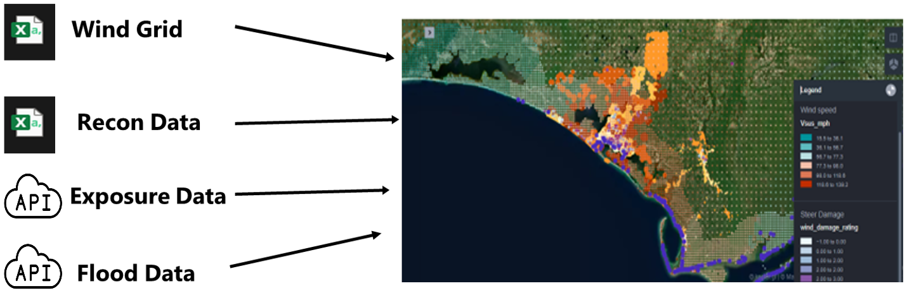
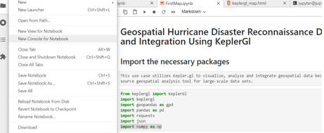
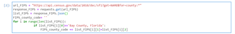
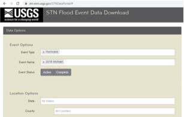
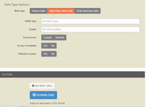
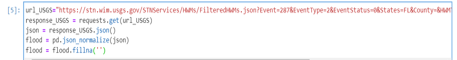
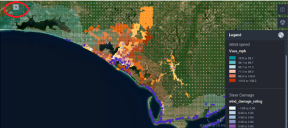
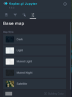
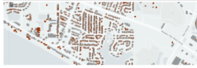
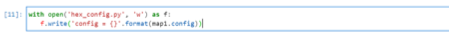

/// html | header

## Hurricane Data Integration &amp; Visualization

Geospatial Hurricane Disaster Reconnaissance Data Integration and Visualization Using KeplerGl

///

**Pinelli, J.-P. – Florida Tech**      
**Sziklay, E. – Florida Tech**    
**Ajaz, M.A. – Florida Tech**   

*Key Words: Hurricane, Disaster Reconnaissance, StEER Network, NSI Database, wind field, JupyterLab, API, JSON, KeplerGI*

### Resources 

* <a href="https://jupyter.designsafe-ci.org/hub/user-redirect/notebooks/CommunityData/Use%20Case%20Products/Hazard-Exposure-Reconnaissance%20Integration%20and%20Visualization/FirstMap.ipynb">Jupyter notebook on DesignSafe Jupyterhub</a>
* GitHub, <a href="https://github.com/keplergl/kepler.gl">https://github.com/keplergl/kepler.gl</a> 
* StEER Network,<a href="../../../Containers/com.apple.mail/Data/Library/Mail%20Downloads/F826EEA0-D8C2-4F19-B0E4-C81BF6BFFC38/%20https:/www.steer.network"> https://www.steer.network</a>
* U.S. Geological Survey, <a href="https://stn.wim.usgs.gov/STNDataPortal/%23">https://stn.wim.usgs.gov/STNDataPortal/#</a>
* NSI data base, <a href="https://www.hec.usace.army.mil/confluence/nsi">https://www.hec.usace.army.mil/confluence/nsi</a>
* Fulcrum, <a href="https://web.fulcrumapp.com/apps">https://web.fulcrumapp.com/apps</a>

### Description

The purpose of this JupyterLab is to integrate field damage, hazard, and exposure data from past hurricane events. KeplerGl provides customizable geospatial map visualization and user-friendly analysis tools. Different kinds of data from different sources related to any hurricane event are collected.  The exposure data from the National Structure Inventory (NSI) database and flood data from U.S. Geological Survey (USGS) are both collected via an application-programming interface or API.  API is storage-friendly and updates automatically. In that case, the script connects to the service provider. The field damage reconnaissance data from Structural Extreme Events Reconnaissance (StEER) is available from both DesignSafe and Fulcrum without an API, whereas the wind field data from the Applied Research Associates, Inc. (ARA) wind grid is on DesignSafe. 

### Implementation

This use case uses Hurricane Michael as an example to illustrate the data collection, integration, and visualization on the map. This software can be extended to other hazards like tornadoes and earthquakes.  Figure 1 shows the main components of the data integration for Hurricane Michael. All the components are georeferenced. They are displayed in different layers in KeplerGl. 

Figure 1.  Integration of Hazard, Reconnaissance and Exposure Data

### Instructions

#### Using JupyterHub on DesignSafe####
#### Accessing JupyterHub####
*Navigate to the JupyterHub: Use this <a href="https://www.designsafe-ci.org/rw/workspace/#!/Jupyter::Analysis">link</a> to go directly to the JupyterHub portal on DesignSafe.
*Sign In: You must have a TACC (Texas Advanced Computing Center) account to access the resources. If you do not have an account, you can register <a href="https://www.designsafe-ci.org/account/register/">here</a>.
*Access the Notebook: Once signed in, you can access and interact with the Jupyter notebooks available on your account.
*To run this Notebook, <a href="https://jupyter.designsafe-ci.org/hub/user-redirect/lab/tree/NHERI-Published/PRJ-3903v3/FirstMap.ipynb" target="_blank">FirstMap.ipynb</a> you must copy it to your MyData directory to make it write-able as it is read only in NHERI- published directory. Use your favorite way to lunch a Jupyter Notebook and then open the FirstMap.ipynb file.

1. Run the following command cell to copy the project to your MyData or change path to wherever you want to copy it to: after opening this Notebook in MyData you don't have to run the below cell again
	!umask 0022; cp -r /home/jupyter/NHERI-Published/PRJ-3903v3/home/jupyter/MyData/PRJ-3903; chmod -R u+rw /home/jupyter/MyData/PRJ-3903

2. Navigate to your 'MyData' directory.
For illustrative purposes, input files have been created and shared in this project. These files have been pre-processed and conveniently organized used to illustrate the data collection, integration, and visualization on the map. The outcomes as follows: 
	1.	2018-Michael_windgrid_ver36.csv
	2.	hex_config.py
	3.	Steer_deamage.csv
	4.	FirstMap.ipynb
	Results: 
	1. first_map.html
	2. first_map_read_only.html

### Jupyter Notebooks

#### Installing and importing the required packages

When using the JupyterLab for the first time, some packages need to be installed. Start a new console by clicking <b>File &gt; New Console for Notebook</b> and copy and paste the following code: 

	jupyter lab clean --all &&   pip install --no-cache-dir --upgrade keplergl && \  jupyter labextension install @jupyter-widgets/jupyterlab-manager keplergl-jupyter

The code above installs <b>KeplerGl</b>, as well as the required dependencies. 

Figure 2. Open a New Console.

There is no need to install <b>geopandas</b>, <b>pandas </b>and<b> json</b>.  These are built in modules in Python. As for the installation of the remaining two packages, use the following commands in the same console:

	pip install requests
	pip install numpy

#### Get the exposure data from the NSI database

Exposure or building data is one of the main components of the integrated model. The NSI provides access to building data from diverse sources across 50 states in the US and it is updated on a yearly basis. For each building, public and private fields are provided. This JupyterLab accesses the publicly available fields only.  It is possible to get access to the private fields through a Data Use Agreement with Homeland Infrastructure Foundation-Level Data (HIFLD). The public fields include valuable building attributes such as occupation type (occtype), building type (bldgtype), square footage of the structure (sqft), foundation type (found type), foundation height (found_ht), number of stories (num_story), median year built (med_yr_blt) and ground elevation at the structure (ground_elv). Building data can be accessed from NSI in two ways, one by direct download in json format or via the API service. This JupyterLab provides data access via API. Figure 3 shows how the script establishes two API connections and sends requests.

Figure 3. Process of Exposure Data Access via APIs.

Each state and county in the United Sates have a unique FIPS code. Building data from the NSI database can be accessed for each county using its proper FIPS code. The following code gets the FIPS code of the county of interest. 

In this example we get building data in Bay County, Florida. For any other county, replace 'Bay County, Florida' with the desired county and state. Keep this format exactly as it is. Capitalize the first letters and write a comma after County. 

#### Download ARA Wind and Building Damage Data 

ARA wind grid data for hurricane events is available on DesignSafe for each event. The grid wind data includes two fields: The 1-minute sustained maximum wind speed (mph) and the 3-second maximum wind gust (mph), both at 10-meters for open terrain. Both can be displayed as separate layers on the map.

StEER reconnaissance data can be accessed and downloaded from <a href="https://web.fulcrumapp.com/apps">https://web.fulcrumapp.com/apps</a> or from DesignSafe (Roueche at al.2020). 

In this script we access the data from Fulcrum. Both ARA wind and the StEER damage reconnaissance data must be in CSV format and in UTF-8 Unicode.

#### Getting flood data from USGS via JSON REST Service

REST is a common API that that uses HTTP requests to access and use data. To get the REST URLs for a hazard event where flood was present, visit <a href="https://stn.wim.usgs.gov/STNDataPortal/%23,%20">https://stn.wim.usgs.gov/STNDataPortal/#,</a> browse the flood event (in this use case it is 2018 Michael) and hit the 'Get REST URL' button at the bottom of the page (see figure 4).

Figure 4. Accessing JSON REST on USGS

The desired URL pops up in a new window. Copy and replace the JSON REST Service URL in the first line of the code below.

#### Adding previously collected data and displaying them on the map 

As the Python script adds data to the map, the user still must set it up to display using the panel on the left. In fact, a new layer needs to be added and configured for each data source. The left panel is activated and deactivated by clicking on the small arrow, circled in red on Figure 5. 

Figure 5. Every data is added as a new layer on the map.

For each new layer, the user specifies the basic type (point, polygon, arc, line etc.), selects the latitude and longitude fields from the data (Lat, Long) and decides on the fill color, too. The color can be based on a field value, making the map to be color-coded. In this JupyterLab, the reconnaissance damage data has been color-coded based on the wind damage rating value (0-4). The deeper purple the color, the higher the wind damage rating of the property. The layer of buildings is also color-coded based on the field median-year-built. This is an estimated value only and the map shows larger areas with the same color implying that this attribute must be treated with caution. 

Finally, the maximum open terrain 1-minute sustained wind speed (mph) and 3-second wind gust (mph) at 10-meters are also color-coded. 

#### Customizing the map further

There are several extra tools in KeplerGl that allow the user to customize the map further. The first most important capability of KeplerGl is that the map style can be changed by clicking on the Base map icon (see Figure6). 

Figure 6. Changing the map style in KeplerGl

An advantage of using a map style other than Satellite is that the building footprints become visible on the map as Figure 7 shows. 

Figure 7. Microsoft Building Footprint is a built-in layer in KeplerGl

The second most important capability of KeplerGl is that the user may select the fields to be displayed when hoovering a point geometry on the map. This can be done for each layer by clicking the Interactions icon and then activating Tooltip in the panel as Figure 8 shows.

Figure 8. Selecting the most relevant fields for mouse over.

Finally, the user may draw a rectangle or polygon on the map to highlight specific areas of interest. This tool is available on the right panel by clicking the Draw on map icon. 

#### Saving the map and exporting it as an interactive html file

After the users customized the map, if they wish to reopen it next time with the same configuration then they need to run the following code.

This code creates a configuration file in which all settings are saved. This file needs to be loaded at the beginning of the script.

The user must also click <b>Widget &gt; Save Notebook Widget State</b> before shutting down the kernel to make sure it that the same map will be reloaded next time.

With the code below the most recently loaded map with all its data and configuration will be saved in the folder as an html file. 

The html file generated cannot be opened directly from DesignSafe.User needs to save the html file and  open locally on a browser or published on the Internet. This is an interactive html file, meaning that the user can work on the map and customize it the same way as in the JupyterLab.  There is also an option to create a read-only html file by setting the read-only variable to true. 

### Citations and Licensing

* Please cite<a href="https://doi.org/10.1061/(ASCE)NH.1527-6996.0000246" target="_blank">Rathje et al. (2017)</a>to acknowledge the use of DesignSafe resources.
* This software is distributed under the <a href="https://www.gnu.org/licenses/gpl-3.0.html">GNU General Public License</a>.
* Roueche, D., T. Kijewski-Correa, J. Cleary, K. Gurley, J. Marshall, J. Pinelli, D. Prevatt, D. Smith, K. Ambrose, C. Brown, M. Moravej, J. Palmer, H. Rawajfih, M. Rihner, (2020) &quot;StEER Field Assessment Structural Team (FAST)&quot;, in <i>StEER - Hurricane Michael</i>. DesignSafe-CI. <a href="https://doi.org/10.17603/ds2-5aej-e227">https://doi.org/10.17603/ds2-5aej-e227.</a>

* This use-case page was last updated on 5/1/2024
